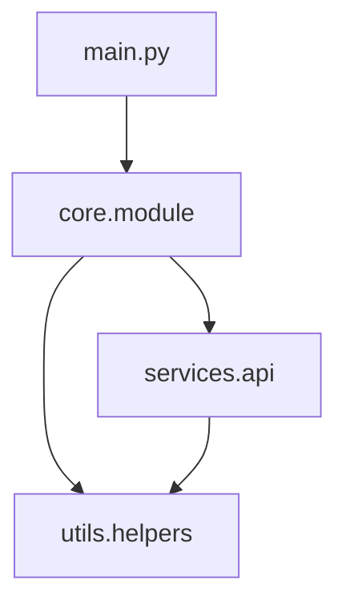

# Code Analyzer Agent - Mermaid Visualization Update

## Summary
Successfully updated the Code Analyzer agent template to include Mermaid diagram generation capabilities. The agent can now generate visual representations of code structure and relationships.

## Changes Made

### 1. Template Version Update
- Updated agent version from `2.5.0` to `2.6.0`
- Updated last modified date to `2025-08-26`

### 2. Enhanced Capabilities
- Added `Write` tool to capabilities (needed for saving diagram files)
- Added visualization expertise to domain knowledge
- Added mermaid-related tags: `mermaid`, `visualization`, `architecture-diagrams`

### 3. Updated Agent Description
- Changed from: "Multi-language code analysis using Python AST and tree-sitter packages"
- Changed to: "Multi-language code analysis with AST parsing and Mermaid diagram visualization"

### 4. New Instructions Added
The agent instructions now include:

#### Visualization Capabilities Section
- Trigger keywords for diagram generation
- Available diagram types (entry_points, module_deps, class_hierarchy, call_graph)
- Complete usage example with MermaidGeneratorService

#### Code Examples
```python
from claude_mpm.services.visualization import (
    DiagramConfig,
    DiagramType,
    MermaidGeneratorService
)

# Initialize and use the service
service = MermaidGeneratorService()
service.initialize()

# Generate diagrams from analysis results
diagram = service.generate_diagram(
    DiagramType.MODULE_DEPS,
    analysis_results,
    config
)
```

#### Output Format Examples
- Standard analysis report format
- Enhanced report with embedded Mermaid diagrams
- Guidelines for when to automatically generate diagrams

## Available Diagram Types

1. **entry_points**: Application entry points and initialization flow
2. **module_deps**: Module dependency relationships
3. **class_hierarchy**: Class inheritance and relationships
4. **call_graph**: Function call flow analysis

## Trigger Words
The agent will generate visualizations when users mention:
- "visualization", "diagram", "show relationships"
- "architecture overview", "dependency graph"
- "class structure", "call flow"

## Backward Compatibility
All changes are additive and maintain backward compatibility:
- Existing analysis capabilities remain unchanged
- Diagram generation is optional and triggered by user request
- No breaking changes to existing functionality

## Testing
Created validation script: `/scripts/test_code_analyzer_mermaid.py`
- Validates JSON structure
- Confirms mermaid capabilities are present
- Verifies all required sections in instructions
- All tests pass ✅

## Usage Example
When a user requests code analysis with visualization:

```
User: "Analyze my Python project and show me the module dependencies as a diagram"

Agent Response:
# Code Analysis Report with Visualizations

## Module Dependencies


[Detailed analysis continues...]
```

## Files Modified
- `/src/claude_mpm/agents/templates/code_analyzer.json` - Main template file updated

## Files Created
- `/scripts/test_code_analyzer_mermaid.py` - Validation script for changes
- `/CODE_ANALYZER_MERMAID_UPDATE.md` - This summary document

## Notes
- The MermaidGeneratorService is already part of the codebase at `/src/claude_mpm/services/visualization/`
- No additional Python dependencies needed (mermaid syntax is plain text)
- Diagrams can be rendered by any Mermaid-compatible viewer (GitHub, mermaid.live, etc.)