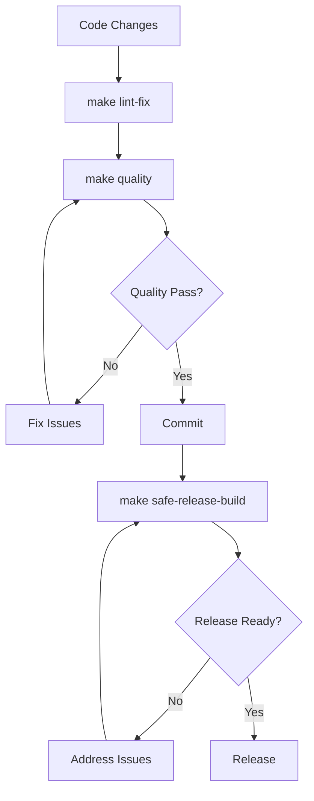

# Claude MPM Deployment Guide

**Version**: 4.2.2  
**Last Updated**: September 2, 2025

Complete guide for deploying, versioning, and releasing Claude MPM with comprehensive quality gates and operational procedures.

## Table of Contents

- [Quick Deployment](#quick-deployment)
- [Version Management](#version-management)  
- [Quality Gates](#quality-gates)
- [Release Process](#release-process)
- [Environment Configuration](#environment-configuration)
- [Security Protocols](#security-protocols)
- [Operational Procedures](#operational-procedures)
- [Troubleshooting](#troubleshooting)

## Quick Deployment

### Development Deployment

```bash
# Ensure clean state
make quality

# Install development dependencies
pip install -e .[dev]

# Deploy agents
./scripts/claude-mpm agents deploy

# Verify installation
./scripts/claude-mpm --version
./scripts/claude-mpm run --help
```

### Production Deployment

```bash
# Complete quality gate
make safe-release-build

# Build distribution
python -m build

# Install from wheel
pip install dist/claude_mpm-*.whl

# Verify installation
claude-mpm --version
```

## Version Management

### Dual Version System (v4.0.25+)

Claude MPM uses a sophisticated dual tracking system:

**VERSION file**: Semantic version only (e.g., "4.2.2")
**BUILD_NUMBER file**: Serial build number (e.g., "332")

### Version Formats

Three display formats for different contexts:

```bash
# Development format (PEP 440 compliant)
4.2.2+build.332

# UI/Logging format (user-friendly)
v4.2.2-build.332  

# PyPI release format (clean semantic)
4.2.2
```

### Version Management Commands

```bash
# Check current version
./scripts/manage_version.py status

# Bump patch version
./scripts/manage_version.py bump patch

# Bump minor version  
./scripts/manage_version.py bump minor

# Bump major version
./scripts/manage_version.py bump major

# Set specific version
./scripts/manage_version.py set 4.3.0
```

### Conventional Commits

Use conventional commit format for automatic version bumping:

```bash
# Patch version bump
git commit -m "fix: resolve agent loading issue"

# Minor version bump  
git commit -m "feat: add new deployment strategy"

# Major version bump
git commit -m "feat!: breaking change in service interface"
git commit -m "feat: new feature

BREAKING CHANGE: service interface changed"

# Other types
git commit -m "perf: improve agent loading speed"
git commit -m "refactor: restructure service layer"
git commit -m "docs: update deployment guide"
```

### Build Number Management

Build numbers increment automatically:

- **Pre-commit hook**: Increments on substantial code changes
- **Manual increment**: `./scripts/manage_version.py increment-build`
- **Reset on version bump**: New semantic version resets build to 1

### Version Display Logic

```python
from claude_mpm._version import get_version_info

version_info = get_version_info()
# Returns: {
#   'version': '4.2.2',
#   'build_number': 332,
#   'development_format': '4.2.2+build.332',
#   'display_format': 'v4.2.2-build.332',
#   'release_format': '4.2.2'
# }
```

## Quality Gates

### Daily Development Commands

**Three-tier quality system:**

#### 1. Auto-Fix (Development)

```bash
make lint-fix
```

**What it does:**
- Black formatter for consistent style
- isort for import organization  
- Auto-fixable Ruff issues
- Safe to run anytime

#### 2. Quality Gate (Pre-commit)

```bash  
make quality
```

**What it does:**
- Complete linting (Ruff, Black, isort, Flake8, mypy)
- Structure validation
- Code quality checks
- Security scanning
- **Must pass before commits**

#### 3. Release Gate (Pre-release)

```bash
make safe-release-build
```

**What it does:**
- Complete quality gate
- Comprehensive test suite
- Build validation
- Security verification
- **Required for releases**

### Quality Standards

- **Code Coverage**: Minimum 85%
- **Type Coverage**: All public APIs typed
- **Documentation**: All public functions documented  
- **Performance**: No benchmark regressions
- **Security**: Pass all security scans

### Quality Pipeline



## Release Process

### 1. Pre-Release Preparation

```bash
# Ensure clean working directory
git status

# Run complete quality gate
make safe-release-build

# Update version if needed
./scripts/manage_version.py bump minor

# Update changelog
# Edit CHANGELOG.md with new version details
```

### 2. Build and Test

```bash
# Clean previous builds
rm -rf dist/ build/

# Build distribution packages
python -m build

# Test installation
pip install --force-reinstall dist/claude_mpm-*.whl

# Verify installation
claude-mpm --version
claude-mpm agents list --system
```

### 3. Release to PyPI

```bash
# Upload to test PyPI first
twine upload --repository testpypi dist/*

# Test install from test PyPI
pip install --index-url https://test.pypi.org/simple/ claude-mpm

# Upload to production PyPI
twine upload dist/*
```

### 4. GitHub Release

```bash
# Create git tag
git tag -a v4.2.2 -m "Release v4.2.2"

# Push tag
git push origin v4.2.2

# Create GitHub release (manual or via gh CLI)
gh release create v4.2.2 dist/* \
  --title "Claude MPM v4.2.2" \
  --notes "Release notes here"
```

### 5. Post-Release Verification

```bash
# Install from PyPI
pip uninstall claude-mpm
pip install claude-mpm

# Verify functionality
claude-mpm --version
claude-mpm run --help

# Test key features
claude-mpm agents list
claude-mpm agents deploy
```

## Environment Configuration

### Development Environment

```bash
# Environment variables
export CLAUDE_MPM_ENV=development
export CLAUDE_MPM_LOG_LEVEL=DEBUG
export CLAUDE_MPM_ENABLE_CACHE=true

# Development configuration
cat > .claude-mpm/config/development.yaml << 'EOF'
environment: development
debug: true
cache:
  enabled: true
  ttl: 300
logging:
  level: DEBUG
  format: detailed
agents:
  auto_reload: true
  validate_schema: true
EOF
```

### Production Environment

```bash
# Environment variables
export CLAUDE_MPM_ENV=production
export CLAUDE_MPM_LOG_LEVEL=INFO
export CLAUDE_MPM_ENABLE_CACHE=true
export CLAUDE_MPM_CACHE_TTL=3600

# Production configuration
cat > .claude-mpm/config/production.yaml << 'EOF'
environment: production
debug: false
cache:
  enabled: true
  ttl: 3600
logging:
  level: INFO
  format: json
agents:
  auto_reload: false
  validate_schema: true
  cleanup_outdated_user_agents: true
security:
  enable_input_validation: true
  require_secure_connections: true
EOF
```

### Multi-Environment Configuration

```bash
# Base configuration
cat > .claude-mpm/config/config.yaml << 'EOF'
# Base configuration inherited by all environments
cache:
  enabled: true
agents:
  validate_schema: true
security:
  enable_input_validation: true

# Environment-specific overrides
environments:
  development:
    debug: true
    logging:
      level: DEBUG
  
  staging:
    debug: false
    logging:
      level: INFO
      
  production:
    debug: false
    logging:
      level: WARN
    security:
      require_secure_connections: true
EOF
```

## Security Protocols

### Input Validation

All inputs are validated at multiple layers:

```python
# Service layer validation
from claude_mpm.validation import validate_input

@validate_input(schema="agent_deployment")
def deploy_agent(self, agent_config: dict):
    # Implementation with guaranteed valid input
    pass
```

### Path Security

Comprehensive path traversal prevention:

```python
# Secure path handling
from claude_mpm.security import secure_path

# Validates path is within allowed directories
safe_path = secure_path("/path/to/file", allowed_roots=["/project"])
```

### Secret Management

Never commit secrets - use environment variables:

```bash
# Good - environment variables
export CLAUDE_API_KEY="sk-ant-..."
export DATABASE_URL="postgresql://..."

# Bad - hardcoded secrets  
API_KEY = "sk-ant-api03-..."  # Never do this
```

### Audit Logging

All security-relevant operations are logged:

```python
from claude_mpm.security import audit_log

@audit_log(action="agent_deploy", level="INFO")  
def deploy_agent(self, agent_config):
    # Operation is automatically logged
    pass
```

### Security Checklist

Before deployment, verify:

- [ ] No hardcoded secrets in code
- [ ] All inputs validated against schemas
- [ ] File operations use secure path handling
- [ ] API endpoints have proper authentication
- [ ] Logging doesn't expose sensitive data
- [ ] Dependencies have no known vulnerabilities
- [ ] Error handling doesn't leak system information

## Operational Procedures

### Health Monitoring

```bash
# Check system health
curl http://localhost:8765/health

# Monitor service status
claude-mpm agents list --health

# View performance metrics
claude-mpm info --performance
```

### Log Management

```bash
# View recent logs
tail -f .claude-mpm/logs/claude-mpm.log

# Search for errors
grep "ERROR" .claude-mpm/logs/*.log

# Log rotation (automatic in production)
logrotate .claude-mpm/config/logrotate.conf
```

### Backup Procedures

```bash
# Backup agent configurations
tar -czf agents-backup-$(date +%Y%m%d).tar.gz .claude-mpm/

# Backup project memories
tar -czf memories-backup-$(date +%Y%m%d).tar.gz .claude-mpm/memories/

# Restore from backup
tar -xzf agents-backup-20250902.tar.gz
```

### Performance Monitoring

```bash
# Monitor resource usage
python -c "
from claude_mpm.services.infrastructure import PerformanceMonitor
monitor = PerformanceMonitor()
metrics = monitor.get_metrics()
print(f'Memory usage: {metrics[\"memory_mb\"]}MB')
print(f'CPU usage: {metrics[\"cpu_percent\"]}%')
"

# Cache performance
python -c "
from claude_mpm.services.core.cache import CacheService
cache = CacheService.get_instance()
stats = cache.get_stats()
print(f'Cache hit rate: {stats[\"hit_rate_percent\"]}%')
"
```

## Troubleshooting

### Common Deployment Issues

#### Version Inconsistencies

**Problem**: Different versions reported by different commands

**Solution:**
```bash
# Check all version sources
./scripts/manage_version.py status
cat VERSION
cat BUILD_NUMBER
python -c "import claude_mpm; print(claude_mpm.__version__)"

# Rebuild version info
./scripts/manage_version.py rebuild
pip install -e .
```

#### Quality Gate Failures

**Problem**: `make quality` fails

**Solution:**
```bash
# Run each component separately
make lint-fix    # Fix auto-fixable issues
flake8 src/      # Check remaining linting issues
mypy src/        # Check type annotations
pytest tests/   # Run test suite

# View detailed error output
make quality 2>&1 | tee quality-report.txt
```

#### Agent Deployment Issues

**Problem**: Agents not deploying correctly

**Solution:**
```bash
# Check agent validation
./scripts/claude-mpm agents fix --all --dry-run

# Force clean deployment
./scripts/claude-mpm agents clean
./scripts/claude-mpm agents force-deploy

# Verify deployment
./scripts/claude-mpm agents list --deployed
```

#### Build Issues

**Problem**: `python -m build` fails

**Solution:**
```bash
# Clean build environment
rm -rf dist/ build/ *.egg-info/

# Check dependencies
pip install --upgrade build setuptools wheel

# Build with verbose output
python -m build --sdist --wheel --outdir dist/ .

# Verify build contents
tar -tzf dist/claude-mpm-*.tar.gz | head -20
```

### Environment Issues

#### Permission Problems

**Problem**: Permission denied during installation

**Solution:**
```bash
# Use user installation
pip install --user -e .

# Or create virtual environment
python -m venv venv
source venv/bin/activate
pip install -e .
```

#### Path Issues  

**Problem**: Commands not found after installation

**Solution:**
```bash
# Check installation location
pip show -f claude-mpm | grep Location

# Add to PATH
export PATH="$PATH:$HOME/.local/bin"

# Verify executable
which claude-mpm
claude-mpm --version
```

### Performance Issues

#### Slow Startup

**Problem**: Claude MPM takes long to start

**Solution:**
```bash
# Profile startup time
time ./scripts/claude-mpm --help

# Check lazy loading
grep -r "lazy_import" src/claude_mpm/

# Optimize cache warming
export CLAUDE_MPM_WARM_CACHE=true
```

#### Memory Usage

**Problem**: High memory consumption

**Solution:**
```bash
# Monitor memory usage
python -m memory_profiler ./scripts/claude-mpm run

# Check for memory leaks
valgrind --tool=memcheck python -m claude_mpm

# Optimize cache settings
export CLAUDE_MPM_CACHE_TTL=1800  # Reduce TTL
```

### Getting Help

1. **Check Logs**: Look in `.claude-mpm/logs/` for detailed errors
2. **Enable Debug**: Set `CLAUDE_MPM_LOG_LEVEL=DEBUG`
3. **Verify Environment**: Check Python version, dependencies
4. **Test Minimal Case**: Isolate issue with simple test
5. **Report Issues**: Include system info, versions, error logs

---

## Related Documentation

- [DEVELOPMENT.md](DEVELOPMENT.md) - Development workflows and testing
- [ARCHITECTURE.md](ARCHITECTURE.md) - System architecture and design
- [AGENTS.md](AGENTS.md) - Agent deployment and management
- [TROUBLESHOOTING.md](TROUBLESHOOTING.md) - Extended troubleshooting