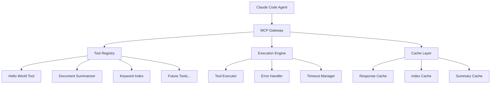

# Claude MPM MCP Gateway - Product Requirements Document

**Document Version:** 1.0  
**Date:** August 15, 2025  
**Product Manager:** Claude MPM Development Team  
**Engineering Lead:** TBD  
**Status:** Draft for Review

---

## Executive Summary

### Vision Statement
Create a universal Model Context Protocol (MCP) gateway for Claude MPM that enables seamless tool registration, execution, and management, starting with document summarization and keyword indexing to solve agent memory limitations.

### Problem Statement
Claude MPM agents currently face critical memory management issues when processing large documentation files. Claude Code retains entire file contents in memory, leading to:
- Token bloat (2000+ tokens for medium files)
- Context overflow exceeding 8KB agent memory limits
- Excessive API costs from repetitive file reading
- Reduced agent effectiveness on large codebases

### Solution Overview
Build a modular MCP gateway system that:
1. **Universal Tool Registration**: Allows dynamic registration and discovery of custom tools
2. **Memory-Efficient Processing**: Provides document summarization and keyword indexing instead of full file reads
3. **Extensible Architecture**: Enables easy addition of new tools and capabilities
4. **Seamless Integration**: Works within existing Claude Code and Claude MPM workflows

---

## Product Objectives

### Primary Goals
1. **Reduce Memory Usage**: Decrease agent token consumption by 60-80% for large documents
2. **Improve Agent Performance**: Enable effective processing of large codebases without memory constraints
3. **Enable Tool Extensibility**: Provide framework for community and internal tool development
4. **Maintain Developer Experience**: Seamless integration with existing Claude Code workflows

### Success Metrics
- **Memory Reduction**: 60-80% token reduction for large document processing
- **Performance Improvement**: 50% faster agent response times on large codebases
- **Tool Adoption**: 5+ tools registered within 3 months of launch
- **Developer Satisfaction**: 90%+ satisfaction in user feedback surveys

---

## User Stories & Requirements

### Epic 1: MCP Gateway Foundation

#### US-001: Universal Tool Registration
**As a** developer  
**I want to** register custom tools with the MCP gateway  
**So that** agents can discover and use my tools automatically

**Acceptance Criteria:**
- Tool registration via configuration files or API calls
- Dynamic tool discovery and loading
- Tool versioning and conflict resolution
- Automatic tool documentation generation

#### US-002: Tool Execution Framework
**As a** Claude MPM agent  
**I want to** execute registered tools through the gateway  
**So that** I can extend my capabilities without code changes

**Acceptance Criteria:**
- Standardized tool execution interface
- Error handling and timeout management
- Tool execution logging and monitoring
- Response caching for performance optimization

### Epic 2: Core Tools Implementation

#### US-003: Hello World Testing Tool
**As a** developer  
**I want to** test the MCP gateway with a simple hello world tool  
**So that** I can verify the system works before building complex tools

**Acceptance Criteria:**
- Simple echo/ping functionality
- Parameter passing and response handling
- Error testing capabilities
- Performance benchmarking features

#### US-004: Document Summarizer Tool
**As a** documentation agent  
**I want to** get document summaries instead of full content  
**So that** I can process large files without exceeding memory limits

**Acceptance Criteria:**
- Multiple summarization algorithms (LexRank, LSA, TextRank)
- Configurable summary length and compression ratios
- Support for multiple file formats (MD, TXT, RST, code files)
- Metadata preservation and source referencing

#### US-005: Keyword Index Tool
**As a** research agent  
**I want to** search documents by keywords and get relevant sections  
**So that** I can find specific information without reading entire files

**Acceptance Criteria:**
- Fast keyword indexing of document collections
- Semantic search capabilities
- Context-aware section extraction
- Relevance scoring and ranking

### Epic 3: Integration & Performance

#### US-006: Claude Code Integration
**As a** developer  
**I want to** use MCP tools transparently within Claude Code  
**So that** existing workflows continue working with enhanced capabilities

**Acceptance Criteria:**
- Automatic tool discovery in Claude Code sessions
- Seamless fallback to original tools when needed
- Consistent error handling and user experience
- Performance monitoring and optimization

---

## Technical Architecture

### System Overview



### Core Components

#### 1. MCP Gateway Server
```python
# Core gateway service
claude-mpm/
├── src/claude_mpm/
│   ├── mcp_gateway/
│   │   ├── __init__.py
│   │   ├── gateway_server.py        # Main MCP server
│   │   ├── tool_registry.py         # Tool registration system
│   │   ├── execution_engine.py      # Tool execution framework
│   │   └── cache_manager.py         # Response caching
│   ├── tools/
│   │   ├── __init__.py
│   │   ├── hello_world_tool.py      # Testing tool
│   │   ├── document_summarizer.py   # Document processing
│   │   └── keyword_indexer.py       # Search and indexing
│   └── config/
│       ├── mcp_gateway_config.yaml  # Gateway configuration
│       └── tools_config.yaml        # Tool-specific settings
```

#### 2. Tool Interface Specification
```python
from abc import ABC, abstractmethod
from typing import Dict, Any, Optional

class MCPTool(ABC):
    """Base interface for all MCP tools."""
    
    @property
    @abstractmethod
    def name(self) -> str:
        """Tool identifier."""
        pass
    
    @property
    @abstractmethod
    def description(self) -> str:
        """Tool description for documentation."""
        pass
    
    @property
    @abstractmethod
    def parameters(self) -> Dict[str, Any]:
        """JSON schema for tool parameters."""
        pass
    
    @abstractmethod
    async def execute(self, parameters: Dict[str, Any]) -> Dict[str, Any]:
        """Execute tool with given parameters."""
        pass
    
    @abstractmethod
    def validate_parameters(self, parameters: Dict[str, Any]) -> bool:
        """Validate input parameters."""
        pass
```

### Data Flow Architecture

#### Tool Registration Flow
1. Tool declares interface and capabilities
2. Gateway validates tool specification
3. Tool registered in dynamic registry
4. Tool becomes available to all agents

#### Tool Execution Flow
1. Agent requests tool execution via MCP protocol
2. Gateway validates request and parameters
3. Tool executed with timeout and error handling
4. Response cached and returned to agent

---

## Implementation Plan

### Phase 1: Foundation (Weeks 1-2)
**Deliverables:**
- MCP Gateway server with basic tool registry
- Hello World tool implementation
- Basic tool execution framework
- Unit tests and documentation

**Technical Tasks:**
- Implement `MCPGatewayServer` with MCP protocol support
- Create `ToolRegistry` with dynamic loading capabilities
- Build `HelloWorldTool` with comprehensive testing
- Set up development environment and CI/CD pipeline

### Phase 2: Core Tools (Weeks 3-4)
**Deliverables:**
- Document Summarizer tool with multiple algorithms
- Keyword Index tool with semantic search
- Tool caching and performance optimization
- Integration testing suite

**Technical Tasks:**
- Implement `DocumentSummarizer` with Sumy integration
- Build `KeywordIndexer` with full-text search capabilities
- Add response caching and performance monitoring
- Create comprehensive integration tests

### Phase 3: Integration & Polish (Weeks 5-6)
**Deliverables:**
- Claude Code MCP integration
- Performance optimization and monitoring
- Documentation and developer guides
- Beta testing with internal teams

**Technical Tasks:**
- Configure Claude Code to use MCP gateway automatically
- Implement performance monitoring and alerting
- Create developer documentation and examples
- Conduct beta testing and gather feedback

---

## Technical Specifications

### MCP Gateway Server Specification

#### Configuration
```yaml
# mcp_gateway_config.yaml
mcp_gateway:
  server:
    host: "localhost"
    port: 3001
    max_connections: 100
    timeout_seconds: 30
  
  cache:
    enabled: true
    ttl_seconds: 3600
    max_size_mb: 100
  
  logging:
    level: "INFO"
    file: "mcp_gateway.log"
    max_size_mb: 50
  
  tools:
    auto_discovery: true
    config_file: "tools_config.yaml"
    reload_interval: 300
```

#### Tool Configuration
```yaml
# tools_config.yaml
tools:
  hello_world:
    enabled: true
    module: "claude_mpm.tools.hello_world_tool"
    class: "HelloWorldTool"
    config:
      max_message_length: 1000
  
  document_summarizer:
    enabled: true
    module: "claude_mpm.tools.document_summarizer"
    class: "DocumentSummarizerTool"
    config:
      algorithms: ["lexrank", "lsa", "textrank"]
      default_algorithm: "lexrank"
      max_file_size_mb: 10
      cache_summaries: true
  
  keyword_indexer:
    enabled: true
    module: "claude_mpm.tools.keyword_indexer"
    class: "KeywordIndexerTool"
    config:
      index_path: "./mcp_indexes"
      max_results: 20
      enable_semantic_search: true
```

### Tool Specifications

#### Hello World Tool
```python
class HelloWorldTool(MCPTool):
    @property
    def name(self) -> str:
        return "hello_world"
    
    @property
    def description(self) -> str:
        return "Simple testing tool that echoes messages and provides system info"
    
    @property
    def parameters(self) -> Dict[str, Any]:
        return {
            "type": "object",
            "properties": {
                "message": {
                    "type": "string",
                    "description": "Message to echo back"
                },
                "include_system_info": {
                    "type": "boolean", 
                    "description": "Include system information in response",
                    "default": False
                }
            },
            "required": ["message"]
        }
```

#### Document Summarizer Tool
```python
class DocumentSummarizerTool(MCPTool):
    @property
    def name(self) -> str:
        return "document_summarizer"
    
    @property
    def parameters(self) -> Dict[str, Any]:
        return {
            "type": "object",
            "properties": {
                "file_path": {
                    "type": "string",
                    "description": "Path to document to summarize"
                },
                "algorithm": {
                    "type": "string",
                    "enum": ["lexrank", "lsa", "textrank"],
                    "default": "lexrank"
                },
                "sentence_count": {
                    "type": "integer",
                    "minimum": 1,
                    "maximum": 50,
                    "default": 5
                },
                "target_tokens": {
                    "type": "integer",
                    "minimum": 100,
                    "maximum": 2000,
                    "description": "Target token count (overrides sentence_count)"
                }
            },
            "required": ["file_path"]
        }
```

#### Keyword Indexer Tool
```python
class KeywordIndexerTool(MCPTool):
    @property
    def name(self) -> str:
        return "keyword_indexer"
    
    @property
    def parameters(self) -> Dict[str, Any]:
        return {
            "type": "object",
            "properties": {
                "query": {
                    "type": "string",
                    "description": "Search query or keywords"
                },
                "index_path": {
                    "type": "string",
                    "description": "Path to document collection to search"
                },
                "max_results": {
                    "type": "integer",
                    "minimum": 1,
                    "maximum": 50,
                    "default": 10
                },
                "include_context": {
                    "type": "boolean",
                    "description": "Include surrounding context for matches",
                    "default": true
                },
                "semantic_search": {
                    "type": "boolean",
                    "description": "Use semantic search instead of keyword matching",
                    "default": false
                }
            },
            "required": ["query", "index_path"]
        }
```

---

## Risk Assessment & Mitigation

### Technical Risks

#### High Priority
1. **MCP Protocol Compatibility**
   - *Risk*: Changes in MCP specification breaking compatibility
   - *Mitigation*: Implement robust version handling and backward compatibility

2. **Performance Impact**
   - *Risk*: Gateway adding latency to tool execution
   - *Mitigation*: Implement aggressive caching and async processing

3. **Tool Security**
   - *Risk*: Malicious tools compromising system security
   - *Mitigation*: Implement tool sandboxing and permission systems

#### Medium Priority
1. **Memory Management**
   - *Risk*: Large document processing causing memory issues
   - *Mitigation*: Implement streaming processing and memory limits

2. **Tool Conflicts**
   - *Risk*: Multiple tools with same name or conflicting behavior
   - *Mitigation*: Implement robust tool versioning and namespacing

### Product Risks

#### High Priority
1. **User Adoption**
   - *Risk*: Developers not adopting new tool system
   - *Mitigation*: Ensure seamless integration and clear value proposition

2. **Documentation Quality**
   - *Risk*: Poor summarization affecting agent performance
   - *Mitigation*: Implement multiple algorithms and quality metrics

---

## Success Criteria & KPIs

### Launch Criteria
- [ ] MCP Gateway handles 100+ concurrent tool requests
- [ ] Hello World tool achieves 99%+ uptime in testing
- [ ] Document Summarizer reduces token usage by 60%+ 
- [ ] Keyword Indexer provides relevant results in <500ms
- [ ] Claude Code integration works without workflow changes

### Post-Launch KPIs

#### Performance Metrics
- **Token Reduction**: 60-80% reduction in agent memory usage
- **Response Time**: <500ms for summarization, <200ms for keyword search
- **Uptime**: 99.9% gateway availability
- **Cache Hit Rate**: >70% for frequently accessed documents

#### Adoption Metrics
- **Tool Registration**: 5+ community tools within 3 months
- **Usage Growth**: 50% month-over-month increase in tool calls
- **Agent Efficiency**: 40% improvement in large codebase processing times

#### Quality Metrics
- **Error Rate**: <1% tool execution failures
- **User Satisfaction**: 90%+ positive feedback scores
- **Summary Quality**: 85%+ accuracy in semantic preservation tests

---

## Future Roadmap

### Phase 4: Advanced Features (Months 2-3)
- **Semantic Document Clustering**: Group related documents automatically
- **Multi-language Support**: Extend summarization to non-English content
- **Custom Algorithm Registry**: Allow users to register custom summarization algorithms
- **Real-time Index Updates**: Automatically update indexes when files change

### Phase 5: Enterprise Features (Months 4-6)
- **Tool Marketplace**: Community platform for sharing and discovering tools
- **Advanced Security**: Role-based access control and tool permissions
- **Performance Analytics**: Detailed metrics and optimization recommendations
- **Enterprise Integration**: Support for enterprise document management systems

### Community Ecosystem
- **Plugin Development Kit**: Comprehensive SDK for tool development
- **Documentation Portal**: Interactive guides and examples
- **Community Forums**: Support and collaboration platform
- **Certification Program**: Quality assurance for community tools

---

## Appendix

### Related Documents
- Claude MPM Architecture Overview
- MCP Protocol Specification
- Agent Memory System Design
- Performance Benchmarking Guidelines

### Glossary
- **MCP**: Model Context Protocol - standard for AI tool communication
- **Tool Registry**: System for discovering and managing available tools
- **LexRank**: Graph-based text summarization algorithm
- **Token**: Unit of text processing in language models
- **Semantic Search**: Search based on meaning rather than exact keywords