# Claude-MPM Codebase Visualizations

# Module Dependency Graph

# Architectural Layers

# Key Class Hierarchies

```mermaid
classDiagram
    ABC <|-- IServiceContainer
    ABC <|-- IConfigurationService
    ABC <|-- IConfigurationManager
    ABC <|-- ICacheService
    ABC <|-- IHealthMonitor
    ABC <|-- IAgentRegistry
    ABC <|-- IPromptCache
    ABC <|-- ITemplateManager
    ABC <|-- IServiceFactory
    ABC <|-- IStructuredLogger
    ABC <|-- IServiceLifecycle
    ABC <|-- IErrorHandler
    ABC <|-- IPerformanceMonitor
    ABC <|-- IEventBus
    ABC <|-- BaseService
    ABC <|-- EnhancedBaseService
    ABC <|-- BaseHook
    ABC <|-- BaseSectionGenerator
    Exception <|-- ConfigAliasError
    Exception <|-- GitOperationError
    ConfigAliasError <|-- AliasNotFoundError
    ConfigAliasError <|-- DuplicateAliasError
    ConfigAliasError <|-- InvalidDirectoryError
    Enum <|-- LaunchMode
    Enum <|-- AgentPriority
    Enum <|-- TaskStatus
    Enum <|-- WorktreeStatus
    Enum <|-- PromptTemplate
    Enum <|-- HookType
    Enum <|-- ProcessStatus
    Enum <|-- BaseAgentSection
    Enum <|-- LifecycleOperation
    Enum <|-- LifecycleState
    Enum <|-- ProfileTier
    Enum <|-- ProfileStatus
    Enum <|-- BranchStrategyType
    Enum <|-- BranchType
    Enum <|-- VersionBumpType
    Enum <|-- ConflictType
    Enum <|-- ResolutionStrategy
    Enum <|-- ModificationType
    Enum <|-- ModificationTier
    Enum <|-- ParentDirectoryAction
    Enum <|-- ParentDirectoryContext
    Enum <|-- DeploymentContext
    IServiceLifecycle <|-- EnhancedBaseService
    str <|-- AgentPriority
    str <|-- TaskStatus
    str <|-- WorktreeStatus
    str <|-- BaseAgentSection
    BaseHook <|-- SubmitHook
    BaseHook <|-- PreDelegationHook
    BaseHook <|-- PostDelegationHook
    BaseHook <|-- TicketExtractionHook
    PostDelegationHook <|-- ResultValidatorHook
    PostDelegationHook <|-- ResultMetricsHook
    TicketExtractionHook <|-- AutoTicketExtractionHook
    TicketExtractionHook <|-- TicketPriorityAnalyzerHook
    PreDelegationHook <|-- ContextFilterHook
    PreDelegationHook <|-- AgentCapabilityEnhancerHook
    class BaseService {
        +__init__()
        +start()
        +stop()
        +restart()
        +health_check()
    }
    class AgentRegistry {
        +__init__()
        +discover_agents()
        +get_agent()
        +list_agents()
        +listAgents()
    }
```

# Code Hotspots

# Improvement Roadmap

## Key Insights from Visualizations

1. **Module Dependencies**: The codebase shows clear separation between layers
2. **Architecture**: Well-defined layers with orchestration at the top
3. **Hotspots**: Several areas need refactoring for maintainability
4. **Improvement Path**: Phased approach starting with complexity reduction

## Next Steps

1. Create epic tickets for each improvement phase
2. Prioritize complexity reduction in identified hotspots
3. Establish metrics for tracking improvement progress
4. Set up automated quality gates to prevent regression