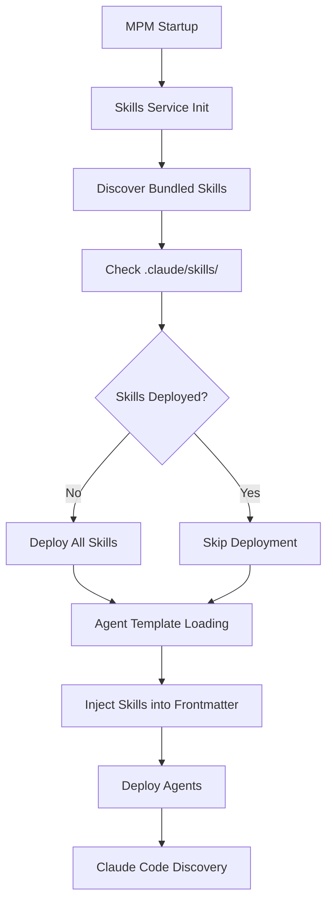

# Claude MPM Skills Integration Design Document

**Version:** 1.0.0  
**Date:** October 28, 2025  
**Status:** Design - Ready for Implementation  
**Target:** Claude Code 2.0.13+

## Executive Summary

This document specifies the integration of Claude Code Skills into Claude MPM's agent system. Skills will be automatically deployed on startup from a curated bundle, referenced in agent frontmatter via JSON templates, and made accessible to agents through a three-tier discovery system.

## Architecture Overview

### System Components

```
┌─────────────────────────────────────────────────────────────┐
│                    Claude MPM Startup                        │
└────────────────────┬────────────────────────────────────────┘
                     │
                     ▼
┌─────────────────────────────────────────────────────────────┐
│              Skills Deployment Service                       │
│  - Discovers bundled skills from source path                │
│  - Deploys to .claude/skills/ automatically                 │
│  - Validates SKILL.md format and metadata                   │
└────────────────────┬────────────────────────────────────────┘
                     │
                     ▼
┌─────────────────────────────────────────────────────────────┐
│           Agent Template Enhancement Service                 │
│  - Reads agent JSON templates                               │
│  - Injects skill references into frontmatter                │
│  - Generates markdown with embedded skills field            │
└────────────────────┬────────────────────────────────────────┘
                     │
                     ▼
┌─────────────────────────────────────────────────────────────┐
│              Agent Deployment (Existing)                     │
│  - Deploys agents to .claude/agents/                        │
│  - Agents now include skills frontmatter                    │
└────────────────────┬────────────────────────────────────────┘
                     │
                     ▼
┌─────────────────────────────────────────────────────────────┐
│            Claude Code Runtime (Native)                      │
│  - Discovers agents in .claude/agents/                      │
│  - Discovers skills in .claude/skills/                      │
│  - Progressive disclosure (30-50 tokens per skill)          │
└─────────────────────────────────────────────────────────────┘
```

### Directory Structure

```
claude-mpm/
├── src/
│   └── claude_mpm/
│       ├── skills/                    # NEW: Skills subsystem
│       │   ├── __init__.py
│       │   ├── skills_service.py      # Skills management
│       │   ├── skills_deployer.py     # Deployment logic
│       │   ├── skills_registry.py     # Skill-agent mappings
│       │   └── bundled/               # Built-in skills source
│       │       ├── development/
│       │       ├── testing/
│       │       ├── collaboration/
│       │       └── integration/
│       │
│       └── agents/
│           └── templates/             # ENHANCED: Agent templates
│               ├── engineer.json      # Now includes skills field
│               ├── qa.json
│               └── ...
│
├── .claude/                           # Runtime deployment target
│   ├── agents/                        # Agents (existing)
│   └── skills/                        # Skills (new)
│       ├── development/
│       ├── testing/
│       └── ...
│
└── config/
    └── skills_registry.yaml           # NEW: Skill mappings
```

## Skill-to-Agent Mappings

### Development Agents

#### engineer (General Software Development)

**Skills:**
- `test-driven-development` - Core TDD workflow
- `systematic-debugging` - Methodical debugging
- `code-review` - Quality review patterns
- `git-worktrees` - Advanced git workflows

**URLs:**
```yaml
test-driven-development:
  source: https://github.com/obra/superpowers-skills/tree/main/skills/testing/test-driven-development
  
systematic-debugging:
  source: https://github.com/obra/superpowers-skills/tree/main/skills/debugging/systematic-debugging
  
code-review:
  source: https://github.com/obra/superpowers-skills/tree/main/skills/collaboration/code-review
  
git-worktrees:
  source: https://github.com/obra/superpowers-skills/tree/main/skills/development/git-worktrees
```

#### python_engineer

**Skills:**
- `test-driven-development`
- `async-testing`
- `systematic-debugging`
- `data-analysis` (custom - to be created)

**URLs:**
```yaml
async-testing:
  source: https://github.com/obra/superpowers-skills/tree/main/skills/testing/async-testing
```

#### typescript_engineer / nextjs_engineer

**Skills:**
- `test-driven-development`
- `webapp-testing`
- `artifacts-builder`

**URLs:**
```yaml
webapp-testing:
  source: https://github.com/anthropics/skills/tree/main/webapp-testing
  
artifacts-builder:
  source: https://github.com/anthropics/skills/tree/main/artifacts-builder
```

#### golang_engineer

**Skills:**
- `test-driven-development`
- `systematic-debugging`
- `concurrency-patterns` (custom - to be created)

#### rust_engineer

**Skills:**
- `test-driven-development`
- `systematic-debugging`
- `memory-safety` (custom - to be created)

#### ruby_engineer

**Skills:**
- `test-driven-development`
- `systematic-debugging`

#### php_engineer

**Skills:**
- `test-driven-development`
- `systematic-debugging`

### Testing & QA Agents

#### qa (Quality Assurance)

**Skills:**
- `test-driven-development`
- `systematic-debugging`
- `verification`
- `testing-anti-patterns`
- `defense-in-depth`

**URLs:**
```yaml
verification:
  source: https://github.com/obra/superpowers-skills/tree/main/skills/debugging/verification
  
testing-anti-patterns:
  source: https://github.com/obra/superpowers-skills/tree/main/skills/testing/testing-anti-patterns
  
defense-in-depth:
  source: https://github.com/BehiSecc/awesome-claude-skills/tree/main/defense-in-depth
```

#### web_qa (Web Testing)

**Skills:**
- `webapp-testing`
- `test-driven-development`
- `playwright-browser-automation`

**URLs:**
```yaml
playwright-browser-automation:
  source: https://github.com/ComposioHQ/awesome-claude-skills/tree/main/playwright-browser-automation
```

### Research & Analysis Agents

#### research (Code Analysis)

**Skills:**
- `root-cause-tracing`
- `systematic-debugging`

**URLs:**
```yaml
root-cause-tracing:
  source: https://github.com/obra/superpowers-skills/tree/main/skills/debugging/root-cause-tracing
```

#### code_analyzer (Static Analysis)

**Skills:**
- `code-review`
- `systematic-debugging`
- `root-cause-tracing`

#### data_engineer

**Skills:**
- `csv-data-summarizer`
- `data-analysis` (custom)

**URLs:**
```yaml
csv-data-summarizer:
  source: https://github.com/ComposioHQ/awesome-claude-skills/tree/main/csv-data-summarizer
```

### Operations Agents

#### ops (Deployment & Operations)

**Skills:**
- `systematic-debugging`
- `verification`
- `deployment-checklist` (custom - to be created)

#### version_control (Git Management)

**Skills:**
- `git-worktrees`
- `finishing-branches`

**URLs:**
```yaml
finishing-branches:
  source: https://github.com/obra/superpowers-skills/tree/main/skills/development/finishing-branches
```

### Collaboration & Planning Agents

#### PM (Project Manager)

**Skills:**
- `brainstorming`
- `planning`
- `parallel-agents`

**URLs:**
```yaml
brainstorming:
  source: https://github.com/obra/superpowers-skills/tree/main/skills/collaboration/brainstorming
  
planning:
  source: https://github.com/obra/superpowers-skills/tree/main/skills/collaboration/planning
  
parallel-agents:
  source: https://github.com/obra/superpowers-skills/tree/main/skills/collaboration/parallel-agents
```

### Documentation Agents

#### documentation (Documentation Creation)

**Skills:**
- `internal-comms`
- `writing-clearly-and-concisely`
- `content-research-writer`

**URLs:**
```yaml
internal-comms:
  source: https://github.com/anthropics/skills/tree/main/internal-comms
  
writing-clearly-and-concisely:
  source: https://github.com/obra/superpowers-marketplace/tree/main/elements-of-style
  
content-research-writer:
  source: https://github.com/BehiSecc/awesome-claude-skills/tree/main/content-research-writer
```

### Integration & Tools Agents

#### Integration Specialist (New Custom Agent)

**Skills:**
- `mcp-builder`
- `skill-creator`

**URLs:**
```yaml
mcp-builder:
  source: https://github.com/anthropics/skills/tree/main/mcp-server
  
skill-creator:
  source: https://github.com/anthropics/skills/tree/main/skill-creator
```

### Specialized Agents

#### security (Security Analysis)

**Skills:**
- `defense-in-depth`
- `systematic-debugging`
- `security-audit` (custom - to be created)

#### refactoring_engineer

**Skills:**
- `code-review`
- `systematic-debugging`
- `test-driven-development`

#### web_ui (Frontend Development)

**Skills:**
- `artifacts-builder`
- `webapp-testing`
- `test-driven-development`

#### memory_manager / project_organizer

**Skills:**
- `file-organizer`

**URLs:**
```yaml
file-organizer:
  source: https://github.com/BehiSecc/awesome-claude-skills/tree/main/file-organizer
```

## JSON Template Enhancements

### Current Template Structure

```json
{
  "agent_id": "engineer",
  "version": "2.0.0",
  "metadata": {
    "name": "Software Engineer",
    "description": "Software development and implementation"
  },
  "capabilities": {
    "model": "claude-sonnet-4-20250514",
    "tools": ["Read", "Write", "Edit", "Bash"]
  }
}
```

### Enhanced Template with Skills

```json
{
  "agent_id": "engineer",
  "version": "2.1.0",
  "metadata": {
    "name": "Software Engineer",
    "description": "Software development and implementation"
  },
  "capabilities": {
    "model": "claude-sonnet-4-20250514",
    "tools": ["Read", "Write", "Edit", "Bash"]
  },
  "skills": {
    "required": [
      "test-driven-development",
      "systematic-debugging"
    ],
    "optional": [
      "code-review",
      "git-worktrees"
    ],
    "auto_load": true
  }
}
```

### Skills Field Specification

```typescript
interface AgentSkillsConfig {
  required: string[];      // Skills that must be present
  optional?: string[];     // Skills used if available
  auto_load?: boolean;     // Auto-inject into agent context
  load_strategy?: 'eager' | 'lazy' | 'on-demand';
}
```

**Load Strategies:**
- `eager`: Load full SKILL.md on agent startup
- `lazy`: Load when agent is invoked
- `on-demand`: Let Claude's progressive disclosure handle it (default)

### Frontmatter Generation

**Input (JSON Template):**
```json
{
  "agent_id": "qa",
  "skills": {
    "required": ["test-driven-development", "verification"],
    "auto_load": true
  }
}
```

**Output (Markdown with Frontmatter):**
```markdown
---
name: qa
description: Quality assurance specialist
tools: Read, Write, Bash, test_runner
skills:
  - test-driven-development
  - verification
  - testing-anti-patterns
version: 2.1.0
---

# QA Agent

You are a quality assurance specialist with access to testing skills.

When testing:
1. Claude will automatically use relevant skills from: test-driven-development, verification
2. Follow TDD patterns rigorously
3. Verify all assertions with evidence
```

## Implementation Specifications

### Phase 1: Skills Service Layer

#### File: `src/claude_mpm/skills/skills_service.py`

```python
from pathlib import Path
from typing import Dict, List, Optional, Any
import yaml
import shutil
from ..utils.logger_mixin import LoggerMixin

class SkillsService(LoggerMixin):
    """Manages Claude Code skills discovery, deployment, and registry."""
    
    def __init__(self):
        super().__init__()
        self.project_root = self._get_project_root()
        self.bundled_skills_path = Path(__file__).parent / "bundled"
        self.deployed_skills_path = self.project_root / ".claude" / "skills"
        self.registry_path = Path(__file__).parent.parent.parent.parent / "config" / "skills_registry.yaml"
        
        # Load registry
        self.registry = self._load_registry()
    
    def _load_registry(self) -> Dict[str, Any]:
        """Load skills registry mapping skills to agents."""
        if not self.registry_path.exists():
            self.logger.warning(f"Skills registry not found: {self.registry_path}")
            return {}
        
        with open(self.registry_path, 'r') as f:
            return yaml.safe_load(f)
    
    def discover_bundled_skills(self) -> List[Dict[str, Any]]:
        """Discover all skills in bundled directory."""
        skills = []
        
        if not self.bundled_skills_path.exists():
            self.logger.warning(f"Bundled skills path not found: {self.bundled_skills_path}")
            return skills
        
        for category_dir in self.bundled_skills_path.iterdir():
            if not category_dir.is_dir():
                continue
            
            for skill_dir in category_dir.iterdir():
                skill_md = skill_dir / "SKILL.md"
                if skill_md.exists():
                    metadata = self._parse_skill_metadata(skill_md)
                    skills.append({
                        'name': skill_dir.name,
                        'category': category_dir.name,
                        'path': skill_dir,
                        'metadata': metadata
                    })
        
        self.logger.info(f"Discovered {len(skills)} bundled skills")
        return skills
    
    def _parse_skill_metadata(self, skill_md: Path) -> Dict[str, Any]:
        """Extract YAML frontmatter from SKILL.md."""
        import re
        
        content = skill_md.read_text()
        match = re.match(r'^---\n(.*?)\n---', content, re.DOTALL)
        
        if not match:
            return {}
        
        try:
            return yaml.safe_load(match.group(1))
        except yaml.YAMLError as e:
            self.logger.error(f"Failed to parse skill metadata: {e}")
            return {}
    
    def deploy_bundled_skills(self, force: bool = False) -> Dict[str, Any]:
        """Deploy bundled skills to .claude/skills/ directory."""
        skills = self.discover_bundled_skills()
        deployed = []
        skipped = []
        errors = []
        
        self.deployed_skills_path.mkdir(parents=True, exist_ok=True)
        
        for skill in skills:
            try:
                target_dir = self.deployed_skills_path / skill['category'] / skill['name']
                
                # Check if already deployed
                if target_dir.exists() and not force:
                    skipped.append(skill['name'])
                    continue
                
                # Deploy skill
                target_dir.parent.mkdir(parents=True, exist_ok=True)
                if target_dir.exists():
                    shutil.rmtree(target_dir)
                shutil.copytree(skill['path'], target_dir)
                
                deployed.append(skill['name'])
                self.logger.debug(f"Deployed skill: {skill['name']}")
                
            except Exception as e:
                self.logger.error(f"Failed to deploy {skill['name']}: {e}")
                errors.append({'skill': skill['name'], 'error': str(e)})
        
        self.logger.info(f"Skills deployment: {len(deployed)} deployed, {len(skipped)} skipped, {len(errors)} errors")
        
        return {
            'deployed': deployed,
            'skipped': skipped,
            'errors': errors
        }
    
    def get_skills_for_agent(self, agent_id: str) -> List[str]:
        """Get list of skills assigned to specific agent."""
        if 'agent_skills' not in self.registry:
            return []
        
        agent_skills = self.registry['agent_skills'].get(agent_id, {})
        return agent_skills.get('required', []) + agent_skills.get('optional', [])
    
    def validate_skill(self, skill_name: str) -> Dict[str, Any]:
        """Validate skill structure and metadata."""
        # Find skill in deployed or bundled
        skill_paths = [
            self.deployed_skills_path,
            self.bundled_skills_path
        ]
        
        for base_path in skill_paths:
            for category_dir in base_path.iterdir():
                if not category_dir.is_dir():
                    continue
                skill_dir = category_dir / skill_name
                if skill_dir.exists():
                    return self._validate_skill_structure(skill_dir)
        
        return {'valid': False, 'errors': [f"Skill not found: {skill_name}"]}
    
    def _validate_skill_structure(self, skill_dir: Path) -> Dict[str, Any]:
        """Validate skill directory structure."""
        errors = []
        warnings = []
        
        # Check SKILL.md exists
        skill_md = skill_dir / "SKILL.md"
        if not skill_md.exists():
            errors.append("Missing SKILL.md")
            return {'valid': False, 'errors': errors}
        
        # Parse and validate metadata
        metadata = self._parse_skill_metadata(skill_md)
        
        if not metadata.get('name'):
            errors.append("Missing required field: name")
        
        if not metadata.get('description'):
            errors.append("Missing required field: description")
        
        if len(metadata.get('description', '')) < 10:
            warnings.append("Description should be at least 10 characters")
        
        # Check optional directories
        if (skill_dir / "scripts").exists():
            warnings.append("Contains scripts/ directory")
        
        if (skill_dir / "references").exists():
            warnings.append("Contains references/ directory")
        
        return {
            'valid': len(errors) == 0,
            'errors': errors,
            'warnings': warnings,
            'metadata': metadata
        }
```

### Phase 2: Agent Template Enhancement

#### File: `src/claude_mpm/skills/agent_skills_injector.py`

```python
from pathlib import Path
from typing import Dict, List, Any
import json
import yaml
from .skills_service import SkillsService
from ..utils.logger_mixin import LoggerMixin

class AgentSkillsInjector(LoggerMixin):
    """Injects skill references into agent templates and frontmatter."""
    
    def __init__(self, skills_service: SkillsService):
        super().__init__()
        self.skills_service = skills_service
    
    def enhance_agent_template(self, template_path: Path) -> Dict[str, Any]:
        """Add skills field to agent template JSON."""
        with open(template_path, 'r') as f:
            template = json.load(f)
        
        agent_id = template.get('agent_id')
        if not agent_id:
            self.logger.error(f"Template missing agent_id: {template_path}")
            return template
        
        # Get skills for this agent from registry
        skills = self.skills_service.get_skills_for_agent(agent_id)
        
        if skills:
            template['skills'] = {
                'required': skills[:2] if len(skills) > 2 else skills,  # First 2 are required
                'optional': skills[2:] if len(skills) > 2 else [],      # Rest are optional
                'auto_load': True
            }
            self.logger.info(f"Enhanced {agent_id} with {len(skills)} skills")
        
        return template
    
    def generate_frontmatter_with_skills(self, agent_config: Dict[str, Any]) -> str:
        """Generate YAML frontmatter including skills field."""
        frontmatter = {
            'name': agent_config.get('agent_id'),
            'description': agent_config.get('metadata', {}).get('description'),
            'version': agent_config.get('version'),
            'tools': agent_config.get('capabilities', {}).get('tools', [])
        }
        
        # Add skills if present
        if 'skills' in agent_config:
            skills_config = agent_config['skills']
            all_skills = skills_config.get('required', []) + skills_config.get('optional', [])
            if all_skills:
                frontmatter['skills'] = all_skills
        
        # Convert to YAML
        yaml_str = yaml.dump(frontmatter, default_flow_style=False, sort_keys=False)
        return f"---\n{yaml_str}---\n"
    
    def inject_skills_documentation(self, agent_content: str, skills: List[str]) -> str:
        """Inject skills documentation reference into agent instructions."""
        skills_section = "\n\n## Available Skills\n\n"
        skills_section += "You have access to the following skills that will be loaded when relevant:\n\n"
        
        for skill in skills:
            skills_section += f"- **{skill}**: Automatically activated when needed\n"
        
        skills_section += "\nClaude will automatically read these skills when your task matches their descriptions.\n"
        
        # Insert after frontmatter
        if '---' in agent_content:
            parts = agent_content.split('---', 2)
            if len(parts) >= 3:
                return f"{parts[0]}---{parts[1]}---{skills_section}{parts[2]}"
        
        return agent_content + skills_section
```

### Phase 3: Startup Integration

#### File: `src/claude_mpm/__init__.py` (Enhanced)

```python
def initialize_mpm():
    """Initialize Claude MPM including skills deployment."""
    from .skills.skills_service import SkillsService
    
    # Existing initialization...
    
    # Deploy skills on startup
    skills_service = SkillsService()
    deployment_result = skills_service.deploy_bundled_skills()
    
    if deployment_result['deployed']:
        logger.info(f"✓ Deployed {len(deployment_result['deployed'])} skills")
    
    if deployment_result['errors']:
        logger.warning(f"⚠ {len(deployment_result['errors'])} skills failed to deploy")
```

### Phase 4: CLI Commands

#### Add to `src/claude_mpm/cli.py`

```python
@cli.group('skills')
def skills_commands():
    """Manage Claude Code skills."""
    pass

@skills_commands.command('list')
@click.option('--category', help='Filter by category')
@click.option('--agent', help='Show skills for specific agent')
def list_skills(category, agent):
    """List available skills."""
    from .skills.skills_service import SkillsService
    
    service = SkillsService()
    
    if agent:
        skills = service.get_skills_for_agent(agent)
        click.echo(f"Skills for {agent}:")
        for skill in skills:
            click.echo(f"  - {skill}")
    else:
        skills = service.discover_bundled_skills()
        
        if category:
            skills = [s for s in skills if s['category'] == category]
        
        for skill in skills:
            click.echo(f"{skill['name']} ({skill['category']})")
            if desc := skill['metadata'].get('description'):
                click.echo(f"  {desc}")

@skills_commands.command('deploy')
@click.option('--force', is_flag=True, help='Force redeployment')
def deploy_skills(force):
    """Deploy bundled skills to project."""
    from .skills.skills_service import SkillsService
    
    service = SkillsService()
    result = service.deploy_bundled_skills(force=force)
    
    click.echo(f"✓ Deployed: {len(result['deployed'])} skills")
    if result['skipped']:
        click.echo(f"⊘ Skipped: {len(result['skipped'])} skills (use --force to redeploy)")
    if result['errors']:
        click.echo(f"✗ Errors: {len(result['errors'])} skills")

@skills_commands.command('validate')
@click.argument('skill_name')
def validate_skill(skill_name):
    """Validate skill structure and metadata."""
    from .skills.skills_service import SkillsService
    
    service = SkillsService()
    result = service.validate_skill(skill_name)
    
    if result['valid']:
        click.echo(f"✓ {skill_name} is valid")
    else:
        click.echo(f"✗ {skill_name} has errors:")
        for error in result['errors']:
            click.echo(f"  - {error}")
    
    if result.get('warnings'):
        click.echo("Warnings:")
        for warning in result['warnings']:
            click.echo(f"  - {warning}")
```

## Configuration: Skills Registry

### File: `config/skills_registry.yaml`

```yaml
version: 1.0.0
last_updated: 2025-10-28

# Skill source repositories
skill_sources:
  superpowers:
    repo: https://github.com/obra/superpowers-skills
    license: MIT
    maintainer: Jesse Vincent
    
  anthropic:
    repo: https://github.com/anthropics/skills
    license: MIT
    maintainer: Anthropic
    
  community:
    repos:
      - https://github.com/BehiSecc/awesome-claude-skills
      - https://github.com/ComposioHQ/awesome-claude-skills
    license: Various

# Agent-to-skills mappings
agent_skills:
  engineer:
    required:
      - test-driven-development
      - systematic-debugging
    optional:
      - code-review
      - git-worktrees
    
  python_engineer:
    required:
      - test-driven-development
      - systematic-debugging
    optional:
      - async-testing
  
  typescript_engineer:
    required:
      - test-driven-development
      - webapp-testing
    optional:
      - artifacts-builder
  
  nextjs_engineer:
    required:
      - test-driven-development
      - webapp-testing
    optional:
      - artifacts-builder
  
  golang_engineer:
    required:
      - test-driven-development
      - systematic-debugging
  
  rust_engineer:
    required:
      - test-driven-development
      - systematic-debugging
  
  ruby_engineer:
    required:
      - test-driven-development
      - systematic-debugging
  
  php_engineer:
    required:
      - test-driven-development
      - systematic-debugging
  
  qa:
    required:
      - test-driven-development
      - verification
    optional:
      - testing-anti-patterns
      - defense-in-depth
  
  web_qa:
    required:
      - webapp-testing
      - test-driven-development
    optional:
      - playwright-browser-automation
  
  research:
    required:
      - root-cause-tracing
      - systematic-debugging
  
  code_analyzer:
    required:
      - code-review
      - systematic-debugging
    optional:
      - root-cause-tracing
  
  data_engineer:
    required:
      - csv-data-summarizer
  
  ops:
    required:
      - systematic-debugging
      - verification
  
  version_control:
    required:
      - git-worktrees
    optional:
      - finishing-branches
  
  documentation:
    required:
      - internal-comms
    optional:
      - writing-clearly-and-concisely
      - content-research-writer
  
  security:
    required:
      - defense-in-depth
      - systematic-debugging
  
  refactoring_engineer:
    required:
      - code-review
      - systematic-debugging
      - test-driven-development
  
  web_ui:
    required:
      - artifacts-builder
      - webapp-testing
      - test-driven-development
  
  project_organizer:
    optional:
      - file-organizer

# Skill metadata
skills_metadata:
  test-driven-development:
    category: testing
    source: superpowers
    url: https://github.com/obra/superpowers-skills/tree/main/skills/testing/test-driven-development
    description: "Enforces RED/GREEN/REFACTOR TDD cycle"
    
  systematic-debugging:
    category: debugging
    source: superpowers
    url: https://github.com/obra/superpowers-skills/tree/main/skills/debugging/systematic-debugging
    description: "Methodical debugging instead of random changes"
    
  root-cause-tracing:
    category: debugging
    source: superpowers
    url: https://github.com/obra/superpowers-skills/tree/main/skills/debugging/root-cause-tracing
    description: "Trace bugs backward through call stack"
    
  verification:
    category: debugging
    source: superpowers
    url: https://github.com/obra/superpowers-skills/tree/main/skills/debugging/verification
    description: "Validate fixes work as intended"
    
  code-review:
    category: collaboration
    source: superpowers
    url: https://github.com/obra/superpowers-skills/tree/main/skills/collaboration/code-review
    description: "Structured code review process"
    
  brainstorming:
    category: collaboration
    source: superpowers
    url: https://github.com/obra/superpowers-skills/tree/main/skills/collaboration/brainstorming
    description: "Structured design refinement"
    
  planning:
    category: collaboration
    source: superpowers
    url: https://github.com/obra/superpowers-skills/tree/main/skills/collaboration/planning
    description: "Create implementation plans"
    
  parallel-agents:
    category: collaboration
    source: superpowers
    url: https://github.com/obra/superpowers-skills/tree/main/skills/collaboration/parallel-agents
    description: "Coordinate multiple agent workflows"
    
  git-worktrees:
    category: development
    source: superpowers
    url: https://github.com/obra/superpowers-skills/tree/main/skills/development/git-worktrees
    description: "Advanced git workflow management"
    
  finishing-branches:
    category: development
    source: superpowers
    url: https://github.com/obra/superpowers-skills/tree/main/skills/development/finishing-branches
    description: "Complete feature branches properly"
    
  async-testing:
    category: testing
    source: superpowers
    url: https://github.com/obra/superpowers-skills/tree/main/skills/testing/async-testing
    description: "Patterns for testing asynchronous code"
    
  testing-anti-patterns:
    category: testing
    source: superpowers
    url: https://github.com/obra/superpowers-skills/tree/main/skills/testing/testing-anti-patterns
    description: "Identify and avoid common testing mistakes"
    
  webapp-testing:
    category: testing
    source: anthropic
    url: https://github.com/anthropics/skills/tree/main/webapp-testing
    description: "Test local web applications using Playwright"
    
  artifacts-builder:
    category: development
    source: anthropic
    url: https://github.com/anthropics/skills/tree/main/artifacts-builder
    description: "Build complex HTML artifacts with React/Tailwind"
    
  mcp-builder:
    category: integration
    source: anthropic
    url: https://github.com/anthropics/skills/tree/main/mcp-server
    description: "Create high-quality MCP servers"
    
  skill-creator:
    category: meta
    source: anthropic
    url: https://github.com/anthropics/skills/tree/main/skill-creator
    description: "Interactive skill creation tool"
    
  internal-comms:
    category: documentation
    source: anthropic
    url: https://github.com/anthropics/skills/tree/main/internal-comms
    description: "Write status reports, newsletters, FAQs"
    
  csv-data-summarizer:
    category: data
    source: community
    url: https://github.com/ComposioHQ/awesome-claude-skills/tree/main/csv-data-summarizer
    description: "Automatic CSV analysis and visualization"
    
  defense-in-depth:
    category: security
    source: community
    url: https://github.com/BehiSecc/awesome-claude-skills/tree/main/defense-in-depth
    description: "Multi-layered testing and security"
    
  playwright-browser-automation:
    category: testing
    source: community
    url: https://github.com/ComposioHQ/awesome-claude-skills/tree/main/playwright-browser-automation
    description: "Model-invoked Playwright automation"
    
  file-organizer:
    category: organization
    source: community
    url: https://github.com/BehiSecc/awesome-claude-skills/tree/main/file-organizer
    description: "Intelligently organize files and folders"
    
  writing-clearly-and-concisely:
    category: documentation
    source: superpowers
    url: https://github.com/obra/superpowers-marketplace/tree/main/elements-of-style
    description: "Writing guidance from Elements of Style"
    
  content-research-writer:
    category: documentation
    source: community
    url: https://github.com/BehiSecc/awesome-claude-skills/tree/main/content-research-writer
    description: "Research-backed content with citations"
```

## Deployment Workflow

### Automatic Deployment (Default)



### Manual Deployment

```bash
# Deploy all skills
claude-mpm skills deploy

# Force redeploy
claude-mpm skills deploy --force

# List deployed skills
claude-mpm skills list

# Validate specific skill
claude-mpm skills validate test-driven-development
```

## Testing Strategy

### Unit Tests

```python
# tests/test_skills_service.py

def test_discover_bundled_skills():
    """Test skill discovery from bundled directory."""
    service = SkillsService()
    skills = service.discover_bundled_skills()
    
    assert len(skills) > 0
    assert all('name' in skill for skill in skills)
    assert all('category' in skill for skill in skills)

def test_deploy_skills():
    """Test skills deployment."""
    service = SkillsService()
    result = service.deploy_bundled_skills()
    
    assert 'deployed' in result
    assert 'errors' in result
    assert len(result['errors']) == 0

def test_get_skills_for_agent():
    """Test skill-agent mapping."""
    service = SkillsService()
    skills = service.get_skills_for_agent('engineer')
    
    assert 'test-driven-development' in skills
    assert 'systematic-debugging' in skills

def test_validate_skill_structure():
    """Test skill validation."""
    service = SkillsService()
    result = service.validate_skill('test-driven-development')
    
    assert result['valid'] is True
    assert len(result['errors']) == 0
```

### Integration Tests

```python
# tests/integration/test_skills_integration.py

def test_end_to_end_skills_deployment():
    """Test complete skills deployment workflow."""
    # 1. Deploy skills
    skills_service = SkillsService()
    deploy_result = skills_service.deploy_bundled_skills()
    
    assert len(deploy_result['deployed']) > 0
    
    # 2. Enhance agent template
    injector = AgentSkillsInjector(skills_service)
    template = injector.enhance_agent_template(
        Path('src/claude_mpm/agents/templates/engineer.json')
    )
    
    assert 'skills' in template
    
    # 3. Generate frontmatter
    frontmatter = injector.generate_frontmatter_with_skills(template)
    
    assert 'skills:' in frontmatter
    assert 'test-driven-development' in frontmatter
```

## Migration Plan

### Phase 1: Infrastructure (Week 1)

**Deliverables:**
- `SkillsService` implementation
- Skills bundled directory structure
- Basic deployment logic
- Unit tests

**Acceptance Criteria:**
- Skills deploy successfully to `.claude/skills/`
- CLI commands work: `list`, `deploy`, `validate`
- All tests pass

### Phase 2: Agent Integration (Week 2)

**Deliverables:**
- `AgentSkillsInjector` implementation
- Enhanced JSON templates with skills field
- Frontmatter generation with skills
- Integration tests

**Acceptance Criteria:**
- Agent templates include skills field
- Deployed agents have skills in frontmatter
- Skills properly referenced

### Phase 3: Skills Content (Week 3)

**Deliverables:**
- Download and bundle priority skills
- Create `skills_registry.yaml`
- Validate all bundled skills
- Documentation

**Acceptance Criteria:**
- 15+ priority skills bundled
- All skills validate successfully
- Registry maps skills to agents

### Phase 4: Testing & Documentation (Week 4)

**Deliverables:**
- Comprehensive test suite
- User documentation
- Developer guide
- Migration guide

**Acceptance Criteria:**
- >80% test coverage
- Documentation complete
- Existing functionality preserved

## Security Considerations

### Skill Validation

```python
def validate_skill_security(skill_path: Path) -> Dict[str, Any]:
    """Check skill for security concerns."""
    concerns = []
    
    # Check for network access in scripts
    if (skill_path / "scripts").exists():
        for script in (skill_path / "scripts").iterdir():
            content = script.read_text()
            if 'requests.' in content or 'urllib' in content:
                concerns.append(f"Network access in {script.name}")
    
    # Check for file system access
    if 'os.system' in content or 'subprocess' in content:
        concerns.append("System command execution detected")
    
    return {'secure': len(concerns) == 0, 'concerns': concerns}
```

### Source Verification

- Only bundle skills from trusted sources
- Verify git repository authenticity
- Review all scripts before bundling
- Maintain allow list of repositories

## Performance Optimization

### Lazy Loading

```python
def get_agent_with_skills(agent_id: str, load_strategy: str = 'lazy'):
    """Load agent with appropriate skill loading strategy."""
    
    if load_strategy == 'eager':
        # Load all skills immediately
        skills = load_all_skills_content(agent_id)
        return inject_skills_in_context(agent_id, skills)
    
    elif load_strategy == 'lazy':
        # Load skills on first use
        return setup_lazy_skill_loader(agent_id)
    
    else:  # on-demand (default)
        # Let Claude's progressive disclosure handle it
        return load_agent_with_skill_references(agent_id)
```

### Caching

```python
@lru_cache(maxsize=128)
def get_skill_metadata(skill_name: str) -> Dict[str, Any]:
    """Cache skill metadata for fast access."""
    return parse_skill_frontmatter(skill_name)
```

## Monitoring & Observability

### Logging

```python
# Log skill deployment
logger.info(f"Skills deployed: {deployed_count}")
logger.debug(f"Deployment details: {deployment_result}")

# Log skill usage (if tracking implemented)
logger.info(f"Agent {agent_id} activated skill: {skill_name}")
```

### Metrics

- Skills deployment success rate
- Agent-skill coverage (% agents with skills)
- Skill validation failures
- Deployment time

## Future Enhancements

### Dynamic Skill Installation

```bash
# Install skill from repository
claude-mpm skills install \
  --repo https://github.com/user/custom-skill \
  --name my-custom-skill

# Install specific version
claude-mpm skills install my-skill@2.0.0
```

### Skill Marketplace Integration

```python
def search_skill_marketplace(query: str) -> List[Dict]:
    """Search public skill repositories."""
    # Integrate with GitHub search API
    # Return matching skills with metadata
    pass
```

### Skill Analytics

```python
def track_skill_usage():
    """Track which skills are used by which agents."""
    # Implementation for usage analytics
    pass
```

## Appendix

### Complete Skill URLs Reference

```yaml
superpowers_skills:
  base_url: https://github.com/obra/superpowers-skills/tree/main/skills
  skills:
    testing:
      - test-driven-development
      - async-testing
      - testing-anti-patterns
    debugging:
      - systematic-debugging
      - root-cause-tracing
      - verification
    collaboration:
      - brainstorming
      - planning
      - code-review
      - parallel-agents
    development:
      - git-worktrees
      - finishing-branches

anthropic_skills:
  base_url: https://github.com/anthropics/skills/tree/main
  skills:
    - webapp-testing
    - artifacts-builder
    - mcp-server (aka mcp-builder)
    - skill-creator
    - internal-comms
    - brand-guidelines

community_skills:
  behisecc:
    base_url: https://github.com/BehiSecc/awesome-claude-skills/tree/main
    skills:
      - defense-in-depth
      - content-research-writer
      - file-organizer
      - systematic-debugging
  
  composio:
    base_url: https://github.com/ComposioHQ/awesome-claude-skills/tree/main
    skills:
      - csv-data-summarizer
      - playwright-browser-automation
      - skill-seekers

superpowers_marketplace:
  base_url: https://github.com/obra/superpowers-marketplace/tree/main
  skills:
    - elements-of-style (aka writing-clearly-and-concisely)
```

### Example Agent Template with Skills

```json
{
  "agent_id": "engineer",
  "version": "2.1.0",
  "metadata": {
    "name": "Software Engineer",
    "description": "Software development and implementation",
    "category": "core-development",
    "tags": ["coding", "implementation", "tdd"]
  },
  "capabilities": {
    "model": "claude-sonnet-4-20250514",
    "resource_tier": "standard",
    "tools": ["Read", "Write", "Edit", "MultiEdit", "Bash", "Grep", "Glob"],
    "max_concurrent_tasks": 3
  },
  "skills": {
    "required": [
      "test-driven-development",
      "systematic-debugging"
    ],
    "optional": [
      "code-review",
      "git-worktrees"
    ],
    "auto_load": true,
    "load_strategy": "on-demand"
  },
  "dependencies": {
    "python": ["pytest>=7.0.0"],
    "system": ["git"],
    "optional": false
  },
  "instructions": "# Software Engineer Agent\n\nYou are a software development specialist..."
}
```

---

**Document Status:** Ready for Implementation  
**Next Steps:**
1. Review and approve design
2. Implement Phase 1 (Skills Service)
3. Create bundled skills directory
4. Implement Phase 2 (Agent Integration)
5. Bundle priority skills
6. Test and validate
7. Document and deploy

**Questions/Decisions Needed:**
1. Approve skill bundling approach (local vs. git submodules)
2. Confirm priority skills list (currently 15 core skills)
3. Decide on load strategy default (recommend: on-demand)
4. Approve security validation requirements
5. Confirm deployment trigger (startup vs. explicit command)
