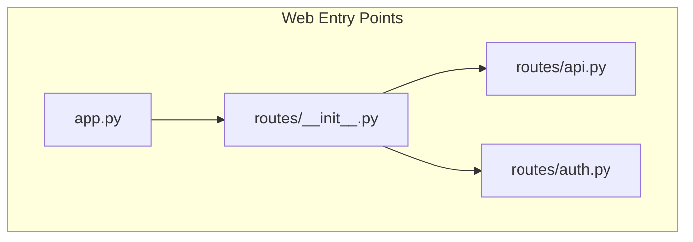
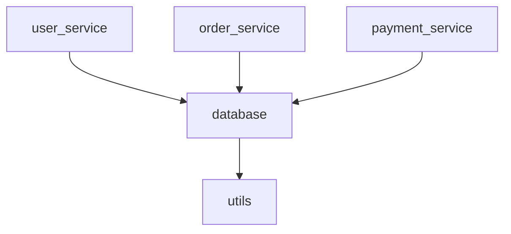
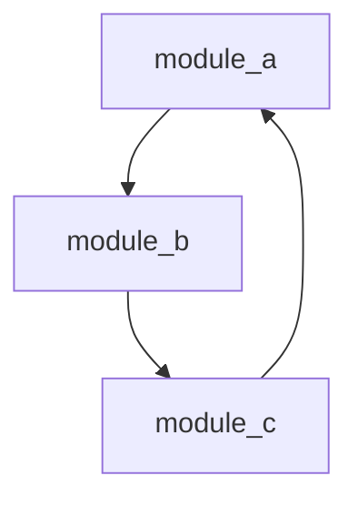
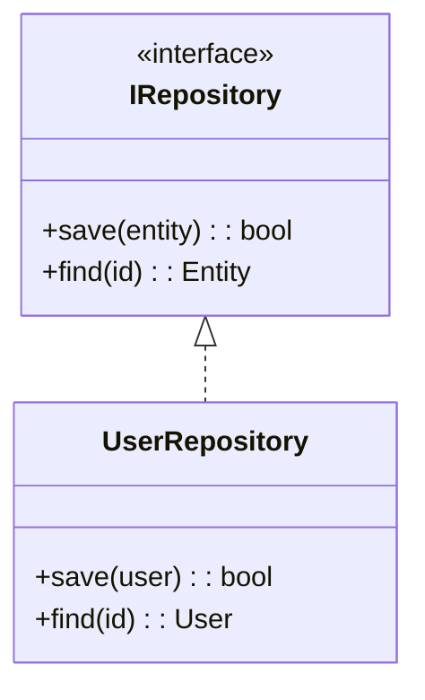
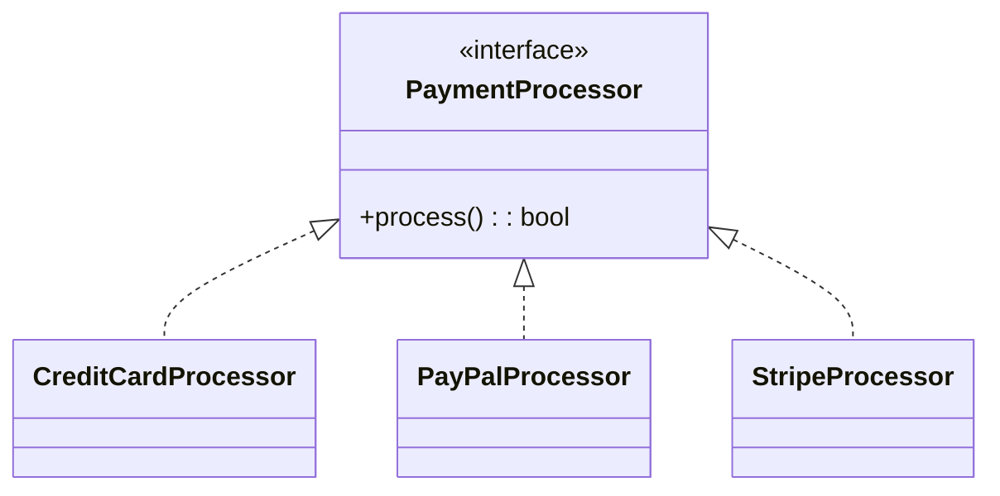
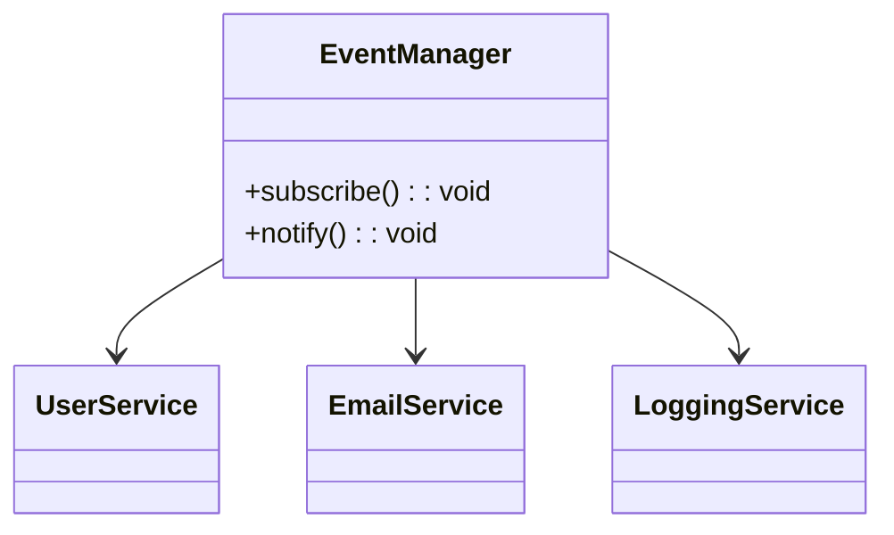

# Code Visualization Best Practices Guide

This guide provides best practices, patterns, and troubleshooting advice for effectively using Mermaid diagram generation with the Code Analyzer agent in Claude MPM.

## Table of Contents

1. [Visualization Strategy](#visualization-strategy)
2. [Diagram Type Selection](#diagram-type-selection)
3. [Performance Optimization](#performance-optimization)
4. [Integration Patterns](#integration-patterns)
5. [Code Quality Insights](#code-quality-insights)
6. [Documentation Workflows](#documentation-workflows)
7. [Troubleshooting](#troubleshooting)
8. [Advanced Techniques](#advanced-techniques)

## Visualization Strategy

### When to Generate Diagrams

**✅ Best Use Cases:**
- **Architecture Review** - Understanding overall system structure
- **Onboarding** - Helping new developers understand codebase
- **Refactoring Planning** - Identifying tightly coupled components
- **Documentation** - Visual documentation for technical specs
- **Code Review** - Visualizing impact of changes
- **Legacy Code Analysis** - Understanding undocumented systems

**❌ Avoid When:**
- Code is very simple (< 5 files)
- Diagrams would be too complex (> 50 nodes)
- Dynamic/runtime-only relationships dominate
- Time-sensitive debugging (use direct analysis instead)

### Progressive Analysis Approach

Start broad, then focus:

```bash
# 1. Start with overview
claude-mpm analyze . --mermaid-types entry_points,module_deps --save-diagrams

# 2. Focus on specific areas
claude-mpm analyze ./core --mermaid-types class_hierarchy

# 3. Deep dive into problem areas  
claude-mpm analyze ./auth --mermaid-types call_graph --focus authentication,login
```

## Diagram Type Selection

### Entry Points Diagrams

**When to use:**
- New project analysis
- Understanding application startup
- Documenting initialization sequence
- Planning deployment strategies

**Best practices:**
```bash
# Focus on main entry points
claude-mpm analyze . --mermaid-types entry_points --focus "main,app,server"

# Good for web applications
claude-mpm analyze . --mermaid-types entry_points --focus "routes,controllers"

# CLI tools analysis
claude-mpm analyze . --mermaid-types entry_points --focus "cli,commands"
```

**Example output interpretation:**

**Insight**: Application has well-separated route modules, good for microservices.

### Module Dependencies

**When to use:**
- Architecture analysis
- Identifying circular imports
- Planning refactoring
- Understanding coupling

**Best practices:**
```bash
# Exclude external dependencies for clarity
claude-mpm analyze . --mermaid-types module_deps --focus internal

# Focus on core business logic
claude-mpm analyze . --mermaid-types module_deps --focus "core,business,domain"
```

**Pattern recognition:**

**Insight**: Good separation of concerns, shared database layer.

**Anti-pattern:**

**Insight**: Circular dependency - needs refactoring.

### Class Hierarchy

**When to use:**
- Object-oriented design review
- Understanding inheritance patterns
- API design documentation
- Design pattern identification

**Best practices:**
```bash
# Focus on specific class families
claude-mpm analyze ./models --mermaid-types class_hierarchy

# Service layer analysis
claude-mpm analyze ./services --mermaid-types class_hierarchy --focus service,manager
```

**Good design patterns:**

**Insight**: Clean interface segregation, testable design.

### Call Graph

**When to use:**
- Performance analysis
- Understanding execution flow
- Debugging complex interactions
- Security analysis (data flow)

**Best practices:**
```bash
# Focus on specific feature flows
claude-mpm analyze . --mermaid-types call_graph --focus "login,authenticate"

# API endpoint analysis
claude-mpm analyze ./api --mermaid-types call_graph --focus "endpoint,handler"
```

## Performance Optimization

### Large Codebase Strategies

**Incremental Analysis:**
```bash
# Analyze by layer
claude-mpm analyze ./models --mermaid-types class_hierarchy
claude-mpm analyze ./services --mermaid-types class_hierarchy  
claude-mpm analyze ./controllers --mermaid-types call_graph

# Analyze by feature
claude-mpm analyze . --focus user --mermaid --save-diagrams
claude-mpm analyze . --focus payment --mermaid --save-diagrams
```

**Memory Management:**
```bash
# Use focus to limit scope
claude-mpm analyze . --focus "core,main" --mermaid

# Analyze specific directories
find ./src -type d -name "test*" -prune -o -type d -print | \
  head -10 | xargs -I {} claude-mpm analyze {} --mermaid-types module_deps
```

### Caching Strategy

```bash
# Generate base diagrams once
claude-mpm analyze . --mermaid --save-diagrams --diagram-output ./docs/architecture

# Update only changed areas
claude-mpm analyze ./new_feature --mermaid --save-diagrams --diagram-output ./docs/architecture
```

## Integration Patterns

### CI/CD Integration

**GitHub Actions Example:**
```yaml
name: Update Architecture Docs
on:
  push:
    branches: [main]
    paths: ['src/**/*.py']

jobs:
  update-diagrams:
    runs-on: ubuntu-latest
    steps:
      - uses: actions/checkout@v3
      - name: Setup Claude MPM
        run: pip install claude-mpm
      - name: Generate Diagrams
        run: |
          claude-mpm analyze ./src --mermaid --save-diagrams --diagram-output ./docs/diagrams
          git add docs/diagrams/
          git diff --staged --quiet || git commit -m "Update architecture diagrams [skip ci]"
          git push
```

### Documentation Integration

**README.md Integration:**
```markdown
# Project Architecture

## Entry Points
```mermaid
<!-- Include generated diagram -->
```

## Module Dependencies  

```

**Sphinx/MkDocs Integration:**
```bash
# Generate diagrams for docs build
claude-mpm analyze . --mermaid --save-diagrams --diagram-output ./docs/source/_static/diagrams
```

### Code Review Workflow

**Pre-review Analysis:**
```bash
# Analyze changes in feature branch
git checkout feature/payment-system
claude-mpm analyze . --focus payment --mermaid --save-diagrams

# Compare with main branch diagrams
git checkout main
claude-mpm analyze . --focus payment --mermaid --save-diagrams --diagram-output ./diagrams-main
```

## Code Quality Insights

### Identifying Architectural Issues

**Tight Coupling Detection:**
```bash
# Look for dense module dependencies
claude-mpm analyze . --mermaid-types module_deps
```

**Signs of tight coupling:**
- Many bidirectional arrows
- Star patterns (one module connected to many)
- Deep dependency chains

**God Object Detection:**
```bash
# Classes with many relationships
claude-mpm analyze . --mermaid-types class_hierarchy
```

**Signs of god objects:**
- Very large class boxes
- Many inheritance/composition arrows
- Central hub in class diagram

**Circular Dependency Detection:**
```bash
claude-mpm analyze . --mermaid-types module_deps --format json > deps.json
# Then analyze JSON for circular references
```

### Design Pattern Recognition

**Strategy Pattern:**


**Observer Pattern:**


## Documentation Workflows

### Living Documentation

**Automated Updates:**
```bash
#!/bin/bash
# docs/update-architecture.sh

# Generate fresh diagrams
claude-mpm analyze . --mermaid --save-diagrams --diagram-output ./docs/diagrams

# Convert to different formats if needed
for diagram in docs/diagrams/*.mmd; do
    # Convert to PNG using mermaid-cli if available
    if command -v mmdc &> /dev/null; then
        mmdc -i "$diagram" -o "${diagram%.mmd}.png"
    fi
done

echo "Architecture diagrams updated"
```

**Documentation Standards:**
1. **File naming**: Use consistent names (`module_deps.mmd`, `class_hierarchy.mmd`)
2. **Metadata**: Include generation info in metadata versions
3. **Version control**: Track diagram changes to see evolution
4. **Regular updates**: Automate updates with code changes

### Multi-format Output

```bash
# Generate for different audiences
claude-mpm analyze . --mermaid --format markdown --output TECHNICAL_OVERVIEW.md
claude-mpm analyze . --mermaid --format json --output analysis-data.json
claude-mpm analyze . --mermaid --save-diagrams --diagram-output ./diagrams
```

## Troubleshooting

### Common Issues and Solutions

#### 1. No Diagrams Generated

**Problem**: Command runs but no diagrams appear
**Diagnosis:**
```bash
# Enable debug logging
export CLAUDE_MPM_LOG_LEVEL=DEBUG
claude-mpm analyze . --mermaid
```

**Solutions:**
- Check if target contains analyzable code
- Try different diagram types: `--mermaid-types entry_points`
- Verify file permissions and paths
- Use `--focus` to target specific areas

#### 2. Empty or Minimal Diagrams

**Problem**: Diagrams generated but very simple
**Common causes:**
- Dynamic imports not detected
- Complex runtime relationships
- Code uses reflection/metaprogramming

**Solutions:**
```bash
# Try different analysis focus
claude-mpm analyze . --focus "class,function,method" --mermaid-types class_hierarchy

# Analyze specific files
claude-mpm analyze main.py --mermaid

# Check different directories
claude-mpm analyze ./src --mermaid-types module_deps
```

#### 3. Performance Issues

**Problem**: Analysis takes too long or uses too much memory
**Solutions:**
```bash
# Limit scope with focus
claude-mpm analyze . --focus "core,main" --mermaid

# Analyze smaller chunks
claude-mpm analyze ./src/core --mermaid-types class_hierarchy

# Use specific diagram types only
claude-mpm analyze . --mermaid-types entry_points
```

#### 4. Invalid Mermaid Syntax

**Problem**: Generated diagrams don't render properly
**Diagnosis:**
```bash
# Validate syntax with mermaid-cli
npm install -g @mermaid-js/mermaid-cli
mmdc -i diagram.mmd -o test.png
```

**Solutions:**
- Usually caused by special characters in code
- Try `--focus` to limit complexity
- Check for non-ASCII characters in class/function names

#### 5. Permission Errors

**Problem**: Cannot save diagrams to specified directory
**Solutions:**
```bash
# Check permissions
ls -la ./diagrams

# Use absolute path
claude-mpm analyze . --save-diagrams --diagram-output /tmp/diagrams

# Create directory manually
mkdir -p ./docs/diagrams
claude-mpm analyze . --save-diagrams --diagram-output ./docs/diagrams
```

### Debugging Techniques

**Incremental Diagnosis:**
```bash
# 1. Test basic functionality
claude-mpm analyze . --mermaid --no-session

# 2. Test specific diagram type
claude-mpm analyze . --mermaid-types entry_points

# 3. Test with minimal scope
claude-mpm analyze single_file.py --mermaid

# 4. Test with debug logging
CLAUDE_MPM_LOG_LEVEL=DEBUG claude-mpm analyze . --mermaid
```

**Service Status Check:**
```bash
# Check if MermaidGeneratorService is available
python3 -c "
from claude_mpm.services.visualization import MermaidGeneratorService
service = MermaidGeneratorService()
print('Service available:', service.initialize())
service.shutdown()
"
```

## Advanced Techniques

### Custom Diagram Configuration

**Programmatic Usage:**
```python
from claude_mpm.services.visualization import (
    DiagramConfig, 
    DiagramType, 
    MermaidGeneratorService
)

# Custom configuration
config = DiagramConfig(
    title="Payment System Architecture",
    direction="LR",  # Left to right for wide diagrams
    include_external=False,  # Only internal modules
    show_parameters=True,    # Method signatures
    max_depth=3             # Limit relationship depth
)

service = MermaidGeneratorService()
service.initialize()

# Generate with custom config
diagram = service.generate_diagram(
    DiagramType.CLASS_HIERARCHY,
    analysis_results,
    config
)

service.shutdown()
```

### Multi-Project Analysis

**Comparative Analysis:**
```bash
# Analyze multiple versions
git checkout v1.0
claude-mpm analyze . --save-diagrams --diagram-output ./diagrams-v1

git checkout v2.0  
claude-mpm analyze . --save-diagrams --diagram-output ./diagrams-v2

# Compare architectures
diff -r diagrams-v1/ diagrams-v2/
```

**Monorepo Analysis:**
```bash
# Analyze each service separately
for service in services/*/; do
    echo "Analyzing $service"
    claude-mpm analyze "$service" --mermaid --save-diagrams \
        --diagram-output "./diagrams/$(basename $service)"
done
```

### Integration with Other Tools

**With SonarQube:**
```bash
# Generate architecture docs for code review
claude-mpm analyze . --mermaid --save-diagrams
# Include diagrams in SonarQube documentation
```

**With PlantUML:**
```python
# Convert Mermaid to PlantUML if needed
def mermaid_to_plantuml(mermaid_content):
    # Custom conversion logic
    pass
```

**With Graphviz:**
```bash
# For custom rendering options
claude-mpm analyze . --format json > analysis.json
# Process JSON to generate DOT format for Graphviz
```

## Best Practices Summary

### Development Workflow
1. **Start with entry points** to understand application structure
2. **Use module dependencies** to identify architectural issues
3. **Generate class diagrams** for OOP design review
4. **Create call graphs** for performance and security analysis
5. **Focus analysis** to improve performance and relevance
6. **Save diagrams** for documentation and version control
7. **Automate updates** in CI/CD for living documentation

### Quality Assurance
1. **Review diagrams** as part of code review process
2. **Look for anti-patterns** (circular dependencies, god objects)
3. **Validate complexity** - if diagrams are too complex, simplify code
4. **Check coverage** - ensure important components are visualized
5. **Monitor evolution** - track how architecture changes over time

### Documentation Standards
1. **Consistent naming** for diagram files and metadata
2. **Regular updates** tied to code changes
3. **Multiple formats** for different audiences
4. **Version control** for architectural evolution tracking
5. **Integration** with existing documentation systems

The key to effective code visualization is understanding what insights each diagram type provides and using them strategically to answer specific architectural questions about your codebase.