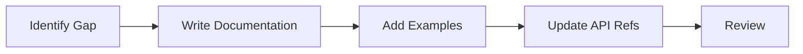

# Development Guide

This section provides comprehensive guidance for developers working on Claude MPM, covering setup, coding standards, testing, and debugging.

## Overview

Developing Claude MPM requires understanding:
- The subprocess orchestration architecture
- Python async/await patterns
- Process management and IPC
- Testing strategies for multi-process systems

## Development Sections

### [Setup Guide](setup.md)
Complete development environment setup including:
- Prerequisites and dependencies
- Virtual environment configuration
- IDE setup and recommendations
- Development tools installation

### [Coding Standards](coding-standards.md)
Project coding conventions:
- Python style guide
- Code organization patterns
- Documentation requirements
- Commit message format

### [Testing Guide](testing.md)
Comprehensive testing strategies:
- Unit testing components
- Integration testing orchestrators
- E2E testing workflows
- Mocking subprocesses

### [Debugging Guide](debugging.md)
Techniques for debugging:
- Subprocess debugging
- Async code debugging
- Performance profiling
- Common issues and solutions

## Quick Start

### 1. Clone and Setup

```bash
# Clone repository
git clone https://github.com/your-repo/claude-mpm.git
cd claude-mpm

# Create virtual environment
python -m venv venv
source venv/bin/activate  # On Windows: venv\Scripts\activate

# Install in development mode
pip install -e ".[dev]"

# Install pre-commit hooks
pre-commit install
```

### 2. Verify Installation

```bash
# Run tests
pytest tests/

# Run linters
flake8 src/
black --check src/
mypy src/

# Run claude-mpm
./claude-mpm --version
```

### 3. Start Developing

```bash
# Create feature branch
git checkout -b feature/your-feature

# Make changes
vim src/claude_mpm/...

# Run tests
pytest tests/ -v

# Commit with conventional commits
git commit -m "feat: add new orchestrator feature"
```

## Development Workflow

### 1. Feature Development


### 2. Bug Fixing


### 3. Documentation



## Project Structure

```
claude-mpm/
├── src/claude_mpm/         # Source code
│   ├── __init__.py
│   ├── cli.py              # CLI interface
│   ├── core/               # Core components
│   ├── orchestration/      # Orchestrators
│   ├── agents/             # Agent system
│   ├── services/           # Services
│   ├── hooks/              # Hook system
│   └── utils/              # Utilities
├── tests/                  # Test suite
│   ├── unit/              # Unit tests
│   ├── integration/       # Integration tests
│   └── e2e/               # End-to-end tests
├── docs/                   # Documentation
│   ├── developer/         # Developer docs
│   ├── user/              # User docs
│   └── design/            # Design docs
├── scripts/                # Development scripts
│   ├── run_tests.sh
│   ├── build.sh
│   └── release.sh
└── examples/               # Example code
```

## Key Development Areas

### 1. Orchestrators
The heart of Claude MPM - managing subprocess lifecycle:
- Subprocess creation and management
- I/O stream handling
- Pattern detection
- Resource monitoring

### 2. Agent System
Multi-agent coordination framework:
- Agent discovery and registration
- Parallel execution
- Result aggregation
- Cross-agent communication

### 3. Hook System
Extensibility mechanism:
- Event interception
- Behavior modification
- Plugin architecture
- Async execution

### 4. Services
Core business logic:
- Ticket extraction
- Session management
- Framework loading
- Configuration handling

## Development Tools

### Required Tools

```bash
# Python 3.8+
python --version

# pip
pip --version

# Git
git --version

# Virtual environment
python -m venv --help
```

### Recommended Tools

```bash
# Code formatting
pip install black

# Linting
pip install flake8 pylint

# Type checking
pip install mypy

# Testing
pip install pytest pytest-cov pytest-asyncio

# Documentation
pip install sphinx sphinx-rtd-theme

# Pre-commit hooks
pip install pre-commit
```

### IDE Configuration

#### VS Code
```json
// .vscode/settings.json
{
    "python.linting.enabled": true,
    "python.linting.flake8Enabled": true,
    "python.formatting.provider": "black",
    "python.testing.pytestEnabled": true,
    "editor.formatOnSave": true
}
```

#### PyCharm
- Enable Black formatter
- Configure pytest as test runner
- Set up remote debugging
- Configure type checking

## Common Development Tasks

### Running Tests

```bash
# All tests
pytest

# Specific test file
pytest tests/test_orchestrator.py

# With coverage
pytest --cov=src/claude_mpm

# Parallel execution
pytest -n auto

# Verbose output
pytest -v
```

### Code Quality

```bash
# Format code
black src/ tests/

# Check formatting
black --check src/ tests/

# Lint code
flake8 src/ tests/

# Type checking
mypy src/

# All checks
pre-commit run --all-files
```

### Building Documentation

```bash
# Build docs
cd docs/
make html

# View docs
open _build/html/index.html

# Auto-rebuild on changes
sphinx-autobuild . _build/html
```

### Debugging

```bash
# Debug mode
export CLAUDE_MPM_DEBUG=true
./claude-mpm

# Subprocess debugging
export CLAUDE_MPM_SUBPROCESS_DEBUG=true

# Hook debugging
export CLAUDE_MPM_HOOK_DEBUG=true

# Full trace
python -m trace -t claude-mpm
```

## Performance Considerations

### Subprocess Management
- Use process pools for agent execution
- Implement proper cleanup
- Monitor resource usage
- Handle zombie processes

### Async Operations
- Use asyncio for I/O operations
- Avoid blocking calls
- Implement timeouts
- Handle backpressure

### Memory Management
- Stream large outputs
- Implement buffer limits
- Clean up resources
- Monitor memory usage

## Security Considerations

### Input Validation
- Sanitize user input
- Prevent command injection
- Validate file paths
- Check permissions

### Process Isolation
- Run agents in restricted environments
- Limit resource access
- Use security profiles
- Monitor system calls

### Sensitive Data
- Redact API keys
- Secure credential storage
- Audit logging
- Encryption at rest

## Contributing Guidelines

### 1. Code Style
- Follow PEP 8
- Use type hints
- Document public APIs
- Keep functions focused

### 2. Testing
- Write tests first (TDD)
- Aim for 80%+ coverage
- Test edge cases
- Mock external dependencies

### 3. Documentation
- Update docs with code
- Include examples
- Document breaking changes
- Keep README current

### 4. Pull Requests
- One feature per PR
- Include tests
- Update documentation
- Follow PR template

## Getting Help

### Resources
- [Architecture Overview](../01-architecture/)
- [API Reference](../04-api-reference/)
- [GitHub Issues](https://github.com/your-repo/claude-mpm/issues)
- [Discussions](https://github.com/your-repo/claude-mpm/discussions)

### Communication
- Issue tracker for bugs
- Discussions for questions
- Pull requests for contributions
- Email for security issues

## Next Steps

1. Complete [Development Setup](setup.md)
2. Review [Coding Standards](coding-standards.md)
3. Understand [Testing Strategy](testing.md)
4. Learn [Debugging Techniques](debugging.md)
5. Start contributing!