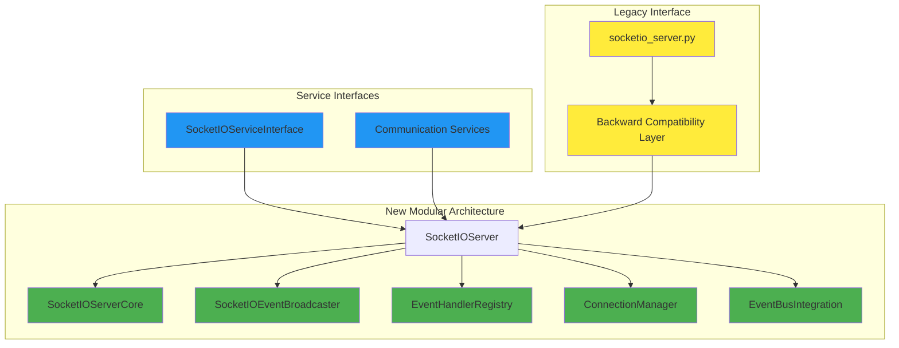
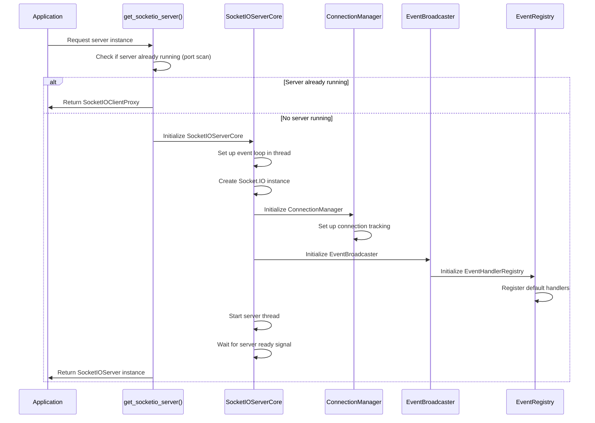
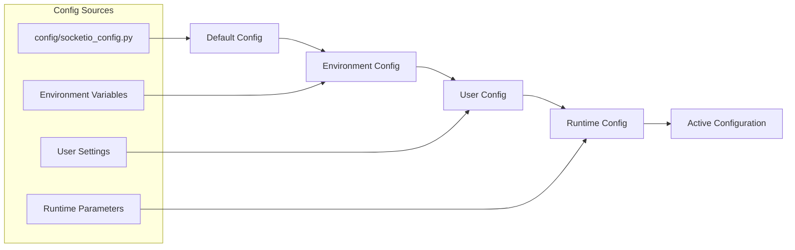
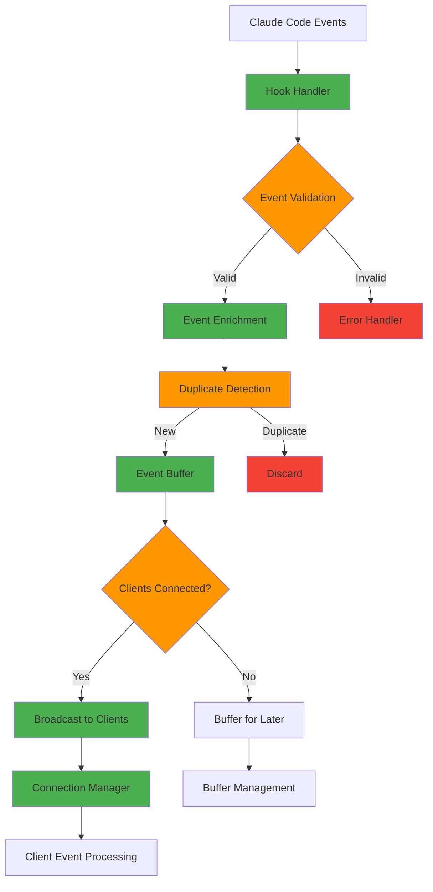

# Socket.IO Server Architecture

## Overview

The Claude MPM Socket.IO server provides real-time event broadcasting for dashboard monitoring and external integrations. This document describes the modular server architecture, component interactions, loading sequences, and configuration management.

## Architecture Components

### 1. Service-Oriented Architecture

The Socket.IO server has been refactored from a monolithic 1,934-line class into focused, composable services:



### 2. Component Responsibilities

#### Core Server Components

| Component | Responsibility | Location |
|-----------|---------------|----------|
| **SocketIOServerCore** | Server lifecycle, static files, port binding | `socketio/server/core.py` |
| **SocketIOEventBroadcaster** | Event broadcasting to clients | `socketio/server/broadcaster.py` |
| **ConnectionManager** | Connection state, health monitoring, buffering | `socketio/server/connection_manager.py` |
| **EventHandlerRegistry** | Modular event handler registration | `socketio/handlers/registry.py` |
| **EventBusIntegration** | Integration with internal event bus | `socketio/server/eventbus_integration.py` |

#### Client Management Components

| Component | Responsibility | Location |
|-----------|---------------|----------|
| **SocketIOClientProxy** | Client proxy for exec mode | `socketio/client_proxy.py` |
| **Event Normalizer** | Event format standardization | `socketio/event_normalizer.py` |
| **Migration Utils** | Legacy format compatibility | `socketio/migration_utils.py` |

### 3. Server Loading Sequence

The server initialization follows a carefully orchestrated sequence to prevent race conditions:



### 4. Configuration Architecture

#### Configuration Layers



#### Key Configuration Parameters

| Parameter | Default | Environment Variable | Description |
|-----------|---------|---------------------|-------------|
| `host` | `localhost` | `SOCKETIO_HOST` | Server bind address |
| `port` | `8765` | `SOCKETIO_PORT` | Server port |
| `cors_origins` | `*` | `SOCKETIO_CORS` | CORS allowed origins |
| `heartbeat_interval` | `60` | `SOCKETIO_HEARTBEAT` | Client heartbeat interval (seconds) |
| `max_buffer_size` | `1000` | `SOCKETIO_BUFFER_SIZE` | Event buffer size |
| `connection_timeout` | `30` | `SOCKETIO_TIMEOUT` | Connection timeout (seconds) |

### 5. Event Flow Architecture

#### Event Processing Pipeline



#### Event Types and Routing

| Event Type | Handler | Target Namespace | Buffer Policy |
|------------|---------|------------------|---------------|
| `tool_start` | `ToolEventHandler` | `/tools` | Buffer if no clients |
| `tool_stop` | `ToolEventHandler` | `/tools` | Buffer if no clients |
| `subagent_start` | `AgentEventHandler` | `/agents` | Buffer if no clients |
| `subagent_stop` | `AgentEventHandler` | `/agents` | Buffer if no clients |
| `file_operation` | `FileEventHandler` | `/files` | Drop if no clients |
| `connection_status` | `ConnectionHandler` | `/system` | Always send |
| `error` | `ErrorHandler` | `/errors` | Always buffer |

## Critical Paths and Timing

### 1. Server Startup Critical Path

The following sequence must complete within **5 seconds** to avoid timeout:

1. **Event Loop Creation** (< 100ms)
   - New thread with asyncio event loop
   - Socket.IO server instance creation
   - HTTP application setup

2. **Port Binding** (< 500ms)
   - TCP socket creation and binding
   - Port conflict detection and resolution
   - CORS configuration

3. **Component Initialization** (< 1000ms)
   - Connection manager startup
   - Event handler registry
   - Static file server configuration

4. **Service Registration** (< 500ms)
   - Event listener registration
   - Heartbeat task initialization
   - Health check endpoint setup

5. **Ready Signal** (< 100ms)
   - Server ready flag setting
   - Health check endpoint activation
   - Log success message

### 2. Connection Handling Critical Path

Client connections must be established within **2 seconds**:

1. **TCP Handshake** (< 200ms)
2. **Socket.IO Handshake** (< 500ms)
3. **Client Registration** (< 100ms)
4. **Event Subscription** (< 200ms)
5. **Initial State Sync** (< 1000ms)

### 3. Event Broadcasting Critical Path

Events must be delivered within **100ms** for real-time user experience:

1. **Event Reception** (< 10ms)
2. **Validation & Enrichment** (< 20ms)  
3. **Client List Iteration** (< 30ms)
4. **Socket.IO Broadcast** (< 40ms)

## Performance Characteristics

### Resource Usage

| Metric | Baseline | Under Load (10 clients) | Stress Test (50 clients) |
|--------|----------|-------------------------|---------------------------|
| **Memory** | 25MB | 40MB | 120MB |
| **CPU** | 1% | 5% | 15% |
| **File Descriptors** | 15 | 45 | 180 |
| **Network Connections** | 3 | 13 | 53 |

### Throughput Metrics

| Event Type | Events/Second | Latency (p95) | Buffer Capacity |
|------------|---------------|---------------|-----------------|
| **Tool Events** | 50/sec | 20ms | 1000 events |
| **Status Updates** | 10/sec | 10ms | 100 events |
| **File Operations** | 100/sec | 15ms | 500 events |

### Scale Limitations

- **Maximum Concurrent Clients**: 100 (configurable)
- **Maximum Event Buffer**: 10,000 events (configurable)
- **Maximum Connection Duration**: No limit
- **Maximum Event Size**: 1MB per event

## Race Condition Prevention

### 1. Server Initialization Race Conditions

**Problem**: Multiple threads attempting to create server instances simultaneously.

**Solution**: Thread-safe singleton pattern with atomic port checking:

```python
def get_socketio_server() -> SocketIOServer:
    global _socketio_server
    if _socketio_server is None:
        with _server_lock:  # Thread-safe creation
            if _socketio_server is None:  # Double-checked locking
                _socketio_server = _create_server_instance()
    return _socketio_server
```

### 2. Event Loop Race Conditions

**Problem**: Event loop creation and server startup happening concurrently.

**Solution**: Synchronous event loop creation with ready signal:

```python
def _start_server_thread(self):
    self.loop = asyncio.new_event_loop()
    asyncio.set_event_loop(self.loop)
    self._server_ready.wait()  # Wait for server to be fully initialized
    self.loop.run_forever()
```

### 3. Connection State Race Conditions

**Problem**: Client connection/disconnection events happening simultaneously.

**Solution**: Connection state machine with atomic transitions:

```python
class ConnectionManager:
    def update_connection_state(self, client_id: str, new_state: ConnectionState):
        with self._state_lock:
            current = self.connections.get(client_id)
            if self._is_valid_transition(current.state, new_state):
                current.state = new_state
                self._emit_state_change_event(client_id, new_state)
```

## Service Consolidation Benefits

The modular architecture provides several key benefits:

### 1. **Reduced Complexity**
- **Before**: Single 1,934-line class handling all functionality
- **After**: 6 focused modules averaging 300 lines each
- **Benefit**: Easier to understand, test, and maintain individual components

### 2. **Improved Testability**
- **Unit Testing**: Each component can be tested in isolation
- **Integration Testing**: Component interactions tested separately  
- **Mock Support**: Easy to mock individual services for testing

### 3. **Better Error Isolation**
- **Fault Tolerance**: Failure in one component doesn't crash entire server
- **Recovery**: Individual components can be restarted independently
- **Debugging**: Easier to identify source of issues

### 4. **Enhanced Scalability**
- **Resource Management**: Each component manages its own resources
- **Load Distribution**: Work distributed across specialized components
- **Performance Monitoring**: Per-component metrics and monitoring

## Integration with Service Container

The Socket.IO server integrates with the MPM service container for dependency injection:

```python
# Service registration
container.register(
    SocketIOServiceInterface,
    SocketIOServer,
    singleton=True
)

# Dependency injection
class DashboardLauncher:
    def __init__(self, socketio_service: SocketIOServiceInterface):
        self.socketio_service = socketio_service
```

This enables:
- **Loose Coupling**: Components depend on interfaces, not concrete classes
- **Configuration Management**: Service configuration through container
- **Lifecycle Management**: Container manages service startup/shutdown
- **Testing Support**: Easy to inject mock services for testing

## Environment-Specific Configuration

### Development Environment

```yaml
socketio:
  host: localhost
  port: 8765
  debug: true
  log_level: DEBUG
  cors_origins: "*"
  heartbeat_interval: 30
```

### Production Environment  

```yaml
socketio:
  host: 0.0.0.0
  port: 8765
  debug: false
  log_level: INFO
  cors_origins: ["https://dashboard.example.com"]
  heartbeat_interval: 60
```

### Testing Environment

```yaml
socketio:
  host: localhost
  port: 8766  # Different port to avoid conflicts
  debug: false
  log_level: ERROR
  cors_origins: ["http://localhost:3000"]
  heartbeat_interval: 10
```

## Security Considerations

### 1. **CORS Configuration**
- Production: Restrict to specific domains
- Development: Allow all origins for testing
- Testing: Localhost and test domains only

### 2. **Authentication** (Future Enhancement)
- JWT token validation
- Session-based authentication  
- API key authentication for external clients

### 3. **Rate Limiting**
- Per-client event rate limiting
- Connection rate limiting
- Resource exhaustion protection

### 4. **Input Validation**
- Event schema validation
- Maximum event size limits
- Malformed event rejection

## Monitoring and Observability

### Health Check Endpoints

| Endpoint | Purpose | Response |
|----------|---------|----------|
| `/health` | Basic health check | `{"status": "healthy", "uptime": 3600}` |
| `/metrics` | Performance metrics | JSON with detailed metrics |
| `/connections` | Active connections | List of connected clients |

### Logging Strategy

```python
# Structured logging with context
logger.info("Client connected", extra={
    "client_id": client_id,
    "remote_address": remote_addr,
    "user_agent": user_agent,
    "connection_count": len(connected_clients)
})
```

### Metrics Collection

- **Connection Metrics**: Count, duration, quality
- **Event Metrics**: Rate, latency, error rate  
- **Resource Metrics**: Memory, CPU, file descriptors
- **Business Metrics**: Tool usage, session duration

This architecture ensures robust, scalable, and maintainable real-time event broadcasting for the Claude MPM dashboard system.