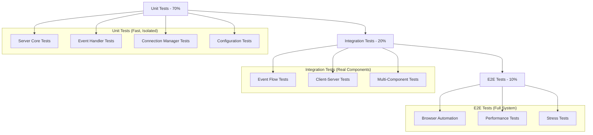

# Socket.IO Testing Strategy

## Overview

This document outlines the comprehensive testing strategy for Claude MPM's Socket.IO server system. It covers unit tests, integration tests, browser automation, performance testing, and critical test paths to ensure robust real-time event broadcasting.

## Testing Architecture

### Test Organization Hierarchy

```
tests/
├── socketio/                           # Socket.IO specific tests
│   ├── test_server_core_lifecycle.py   # Core server functionality
│   ├── test_simple_event_flow.py       # Basic event processing
│   ├── test_event_handler_registry.py  # Event handler system
│   ├── test_socketio_complete.py       # End-to-end scenarios
│   └── test_socketio_configuration.py  # Configuration management
├── integration/
│   └── test_socketio_integration.py    # Cross-system integration
├── dashboard/
│   ├── test_socket_client.js           # Browser-side client tests
│   ├── test_dashboard_events.py        # Dashboard event handling
│   └── test_dashboard_stability.py     # Connection stability tests
└── performance/
    └── test_socketio_performance.py    # Load and stress testing
```

### Testing Pyramid Strategy



## Unit Test Structure and Conventions

### 1. Test Class Organization

```python
class TestSocketIOServerCore:
    """Test core server functionality."""
    
    def setup_method(self):
        """Set up test fixtures before each test."""
        self.test_port = 8766  # Avoid default port conflicts
        self.test_host = "localhost"
        
    def teardown_method(self):
        """Clean up after each test."""
        # Ensure no test servers are left running
        self._cleanup_test_servers()
    
    def test_server_initialization_default_params(self):
        """Test server initialization with default parameters."""
        # Given: Default server parameters
        # When: Server is initialized
        # Then: Verify default configuration
        
    def test_server_initialization_custom_params(self):
        """Test server initialization with custom parameters."""
        # Given: Custom server parameters  
        # When: Server is initialized with custom params
        # Then: Verify custom configuration is applied
```

### 2. Test Naming Conventions

| Test Type | Naming Pattern | Example |
|-----------|----------------|---------|
| **Unit Tests** | `test_[component]_[action]_[condition]` | `test_server_start_with_custom_port` |
| **Integration Tests** | `test_[scenario]_[expected_outcome]` | `test_event_flow_delivers_to_all_clients` |
| **Performance Tests** | `test_[metric]_[load_condition]` | `test_throughput_under_high_load` |
| **Error Tests** | `test_[error_condition]_[expected_handling]` | `test_port_conflict_graceful_fallback` |

### 3. Test Data Management

```python
# Test fixtures and data
@pytest.fixture
def mock_socketio_server():
    """Create a mock Socket.IO server for testing."""
    with patch('socketio.AsyncServer') as mock_server:
        mock_server.return_value.emit = AsyncMock()
        mock_server.return_value.disconnect = AsyncMock()
        yield mock_server.return_value

@pytest.fixture
def sample_tool_events():
    """Generate sample tool events for testing."""
    return [
        {
            "type": "tool_start",
            "tool": "Read",
            "timestamp": 1638360000.0,
            "session_id": "test_session_1"
        },
        {
            "type": "tool_stop", 
            "tool": "Read",
            "timestamp": 1638360001.0,
            "session_id": "test_session_1"
        }
    ]
```

### 4. Assertion Patterns

```python
def test_event_broadcasting_success(self, mock_socketio_server, sample_tool_events):
    """Test successful event broadcasting to clients."""
    # Arrange
    server = SocketIOServer()
    server.sio = mock_socketio_server
    event = sample_tool_events[0]
    
    # Act
    await server.broadcast_event(event)
    
    # Assert - Verify method calls
    mock_socketio_server.emit.assert_called_once_with(
        'tool_event',
        event,
        namespace='/tools'
    )
    
    # Assert - Verify event properties
    assert server.stats['events_sent'] == 1
    assert len(server.event_history) == 1
    assert server.event_history[0]['type'] == 'tool_start'
```

## Integration Test Scenarios

### 1. Event Flow Testing

```python
class TestEventFlowIntegration:
    """Test complete event flow from hook to dashboard."""
    
    @pytest.mark.integration
    async def test_hook_to_dashboard_event_delivery(self):
        """Test event delivery from hook handler to dashboard client."""
        # Given: Running Socket.IO server and connected client
        server = await self._start_test_server()
        client = await self._connect_test_client()
        
        # When: Hook handler sends event
        await self._simulate_hook_event({
            "type": "tool_start",
            "tool": "Read", 
            "timestamp": time.time()
        })
        
        # Then: Client receives event within timeout
        received_event = await client.wait_for_event('tool_event', timeout=2)
        assert received_event['type'] == 'tool_start'
        assert received_event['tool'] == 'Read'
        
    @pytest.mark.integration  
    async def test_multiple_client_broadcast(self):
        """Test broadcasting to multiple connected clients."""
        # Given: Multiple connected clients
        server = await self._start_test_server()
        clients = [await self._connect_test_client() for _ in range(3)]
        
        # When: Event is broadcast
        test_event = {"type": "status", "message": "test"}
        await server.broadcast_event(test_event)
        
        # Then: All clients receive the event
        for client in clients:
            received = await client.wait_for_event('status', timeout=2)
            assert received['message'] == 'test'
```

### 2. Connection Lifecycle Testing

```python
class TestConnectionLifecycleIntegration:
    """Test connection establishment, maintenance, and termination."""
    
    @pytest.mark.integration
    async def test_connection_reconnection_after_server_restart(self):
        """Test client reconnection after server restart."""
        # Given: Connected client
        server = await self._start_test_server()
        client = await self._connect_test_client()
        
        # When: Server is restarted
        await server.stop()
        await asyncio.sleep(1)
        server = await self._start_test_server()
        
        # Then: Client reconnects automatically
        await client.wait_for_reconnection(timeout=5)
        assert client.connected
        
    @pytest.mark.integration
    async def test_event_buffering_during_disconnection(self):
        """Test event buffering when clients are disconnected."""
        # Given: Server with no connected clients
        server = await self._start_test_server()
        
        # When: Events are sent while no clients connected
        events = [
            {"type": "tool_start", "tool": "Read"},
            {"type": "tool_stop", "tool": "Read"}
        ]
        for event in events:
            await server.broadcast_event(event)
        
        # Then: Events are buffered
        assert len(server.event_buffer) == 2
        
        # When: Client connects
        client = await self._connect_test_client()
        
        # Then: Buffered events are delivered
        for event in events:
            received = await client.wait_for_event('tool_event', timeout=2)
            assert received['type'] == event['type']
```

### 3. Error Handling and Recovery

```python
class TestErrorHandlingIntegration:
    """Test error scenarios and recovery mechanisms."""
    
    @pytest.mark.integration
    async def test_malformed_event_handling(self):
        """Test server handling of malformed events."""
        # Given: Running server
        server = await self._start_test_server()
        
        # When: Malformed event is processed
        malformed_event = {"invalid": "no type field"}
        
        # Then: Server handles gracefully without crashing
        await server.broadcast_event(malformed_event)
        assert server.running  # Server still running
        assert server.stats['events_dropped'] == 1
        
    @pytest.mark.integration
    async def test_memory_exhaustion_protection(self):
        """Test protection against memory exhaustion."""
        # Given: Server with limited buffer size
        server = await self._start_test_server(buffer_size=10)
        
        # When: More events than buffer size are sent
        for i in range(20):
            await server.broadcast_event({"type": "test", "id": i})
        
        # Then: Buffer size is maintained
        assert len(server.event_buffer) <= 10
        assert server.stats['events_dropped'] > 0
```

## Browser Automation Test Setup

### 1. JavaScript Test Environment

```javascript
// jest.config.js
module.exports = {
    testEnvironment: 'jsdom',
    setupFilesAfterEnv: ['<rootDir>/jest.setup.js'],
    testMatch: ['**/__tests__/**/*.js', '**/?(*.)+(spec|test).js'],
    collectCoverageFrom: [
        'src/**/*.js',
        '!src/**/*.test.js'
    ],
    coverageThreshold: {
        global: {
            branches: 80,
            functions: 80,
            lines: 80,
            statements: 80
        }
    }
};

// jest.setup.js
import 'whatwg-fetch';

// Mock Socket.IO client
global.io = jest.fn(() => ({
    on: jest.fn(),
    emit: jest.fn(),
    disconnect: jest.fn(),
    connect: jest.fn(),
    connected: true,
    id: 'test-socket-id'
}));

// Mock console to reduce test output
global.console = {
    ...console,
    log: jest.fn(),
    debug: jest.fn(),
    info: jest.fn()
};
```

### 2. Browser Connection Tests

```javascript
describe('Socket.IO Client Connection', () => {
    let socketManager;
    
    beforeEach(() => {
        // Reset mocks
        jest.clearAllMocks();
        
        // Import module under test
        socketManager = new SocketManager('http://localhost:8765');
    });
    
    test('should establish connection to specified host and port', async () => {
        // Arrange
        const mockSocket = {
            on: jest.fn(),
            connect: jest.fn(),
            connected: false
        };
        global.io.mockReturnValue(mockSocket);
        
        // Act
        await socketManager.connect();
        
        // Assert
        expect(global.io).toHaveBeenCalledWith('http://localhost:8765', {
            transports: ['websocket', 'polling'],
            timeout: 20000,
            reconnection: true,
            reconnectionDelay: 1000,
            reconnectionDelayMax: 5000
        });
    });
    
    test('should handle connection timeout gracefully', async () => {
        // Arrange
        const mockSocket = {
            on: jest.fn(),
            connect: jest.fn(() => {
                // Simulate timeout
                setTimeout(() => {
                    mockSocket.on.mock.calls
                        .find(call => call[0] === 'connect_error')[1]
                        (new Error('timeout'));
                }, 100);
            })
        };
        global.io.mockReturnValue(mockSocket);
        
        // Act & Assert
        await expect(socketManager.connect()).rejects.toThrow('timeout');
        expect(socketManager.isConnected()).toBe(false);
    });
    
    test('should retry connection with exponential backoff', async () => {
        // Arrange
        jest.useFakeTimers();
        let connectAttempts = 0;
        
        const mockSocket = {
            on: jest.fn((event, callback) => {
                if (event === 'connect') {
                    setTimeout(() => {
                        connectAttempts++;
                        if (connectAttempts < 3) {
                            // Fail first 2 attempts
                            callback(new Error('connection failed'));
                        } else {
                            // Succeed on 3rd attempt
                            callback();
                        }
                    }, 0);
                }
            }),
            connect: jest.fn()
        };
        global.io.mockReturnValue(mockSocket);
        
        // Act
        const connectionPromise = socketManager.connectWithRetry();
        
        // Advance timers for retry attempts
        jest.advanceTimersByTime(1000);  // First retry
        jest.advanceTimersByTime(2000);  // Second retry
        jest.advanceTimersByTime(4000);  // Third retry (success)
        
        await connectionPromise;
        
        // Assert
        expect(connectAttempts).toBe(3);
        expect(mockSocket.connect).toHaveBeenCalledTimes(3);
        
        jest.useRealTimers();
    });
});
```

### 3. Event Processing Tests

```javascript
describe('Socket.IO Event Processing', () => {
    let socketManager;
    let mockSocket;
    
    beforeEach(() => {
        mockSocket = {
            on: jest.fn(),
            emit: jest.fn(),
            connected: true,
            id: 'test-socket-id'
        };
        global.io.mockReturnValue(mockSocket);
        socketManager = new SocketManager('http://localhost:8765');
    });
    
    test('should process tool events correctly', async () => {
        // Arrange
        const toolEvent = {
            type: 'tool_start',
            tool: 'Read',
            timestamp: Date.now(),
            session_id: 'test_session'
        };
        
        const eventHandler = jest.fn();
        socketManager.onToolEvent(eventHandler);
        
        // Act - Simulate receiving event from server
        const toolEventCallback = mockSocket.on.mock.calls
            .find(call => call[0] === 'tool_event')[1];
        toolEventCallback(toolEvent);
        
        // Assert
        expect(eventHandler).toHaveBeenCalledWith(toolEvent);
        expect(eventHandler).toHaveBeenCalledTimes(1);
    });
    
    test('should handle event processing errors gracefully', async () => {
        // Arrange
        const faultyHandler = jest.fn(() => {
            throw new Error('Handler error');
        });
        socketManager.onToolEvent(faultyHandler);
        
        const consoleError = jest.spyOn(console, 'error').mockImplementation();
        
        // Act
        const toolEventCallback = mockSocket.on.mock.calls
            .find(call => call[0] === 'tool_event')[1];
        toolEventCallback({ type: 'tool_start', tool: 'Read' });
        
        // Assert - Error is logged but doesn't crash
        expect(consoleError).toHaveBeenCalledWith(
            expect.stringContaining('Error processing tool event'),
            expect.any(Error)
        );
        expect(socketManager.isConnected()).toBe(true);
        
        consoleError.mockRestore();
    });
    
    test('should queue events when disconnected', async () => {
        // Arrange
        mockSocket.connected = false;
        const event = { type: 'test', data: 'queued' };
        
        // Act
        socketManager.emitEvent('test_event', event);
        
        // Assert - Event is queued, not sent immediately
        expect(mockSocket.emit).not.toHaveBeenCalled();
        expect(socketManager._eventQueue).toContain({
            event: 'test_event',
            data: event
        });
        
        // When reconnected
        mockSocket.connected = true;
        socketManager._processEventQueue();
        
        // Then queued events are sent
        expect(mockSocket.emit).toHaveBeenCalledWith('test_event', event);
    });
});
```

### 4. Browser Performance Tests

```javascript
describe('Socket.IO Client Performance', () => {
    test('should handle high event rate without memory leaks', async () => {
        // Arrange
        const mockSocket = {
            on: jest.fn(),
            connected: true,
            emit: jest.fn()
        };
        global.io.mockReturnValue(mockSocket);
        
        const socketManager = new SocketManager('http://localhost:8765');
        const initialMemory = performance.memory?.usedJSHeapSize || 0;
        
        // Act - Send 1000 events rapidly
        const events = Array.from({ length: 1000 }, (_, i) => ({
            type: 'performance_test',
            id: i,
            data: `Event ${i}`.repeat(100) // ~800 bytes per event
        }));
        
        const startTime = performance.now();
        events.forEach(event => {
            socketManager.emitEvent('test_event', event);
        });
        const endTime = performance.now();
        
        // Assert - Performance benchmarks
        const duration = endTime - startTime;
        const eventsPerSecond = 1000 / (duration / 1000);
        
        expect(eventsPerSecond).toBeGreaterThan(100); // >100 events/sec
        expect(duration).toBeLessThan(5000); // <5 seconds total
        
        // Memory leak check (if available)
        if (performance.memory) {
            const finalMemory = performance.memory.usedJSHeapSize;
            const memoryIncrease = finalMemory - initialMemory;
            
            // Should not increase by more than 10MB
            expect(memoryIncrease).toBeLessThan(10 * 1024 * 1024);
        }
    });
    
    test('should maintain responsiveness under load', async () => {
        // Arrange
        let eventProcessingTimes = [];
        const mockSocket = {
            on: jest.fn((event, callback) => {
                if (event === 'load_test_event') {
                    // Simulate processing time measurement
                    setTimeout(() => {
                        const startProcessing = performance.now();
                        callback({ timestamp: Date.now() });
                        const endProcessing = performance.now();
                        eventProcessingTimes.push(endProcessing - startProcessing);
                    }, Math.random() * 10); // Random network delay
                }
            }),
            connected: true
        };
        global.io.mockReturnValue(mockSocket);
        
        const socketManager = new SocketManager('http://localhost:8765');
        
        // Act - Simulate receiving events under load
        const eventCallback = mockSocket.on.mock.calls
            .find(call => call[0] === 'load_test_event')[1];
        
        for (let i = 0; i < 100; i++) {
            eventCallback({ id: i, timestamp: Date.now() });
        }
        
        // Wait for all processing to complete
        await new Promise(resolve => setTimeout(resolve, 500));
        
        // Assert - Processing times are reasonable
        const avgProcessingTime = eventProcessingTimes.reduce((a, b) => a + b, 0) / eventProcessingTimes.length;
        const maxProcessingTime = Math.max(...eventProcessingTimes);
        
        expect(avgProcessingTime).toBeLessThan(5); // <5ms average
        expect(maxProcessingTime).toBeLessThan(50); // <50ms maximum
    });
});
```

## Test Coverage Requirements

### 1. Coverage Metrics by Component

| Component | Unit Test Coverage | Integration Coverage | E2E Coverage |
|-----------|-------------------|---------------------|--------------|
| **SocketIOServerCore** | 95% | 85% | 70% |
| **EventBroadcaster** | 90% | 90% | 80% |
| **ConnectionManager** | 95% | 85% | 75% |
| **EventHandlerRegistry** | 90% | 80% | 60% |
| **Client Proxy** | 85% | 90% | 85% |
| **Dashboard Client** | 80% | 85% | 90% |

### 2. Critical Path Coverage

All critical paths must have **100% test coverage**:

- Server startup and initialization
- Client connection establishment
- Event broadcasting to all clients
- Connection failure and recovery
- Graceful server shutdown
- Error handling and logging

### 3. Coverage Enforcement

```bash
# Python coverage requirements
pytest tests/socketio/ --cov=claude_mpm.services.socketio --cov-fail-under=85

# JavaScript coverage requirements  
npm test -- --coverage --coverageThreshold='{"global":{"branches":80,"functions":80,"lines":80,"statements":80}}'

# Combined coverage report
coverage combine
coverage report --show-missing
coverage html
```

## Critical Test Paths

### 1. Happy Path: Complete Event Flow

```python
@pytest.mark.critical_path
async def test_complete_event_flow_happy_path(self):
    """Test the complete happy path from hook to dashboard display."""
    # 1. Start server
    server = await self._start_test_server()
    
    # 2. Connect dashboard client
    client = await self._connect_test_client()
    
    # 3. Hook sends tool start event
    tool_start_event = {
        "type": "tool_start",
        "tool": "Read",
        "timestamp": time.time(),
        "session_id": "critical_path_test"
    }
    await server.process_hook_event(tool_start_event)
    
    # 4. Verify client receives event
    received = await client.wait_for_event('tool_event', timeout=1)
    assert received['type'] == 'tool_start'
    assert received['tool'] == 'Read'
    
    # 5. Hook sends tool stop event
    tool_stop_event = {
        "type": "tool_stop", 
        "tool": "Read",
        "timestamp": time.time(),
        "session_id": "critical_path_test"
    }
    await server.process_hook_event(tool_stop_event)
    
    # 6. Verify client receives stop event
    received = await client.wait_for_event('tool_event', timeout=1)
    assert received['type'] == 'tool_stop'
    
    # 7. Verify server stats updated
    assert server.stats['events_sent'] == 2
    assert len(server.event_history) == 2
```

### 2. Failure Path: Server Restart Recovery

```python
@pytest.mark.critical_path
async def test_server_restart_recovery_path(self):
    """Test recovery after unexpected server restart."""
    # 1. Establish initial connection
    server = await self._start_test_server()
    client = await self._connect_test_client()
    
    # 2. Send events while connected
    await server.broadcast_event({"type": "test", "id": 1})
    received = await client.wait_for_event('test', timeout=1)
    assert received['id'] == 1
    
    # 3. Simulate server crash
    await server.force_stop()
    
    # 4. Send events while server down (should be queued)
    await server.broadcast_event({"type": "test", "id": 2})
    
    # 5. Restart server
    server = await self._start_test_server()
    
    # 6. Client should reconnect and receive queued events
    await client.wait_for_reconnection(timeout=5)
    received = await client.wait_for_event('test', timeout=2)
    assert received['id'] == 2
```

### 3. Performance Path: High Load Handling

```python
@pytest.mark.critical_path
async def test_high_load_performance_path(self):
    """Test system performance under high event load."""
    # 1. Start server with performance monitoring
    server = await self._start_test_server()
    clients = [await self._connect_test_client() for _ in range(10)]
    
    start_time = time.time()
    events_sent = 0
    
    # 2. Send events at high rate (100 events/second for 10 seconds)
    for i in range(1000):
        await server.broadcast_event({
            "type": "performance_test",
            "id": i,
            "timestamp": time.time()
        })
        events_sent += 1
        
        # Rate limiting to maintain 100 events/second
        if i % 100 == 0:
            elapsed = time.time() - start_time
            if elapsed < (i + 1) / 100:
                await asyncio.sleep((i + 1) / 100 - elapsed)
    
    # 3. Verify all clients received all events
    for client in clients:
        received_count = 0
        while received_count < 1000:
            try:
                await client.wait_for_event('performance_test', timeout=0.1)
                received_count += 1
            except asyncio.TimeoutError:
                break
        
        # Allow for some event loss under extreme load
        assert received_count >= 950  # 95% delivery rate minimum
    
    # 4. Verify performance metrics
    total_time = time.time() - start_time
    events_per_second = events_sent / total_time
    
    assert events_per_second >= 90  # 90+ events/second sustained
    assert server.stats['events_sent'] == 1000
    assert len(server.connected_clients) == 10  # All clients still connected
```

## Test Automation and CI Integration

### 1. GitHub Actions Workflow

```yaml
name: Socket.IO Tests

on:
  push:
    branches: [ main, develop ]
    paths: 
      - 'src/claude_mpm/services/socketio/**'
      - 'tests/socketio/**'
  pull_request:
    branches: [ main ]

jobs:
  socketio-tests:
    runs-on: ubuntu-latest
    
    strategy:
      matrix:
        python-version: [3.9, 3.10, 3.11]
        node-version: [16, 18, 20]
    
    steps:
    - uses: actions/checkout@v3
    
    - name: Set up Python ${{ matrix.python-version }}
      uses: actions/setup-python@v4
      with:
        python-version: ${{ matrix.python-version }}
    
    - name: Set up Node.js ${{ matrix.node-version }}
      uses: actions/setup-node@v3
      with:
        node-version: ${{ matrix.node-version }}
    
    - name: Install Python dependencies
      run: |
        pip install -r requirements.txt
        pip install pytest pytest-asyncio pytest-cov
        pip install python-socketio aiohttp
    
    - name: Install Node.js dependencies
      run: |
        cd tests/dashboard
        npm ci
    
    - name: Run Python unit tests
      run: |
        pytest tests/socketio/ -v --cov=claude_mpm.services.socketio --cov-report=xml
    
    - name: Run Python integration tests
      run: |
        pytest tests/integration/test_socketio_integration.py -v --cov-append
    
    - name: Run JavaScript tests
      run: |
        cd tests/dashboard
        npm test -- --coverage --watchAll=false
    
    - name: Run performance tests
      run: |
        pytest tests/performance/test_socketio_performance.py -v -m "not stress"
    
    - name: Upload coverage reports
      uses: codecov/codecov-action@v3
      with:
        files: ./coverage.xml,./tests/dashboard/coverage/lcov.info
        flags: socketio
        name: socketio-coverage
```

### 2. Pre-commit Hooks

```bash
# .pre-commit-config.yaml
repos:
  - repo: local
    hooks:
      - id: socketio-unit-tests
        name: Socket.IO Unit Tests
        entry: pytest tests/socketio/test_server_core_lifecycle.py -v
        language: system
        pass_filenames: false
        
      - id: socketio-critical-path-tests
        name: Socket.IO Critical Path Tests
        entry: pytest tests/socketio/ -v -m critical_path
        language: system
        pass_filenames: false
        
      - id: javascript-tests
        name: JavaScript Socket.IO Tests
        entry: bash -c 'cd tests/dashboard && npm test -- --watchAll=false'
        language: system
        pass_filenames: false
```

### 3. Continuous Performance Monitoring

```python
# performance_regression_test.py
import pytest
import time
import statistics
from dataclasses import dataclass
from typing import List

@dataclass
class PerformanceBenchmark:
    """Performance benchmark results."""
    events_per_second: float
    avg_latency_ms: float
    max_latency_ms: float
    memory_usage_mb: float
    cpu_usage_percent: float

class PerformanceRegressionTest:
    """Detect performance regressions in Socket.IO server."""
    
    # Performance baselines (update when infrastructure changes)
    BASELINE_EVENTS_PER_SECOND = 100.0
    BASELINE_AVG_LATENCY_MS = 20.0  
    BASELINE_MAX_LATENCY_MS = 100.0
    BASELINE_MEMORY_USAGE_MB = 50.0
    
    # Regression thresholds (% degradation)
    EVENTS_PER_SECOND_THRESHOLD = 0.20  # 20% decrease
    LATENCY_THRESHOLD = 0.50  # 50% increase
    MEMORY_THRESHOLD = 0.30  # 30% increase
    
    @pytest.mark.performance
    async def test_performance_regression_detection(self):
        """Detect performance regressions."""
        benchmark = await self._run_performance_benchmark()
        
        # Check for regressions
        regressions = []
        
        if benchmark.events_per_second < self.BASELINE_EVENTS_PER_SECOND * (1 - self.EVENTS_PER_SECOND_THRESHOLD):
            regressions.append(f"Events/sec regression: {benchmark.events_per_second:.1f} < {self.BASELINE_EVENTS_PER_SECOND * (1 - self.EVENTS_PER_SECOND_THRESHOLD):.1f}")
        
        if benchmark.avg_latency_ms > self.BASELINE_AVG_LATENCY_MS * (1 + self.LATENCY_THRESHOLD):
            regressions.append(f"Latency regression: {benchmark.avg_latency_ms:.1f}ms > {self.BASELINE_AVG_LATENCY_MS * (1 + self.LATENCY_THRESHOLD):.1f}ms")
        
        if benchmark.memory_usage_mb > self.BASELINE_MEMORY_USAGE_MB * (1 + self.MEMORY_THRESHOLD):
            regressions.append(f"Memory regression: {benchmark.memory_usage_mb:.1f}MB > {self.BASELINE_MEMORY_USAGE_MB * (1 + self.MEMORY_THRESHOLD):.1f}MB")
        
        # Report results
        if regressions:
            pytest.fail(f"Performance regressions detected:\n" + "\n".join(regressions))
        else:
            print(f"✓ Performance within acceptable ranges:")
            print(f"  Events/sec: {benchmark.events_per_second:.1f}")
            print(f"  Avg latency: {benchmark.avg_latency_ms:.1f}ms")
            print(f"  Memory usage: {benchmark.memory_usage_mb:.1f}MB")
```

This comprehensive testing strategy ensures robust, performant, and reliable Socket.IO server operation through systematic testing at all levels of the system.