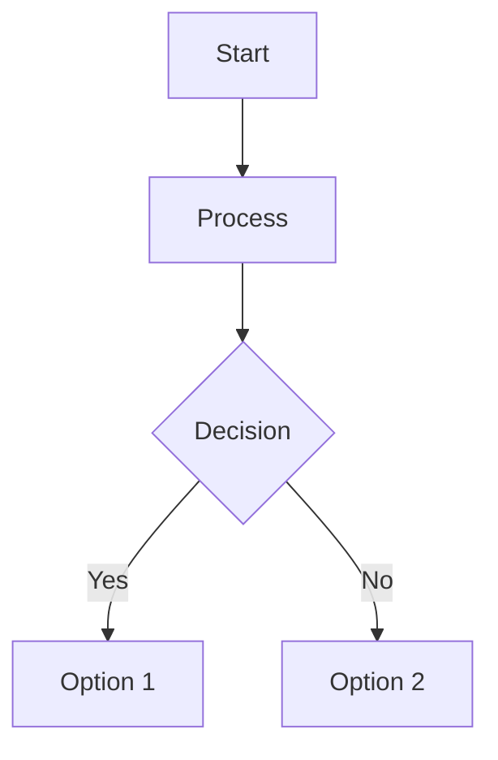
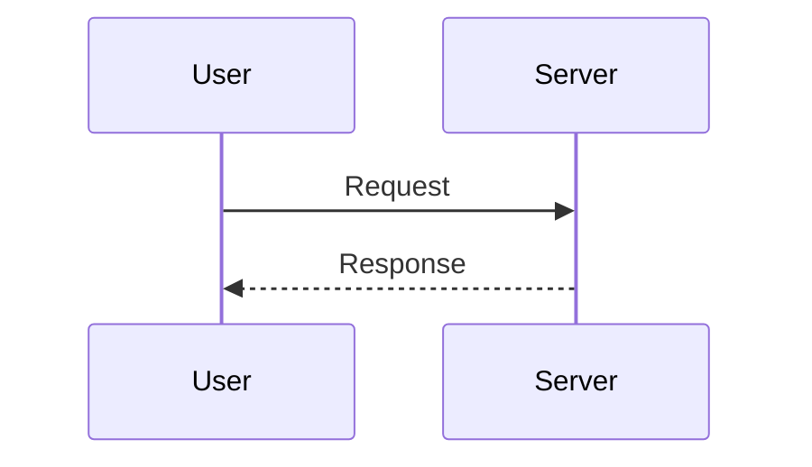
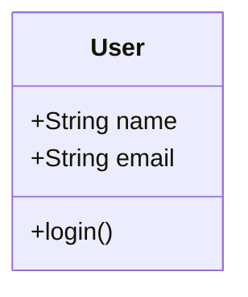
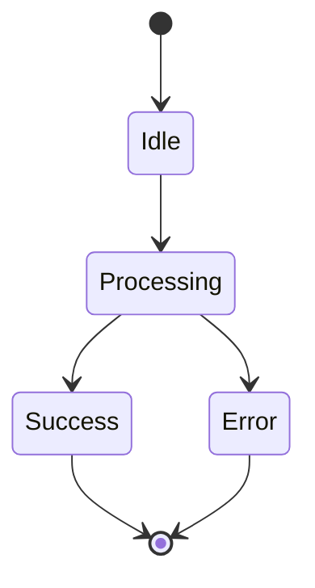
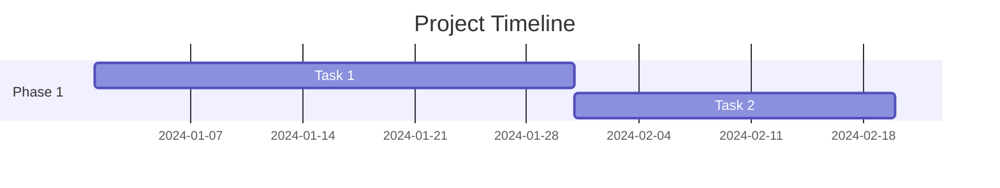
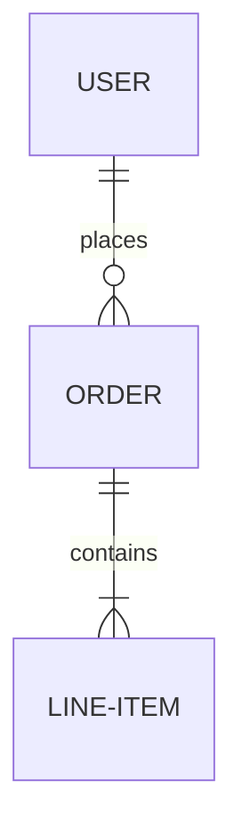

# Mermaid Diagram Rendering in Google Docs

The google-workspace-mcp server now supports rendering Mermaid diagrams as images and inserting them into Google Docs.

## Feature Overview

The `render_mermaid_to_doc` tool:
1. Takes Mermaid diagram code as input
2. Renders it to SVG or PNG using `@mermaid-js/mermaid-cli`
3. Uploads the image to Google Drive with public sharing
4. Inserts the image into the specified Google Doc

## Prerequisites

- **Node.js and npm**: Required for `npx` command
  - macOS: `brew install node`
  - Ubuntu: `sudo apt-get install nodejs npm`
  - Windows: Download from https://nodejs.org/

The tool uses `npx` to run `@mermaid-js/mermaid-cli` without requiring global installation.

## Usage

### Basic Example

```python
result = await google_workspace_server.call_tool(
    "render_mermaid_to_doc",
    {
        "document_id": "your-doc-id",
        "mermaid_code": """graph TD
    A[Start] --> B{Decision}
    B -->|Yes| C[Option 1]
    B -->|No| D[Option 2]
    C --> E[End]
    D --> E
"""
    }
)
```

### Parameters

- **document_id** (required): Google Doc ID where the image will be inserted
- **mermaid_code** (required): Mermaid diagram code
- **insert_index** (optional): Character index for insertion. If not provided, appends to end of document
- **image_format** (optional): "svg" (default, best quality) or "png"
- **width_pt** (optional): Image width in points (maintains aspect ratio if only one dimension specified)
- **height_pt** (optional): Image height in points (maintains aspect ratio if only one dimension specified)

### Return Value

```json
{
  "status": "success",
  "imageUrl": "https://drive.google.com/uc?export=view&id=FILE_ID",
  "fileId": "FILE_ID",
  "insertIndex": 123,
  "documentId": "DOC_ID",
  "format": "svg"
}
```

## Supported Mermaid Diagram Types

All Mermaid diagram types are supported:

### Flowcharts


### Sequence Diagrams


### Class Diagrams


### State Diagrams


### Gantt Charts


### Entity Relationship Diagrams


## Examples

### Insert at Specific Position

```python
result = await google_workspace_server.call_tool(
    "render_mermaid_to_doc",
    {
        "document_id": "doc-id",
        "mermaid_code": "graph LR\n    A-->B",
        "insert_index": 50  # Insert at character position 50
    }
)
```

### Custom Size

```python
result = await google_workspace_server.call_tool(
    "render_mermaid_to_doc",
    {
        "document_id": "doc-id",
        "mermaid_code": "graph TD\n    A-->B-->C",
        "width_pt": 400,  # 400 points wide
        "height_pt": 300  # 300 points tall
    }
)
```

### PNG Format

```python
result = await google_workspace_server.call_tool(
    "render_mermaid_to_doc",
    {
        "document_id": "doc-id",
        "mermaid_code": "graph TD\n    A-->B",
        "image_format": "png"
    }
)
```

## Error Handling

### Common Errors

**NPX Not Installed:**
```
RuntimeError: npx is not installed. Install Node.js and npm from:
  https://nodejs.org/
```

**Invalid Mermaid Syntax:**
```
RuntimeError: Mermaid rendering failed: [error details]
Check syntax at https://mermaid.js.org/intro/
```

**Timeout (>30s):**
```
RuntimeError: Mermaid rendering timed out (>30s).
Simplify the diagram or try again.
```

## Implementation Details

### Rendering Process
1. Writes Mermaid code to temporary file (`.mmd`)
2. Calls `npx -y @mermaid-js/mermaid-cli@11.12.0 -i input.mmd -o output.svg`
3. Reads rendered image from temporary file
4. Uploads image to Google Drive with multipart upload
5. Sets public sharing permissions on the uploaded file
6. Inserts image into Google Doc using `InsertInlineImageRequest` API

### Image Storage
- Images are uploaded to Google Drive with auto-generated names
- Format: `mermaid-diagram-{doc_id[:8]}.{format}`
- Public sharing is enabled to allow Google Docs to display the image
- Files are not automatically deleted (manual cleanup required if needed)

### Sizing
- If neither width nor height specified: Uses default size
- If only width specified: Maintains aspect ratio, scales height
- If only height specified: Maintains aspect ratio, scales width
- If both specified: Uses exact dimensions (may distort)

## Limitations

1. **Timeout**: Complex diagrams may timeout after 30 seconds
2. **Public Images**: Images are publicly accessible via Drive link
3. **No Cleanup**: Uploaded images persist in Drive
4. **File Size**: Very large diagrams may exceed Drive upload limits (<50MB)

## Best Practices

1. **Test Syntax**: Validate Mermaid syntax at https://mermaid.live/ before rendering
2. **Keep Diagrams Simple**: Avoid overly complex diagrams that may timeout
3. **Use SVG**: Prefer SVG format for best quality and scalability
4. **Size Appropriately**: Specify dimensions for consistent layout
5. **Clean Up**: Periodically remove old diagram files from Drive

## References

- [Mermaid Documentation](https://mermaid.js.org/)
- [Mermaid Live Editor](https://mermaid.live/)
- [Google Docs API - InsertInlineImage](https://developers.google.com/docs/api/reference/rest/v1/documents/request#insertinlineimagerequest)
- [Google Drive API - Files Upload](https://developers.google.com/drive/api/guides/manage-uploads)
