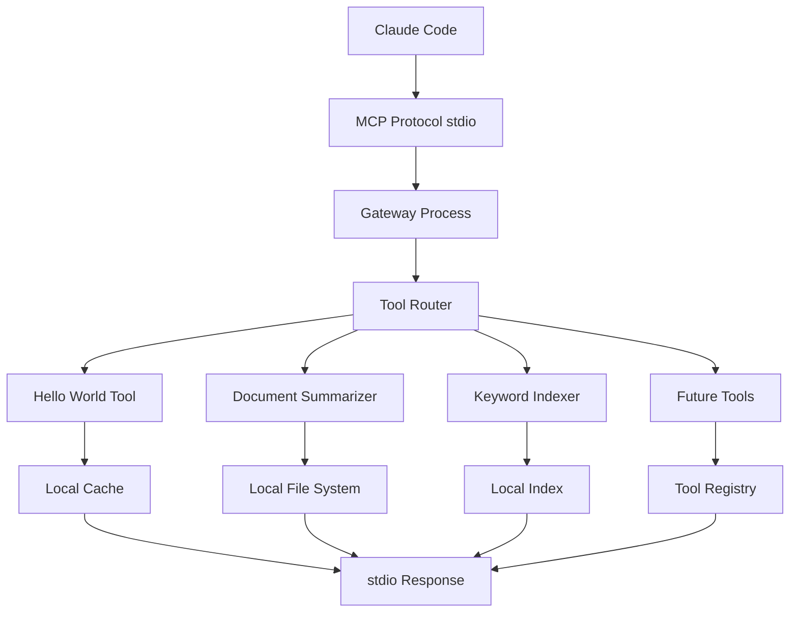

# Claude MPM MCP Gateway - Local Lightweight Architecture Requirements

**Document Version:** 2.0  
**Date:** August 15, 2025  
**Architecture Type:** Local Event-Driven  
**Status:** Technical Requirements Specification

---

## Executive Summary

### Local Lightweight Design Philosophy
The Claude MPM MCP Gateway runs as a **local, lightweight process** on the user's desktop, providing AI tool integration directly within the Claude Code environment. This design prioritizes minimal resource usage, fast startup, and seamless integration with existing Claude Code installations.

### Core Local Benefits
- **Zero Network Dependencies**: Runs entirely on local machine
- **Fast Response Times**: <10ms tool execution for local operations
- **Resource Efficient**: <50MB RAM usage, minimal CPU footprint
- **Auto-Registration**: Seamlessly integrates with Claude Code installations
- **Offline Capable**: Works without internet for local document processing

---

## Local Architecture Overview

### Process-Based Tool Execution


### Local Components

#### 1. MCP Server Process
- **Runtime**: Single Python process with async/await
- **Protocol**: stdio-based MCP server following JSON-RPC 2.0
- **Startup Time**: <500ms cold start, <100ms warm start
- **Memory**: 20-50MB baseline + tool-specific usage
- **CPU**: Minimal idle usage, burst during tool execution

#### 2. Tool Execution Engine
- **Architecture**: Event-driven with async tool handlers
- **Isolation**: Each tool runs in separate async context
- **Timeout**: 30s max per tool (configurable)
- **Concurrency**: Up to 10 concurrent tool executions
- **Error Handling**: Graceful degradation with detailed error reporting

#### 3. Local Storage
- **Cache**: In-memory LRU cache with optional disk persistence
- **Documents**: Direct file system access with path validation
- **Index**: SQLite-based full-text search for keyword indexing
- **Config**: YAML configuration files in installation directory

---

## Technical Architecture Specification

### Core Process Design

#### Single-Process Architecture
```python
# Lightweight process architecture
class MCPGatewayProcess:
    """Single process handling all MCP operations."""
    
    def __init__(self):
        self.server = MCPServer()  # stdio-based MCP server
        self.router = ToolRouter()  # Route tools to handlers
        self.cache = LocalCache()   # In-memory + optional persistence
        self.tools = {}            # Registered tool handlers
        
    async def start(self):
        """Start gateway with minimal resource usage."""
        await self.server.run(stdio_server())
```

#### Event-Driven Tool Execution
```python
# Event-driven tool handling
class ToolExecutionEngine:
    """Async tool execution with resource management."""
    
    async def execute_tool(self, tool_name: str, params: dict) -> dict:
        """Execute tool with timeout and resource limits."""
        
        # Resource limits for local execution
        with resource_limits(memory_mb=100, cpu_percent=25):
            async with asyncio.timeout(30):  # 30s max
                return await self.tools[tool_name].execute(params)
```

### Resource Management

#### Memory Optimization
- **Baseline Usage**: 20MB for core gateway process
- **Tool Overhead**: 5-30MB per active tool execution
- **Cache Size**: Configurable 10-100MB cache limit
- **Memory Monitoring**: Automatic cleanup when limits approached
- **Garbage Collection**: Periodic cleanup of unused resources

#### CPU Efficiency
- **Idle State**: <1% CPU usage when not processing
- **Tool Execution**: Burst to 25-50% during processing
- **Background Tasks**: Minimal indexing and cache maintenance
- **Process Priority**: Normal priority, yields to other applications

#### Disk Usage
- **Binary Size**: <10MB total installation footprint
- **Cache Storage**: 0-500MB depending on configuration
- **Log Files**: Rotating logs with 50MB total limit
- **Index Files**: SQLite databases for keyword search

### Integration Patterns

#### Claude Code Integration
```json
// Automatic registration in Claude Code settings
{
  "mcpServers": {
    "claude-mpm-mcp-gateway": {
      "command": "python",
      "args": ["/path/to/claude-mpm/mcp_gateway/server.py"],
      "env": {
        "CLAUDE_MPM_CONFIG": "/path/to/config.yaml"
      }
    }
  }
}
```

#### Configuration Management
```yaml
# Local configuration file
gateway:
  enabled: true
  port: null  # stdio only, no network ports
  timeout: 30
  max_memory_mb: 100
  
cache:
  enabled: true
  type: "memory"  # memory, disk, or hybrid
  max_size_mb: 50
  ttl_seconds: 3600
  
tools:
  hello_world:
    enabled: true
  document_summarizer:
    enabled: true
    max_file_size_mb: 10
  keyword_indexer:
    enabled: true
    index_path: "./mcp_index.db"
```

---

## Tool Implementation Specifications

### Hello World Tool (Testing)
```python
class HelloWorldTool:
    """Lightweight testing tool for MCP verification."""
    
    async def execute(self, params: dict) -> dict:
        message = params.get("message", "Hello from Claude MPM!")
        
        return {
            "response": f"Echo: {message}",
            "timestamp": datetime.now().isoformat(),
            "gateway_version": get_version(),
            "memory_usage_mb": get_memory_usage()
        }
```

### Document Summarizer Tool
```python
class DocumentSummarizerTool:
    """Local document summarization with caching."""
    
    def __init__(self):
        self.cache = LocalCache(max_size_mb=20)
        
    async def execute(self, params: dict) -> dict:
        file_path = params["file_path"]
        algorithm = params.get("algorithm", "lexrank")
        target_tokens = params.get("target_tokens", 500)
        
        # Check cache first
        cache_key = f"{file_path}:{algorithm}:{target_tokens}"
        if cached := self.cache.get(cache_key):
            return cached
        
        # Process document
        with resource_limits(memory_mb=50):
            content = self._read_file_safely(file_path)
            summary = self._summarize(content, algorithm, target_tokens)
        
        result = {
            "summary": summary,
            "original_tokens": count_tokens(content),
            "summary_tokens": count_tokens(summary),
            "compression_ratio": len(summary) / len(content),
            "algorithm": algorithm
        }
        
        # Cache result
        self.cache.set(cache_key, result, ttl=3600)
        return result
```

### Keyword Indexer Tool
```python
class KeywordIndexerTool:
    """Local full-text search with SQLite backend."""
    
    def __init__(self, index_path: str):
        self.db_path = Path(index_path)
        self._ensure_index()
        
    async def execute(self, params: dict) -> dict:
        query = params["query"]
        path = params["index_path"]
        max_results = params.get("max_results", 10)
        
        # Update index if needed
        await self._update_index_if_needed(path)
        
        # Search index
        results = self._search_index(query, max_results)
        
        return {
            "query": query,
            "results": results,
            "total_indexed_files": self._get_index_size(),
            "search_time_ms": self._last_search_time
        }
```

---

## Performance Requirements

### Response Time Targets
- **Tool Discovery**: <50ms to list available tools
- **Hello World**: <10ms for simple echo operations
- **Document Summary**: <2s for files up to 1MB
- **Keyword Search**: <100ms for typical queries
- **Cold Start**: <500ms from process launch to ready

### Resource Limits
- **Maximum Memory**: 100MB per tool execution
- **Maximum CPU**: 50% sustained, 100% burst for 10s
- **File Size Limits**: 10MB per document processing
- **Concurrent Tools**: 10 simultaneous executions max
- **Cache Size**: 50MB default, 500MB maximum

### Reliability Targets
- **Uptime**: 99.9% while Claude Code is running
- **Error Rate**: <0.1% tool execution failures
- **Recovery Time**: <1s from crashed tool to recovery
- **Memory Leaks**: <1MB growth per hour sustained usage

---

## Installation & Deployment

### Auto-Installation Process
```python
class LocalInstallationManager:
    """Manages local installation and registration."""
    
    def install_mcp_gateway(self):
        """Install gateway in Claude MPM installation."""
        
        # 1. Create gateway directory
        gateway_dir = self.installation_root / "mcp_gateway"
        gateway_dir.mkdir(exist_ok=True)
        
        # 2. Copy server files
        self._copy_server_files(gateway_dir)
        
        # 3. Generate configuration
        self._create_local_config(gateway_dir)
        
        # 4. Register with Claude Code
        self._register_with_claude_code()
        
        # 5. Test installation
        return self._test_gateway_connection()
```

### Directory Structure
```
claude-mpm-installation/
├── mcp_gateway/
│   ├── server.py           # Main MCP server process
│   ├── config.yaml         # Local configuration
│   ├── tools/
│   │   ├── hello_world.py
│   │   ├── document_summarizer.py
│   │   └── keyword_indexer.py
│   ├── cache/
│   │   └── [runtime cache files]
│   └── logs/
│       └── mcp_gateway.log
```

### Health Monitoring
```python
class HealthMonitor:
    """Monitor gateway health and performance."""
    
    def get_health_status(self) -> dict:
        return {
            "status": "healthy" | "degraded" | "unhealthy",
            "uptime_seconds": self.uptime,
            "memory_usage_mb": self.current_memory,
            "tool_executions_total": self.total_executions,
            "error_rate_percent": self.error_rate,
            "cache_hit_rate_percent": self.cache_hit_rate
        }
```

---

## Development & Testing

### Local Development
```bash
# Run gateway in development mode
cd claude-mpm/mcp_gateway
python server.py --dev --verbose

# Test individual tools
python -m tools.hello_world --test
python -m tools.document_summarizer --test-file sample.md

# Monitor performance
python monitor.py --watch-memory --watch-cpu
```

### Testing Framework
```python
class MCPGatewayTester:
    """Test harness for local MCP gateway."""
    
    async def test_tool_execution(self):
        """Test all tools with various inputs."""
        
        # Start test gateway
        gateway = MCPGatewayProcess(test_mode=True)
        await gateway.start()
        
        # Test each tool
        results = {}
        for tool_name in gateway.list_tools():
            results[tool_name] = await self._test_tool(tool_name)
        
        return results
```

---

## Security & Safety

### Local Security Model
- **File System Access**: Restricted to project directories
- **Process Isolation**: Tools run in separate async contexts
- **Resource Limits**: Memory and CPU limits prevent resource exhaustion
- **Input Validation**: All tool inputs validated against schemas
- **Path Traversal Protection**: Prevent access outside allowed directories

### Error Handling
```python
class SafeToolExecution:
    """Safe execution wrapper for all tools."""
    
    async def execute_safely(self, tool, params):
        try:
            # Validate inputs
            self._validate_params(tool.schema, params)
            
            # Apply resource limits
            with resource_limits(memory_mb=50, timeout=30):
                return await tool.execute(params)
                
        except ResourceExhaustionError:
            return {"error": "Tool exceeded resource limits"}
        except ValidationError as e:
            return {"error": f"Invalid parameters: {e}"}
        except Exception as e:
            self.logger.error(f"Tool execution failed: {e}")
            return {"error": "Tool execution failed"}
```

---

## CLI Integration

### Management Commands
```bash
# Check gateway status
claude-mpm mcp status

# Install/update gateway
claude-mpm mcp install

# Test gateway functionality
claude-mpm mcp test

# View performance metrics
claude-mpm mcp metrics

# Enable/disable specific tools
claude-mpm mcp tool enable document_summarizer
claude-mpm mcp tool disable keyword_indexer
```

This local architecture provides all the MCP Gateway functionality while running entirely on the user's desktop with minimal resource usage and seamless Claude Code integration.