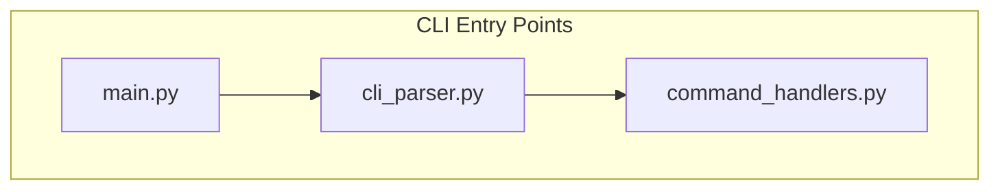
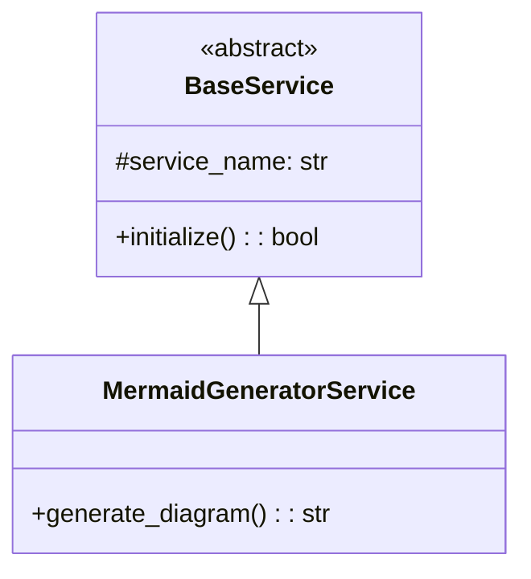

# Analyze Command Reference

The `claude-mpm analyze` command provides comprehensive code analysis capabilities with integrated Mermaid diagram generation for visualizing code structure and relationships.

## Synopsis

```bash
claude-mpm analyze [TARGET] [OPTIONS]
```

## Description

The analyze command performs static code analysis on the specified target (file or directory) using the Code Analyzer agent (v2.6.0+). It can generate various types of Mermaid diagrams to visualize code architecture, dependencies, class hierarchies, and execution flow.

## Arguments

### TARGET
- **Type**: Path (file or directory)
- **Default**: Current directory (`.`)
- **Description**: Path to the code to analyze

**Examples**:
```bash
claude-mpm analyze                    # Analyze current directory
claude-mpm analyze ./src             # Analyze src directory
claude-mpm analyze main.py           # Analyze single file
claude-mpm analyze /path/to/project  # Analyze specific project
```

## Options

### Mermaid Diagram Options

#### `--mermaid`
Enable automatic Mermaid diagram generation for all supported diagram types.

**Default**: Disabled
**Compatible with**: All other mermaid options

```bash
claude-mpm analyze . --mermaid
```

#### `--mermaid-types TYPES`
Specify which types of diagrams to generate (comma-separated).

**Available Types**:
- `entry_points` - Application entry points and initialization flow
- `module_deps` - Module dependency relationships 
- `class_hierarchy` - Class inheritance and relationships (UML-style)
- `call_graph` - Function call flow analysis

**Default**: All types when `--mermaid` is used
**Examples**:
```bash
# Generate only module dependencies and class hierarchy
claude-mpm analyze . --mermaid-types module_deps,class_hierarchy

# Generate only entry points
claude-mpm analyze . --mermaid-types entry_points

# Multiple types
claude-mpm analyze . --mermaid-types "entry_points,call_graph"
```

#### `--save-diagrams`
Save generated diagrams to files instead of only displaying them in the response.

**Default**: Disabled (diagrams only shown in agent response)
**Requires**: `--mermaid` or `--mermaid-types`
**File Format**: `.mmd` files with Mermaid syntax

```bash
claude-mpm analyze . --mermaid --save-diagrams
```

#### `--diagram-output DIR`
Specify the directory where diagram files should be saved.

**Default**: `./diagrams`
**Requires**: `--save-diagrams`
**Directory Creation**: Automatically created if it doesn't exist

```bash
# Save to custom directory
claude-mpm analyze . --mermaid --save-diagrams --diagram-output ./architecture-diagrams

# Save to absolute path
claude-mpm analyze . --mermaid --save-diagrams --diagram-output /tmp/project-diagrams
```

### Analysis Options

#### `--focus AREAS`
Focus analysis on specific areas of the codebase (comma-separated keywords).

**Purpose**: Improve performance and relevance by limiting scope
**Examples**:
```bash
# Focus on authentication code
claude-mpm analyze . --focus authentication,auth

# Focus on database and API components  
claude-mpm analyze . --focus database,api,models

# Focus on specific modules
claude-mpm analyze . --focus "user_service,payment"
```

#### `--format FORMAT`
Specify the output format for analysis results.

**Available Formats**:
- `text` (default) - Human-readable text output
- `json` - Structured JSON output
- `markdown` - Markdown format with embedded diagrams

**Examples**:
```bash
# JSON output for programmatic use
claude-mpm analyze . --mermaid --format json > analysis.json

# Markdown for documentation
claude-mpm analyze . --mermaid --format markdown > ARCHITECTURE.md

# Default text output
claude-mpm analyze . --mermaid --format text
```

### Session Options

#### `--session-id ID`
Use a specific session ID for the analysis.

**Purpose**: Continue previous analysis or maintain context
**Default**: Auto-generated session ID

```bash
claude-mpm analyze . --session-id my-analysis-session
```

#### `--no-session`
Run analysis without creating a session.

**Purpose**: One-time analysis without maintaining state
**Default**: Sessions are created by default

```bash
claude-mpm analyze . --mermaid --no-session
```

#### `--output FILE`
Save the complete analysis output to a file.

**Format**: Depends on `--format` option
**Examples**:
```bash
# Save text analysis to file
claude-mpm analyze . --mermaid --output analysis-report.txt

# Save JSON results
claude-mpm analyze . --format json --output results.json

# Save markdown documentation
claude-mpm analyze . --format markdown --output CODEBASE.md
```

## Usage Examples

### Basic Analysis

```bash
# Simple code analysis without diagrams
claude-mpm analyze .

# Analysis with all diagram types
claude-mpm analyze . --mermaid

# Analysis of specific directory
claude-mpm analyze ./src --mermaid
```

### Diagram Generation

```bash
# Generate and save all diagram types
claude-mpm analyze . --mermaid --save-diagrams

# Generate specific diagrams with custom output
claude-mpm analyze . --mermaid-types module_deps,class_hierarchy \
                    --save-diagrams --diagram-output ./docs/diagrams

# Focus analysis for better diagrams
claude-mpm analyze . --mermaid-types entry_points \
                    --focus "main,app,server" \
                    --save-diagrams
```

### Output Formats

```bash
# Generate markdown documentation with diagrams
claude-mpm analyze . --mermaid --format markdown --output ARCHITECTURE.md

# JSON output with diagram data
claude-mpm analyze . --mermaid --format json --output analysis.json

# Text report with saved diagram files
claude-mpm analyze . --mermaid --save-diagrams --diagram-output ./diagrams
```

### Focused Analysis

```bash
# Analyze authentication components
claude-mpm analyze . --focus authentication,auth,login \
                    --mermaid-types class_hierarchy,call_graph

# Database layer analysis
claude-mpm analyze ./models --focus database,orm,query \
                           --mermaid-types class_hierarchy,module_deps

# API endpoint analysis  
claude-mpm analyze ./api --focus routes,endpoints,handlers \
                         --mermaid-types call_graph,entry_points
```

### Session Management

```bash
# Start analysis session
claude-mpm analyze . --mermaid --session-id project-analysis

# Continue previous session
claude-mpm analyze ./new-feature --mermaid --session-id project-analysis

# One-time analysis
claude-mpm analyze . --mermaid --no-session
```

## Generated Files

When using `--save-diagrams`, the following files are created:

### Standard Diagram Files

```
diagrams/
├── entry_points.mmd              # Application entry points
├── module_deps.mmd               # Module dependencies  
├── class_hierarchy.mmd           # Class relationships
├── call_graph.mmd                # Function call flow
├── entry_points_with_metadata.mmd    # With generation metadata
├── module_deps_with_metadata.mmd     # With generation metadata  
├── class_hierarchy_with_metadata.mmd # With generation metadata
└── call_graph_with_metadata.mmd      # With generation metadata
```

### File Content Format

Each `.mmd` file contains valid Mermaid syntax:

**entry_points.mmd**:


**class_hierarchy.mmd**:


**Metadata versions** include additional information:
```mermaid
%% Generated by claude-mpm analyze command
%% Timestamp: 2024-01-01T12:00:00Z
%% Target: /path/to/project
%% Diagram Type: class_hierarchy
%% Configuration: {"direction": "TB", "include_external": false}

classDiagram
    %% ... diagram content ...
```

## Performance Considerations

### Large Codebases

For large projects, consider:
```bash
# Focus analysis to reduce processing time
claude-mpm analyze . --focus "core,main,api" --mermaid

# Analyze specific subdirectories
claude-mpm analyze ./src/core --mermaid-types class_hierarchy

# Use module dependencies for overview
claude-mpm analyze . --mermaid-types module_deps --save-diagrams
```

### Memory Usage

- Analysis of very large codebases may require significant memory
- Use `--focus` to limit scope
- Analyze subdirectories separately for better performance
- The service automatically truncates very large diagrams (10+ items per class)

## Integration with Development Workflow

### Documentation Generation

```bash
# Generate architecture documentation
claude-mpm analyze . --mermaid --format markdown --output ARCHITECTURE.md

# Update README with diagrams  
claude-mpm analyze . --mermaid-types entry_points --save-diagrams
# Then include ./diagrams/entry_points.mmd in your README.md
```

### Code Review Process

```bash
# Analyze changes in feature branch
claude-mpm analyze ./new-feature --mermaid-types class_hierarchy,call_graph

# Generate comparison diagrams
claude-mpm analyze . --focus "payment,billing" --mermaid --save-diagrams
```

### Continuous Integration

```bash
# Add to CI pipeline for documentation updates
- name: Generate Architecture Diagrams
  run: |
    claude-mpm analyze . --mermaid --save-diagrams --diagram-output ./docs/diagrams
    git add docs/diagrams/
    git commit -m "Update architecture diagrams" || true
```

## Error Handling

### Common Errors

**Target not found**:
```
Error: Target path does not exist: ./nonexistent
```
**Solution**: Check the path and ensure it exists.

**Permission denied for diagram output**:
```
Error: Cannot create diagram output directory: Permission denied
```  
**Solution**: Check write permissions or use a different output directory.

**No diagrams generated**:
```
Warning: No diagrams were generated from the analysis results
```
**Solution**: The code may not contain structures suitable for the requested diagram types. Try different diagram types or focus areas.

### Debug Mode

For troubleshooting, enable debug logging:
```bash
export CLAUDE_MPM_LOG_LEVEL=DEBUG
claude-mpm analyze . --mermaid
```

This will provide detailed information about:
- File discovery and processing
- Diagram generation steps
- Service initialization
- Error details and stack traces

## Exit Codes

- `0` - Success
- `1` - Analysis failed or invalid arguments
- `2` - Target path does not exist
- `3` - Permission or file system error
- `130` - Interrupted by user (Ctrl+C)

## Version History

- **v4.0.25+** - Mermaid visualization support added
- **v2.6.0+** - Code Analyzer agent with diagram generation
- **v4.1.0+** - Enhanced CLI integration with save options

## See Also

- [Mermaid Visualization Guide](../user/03-features/mermaid-visualization.md) - Complete feature documentation
- [Code Analyzer Agent](../agents/README.md) - Agent-specific documentation
- [CLI Commands Reference](../user/02-guides/cli-commands-reference.md) - All CLI commands
- [Code Analysis Guide](../user/03-features/code-analysis.md) - Analysis capabilities

## Examples Repository

For more examples and use cases, see the examples in:
- `/scripts/example_mermaid_generator.py` - Programmatic usage
- `/output/diagrams/` - Sample generated diagrams
- Test files in `/tests/test_mermaid_*.py` - Integration examples