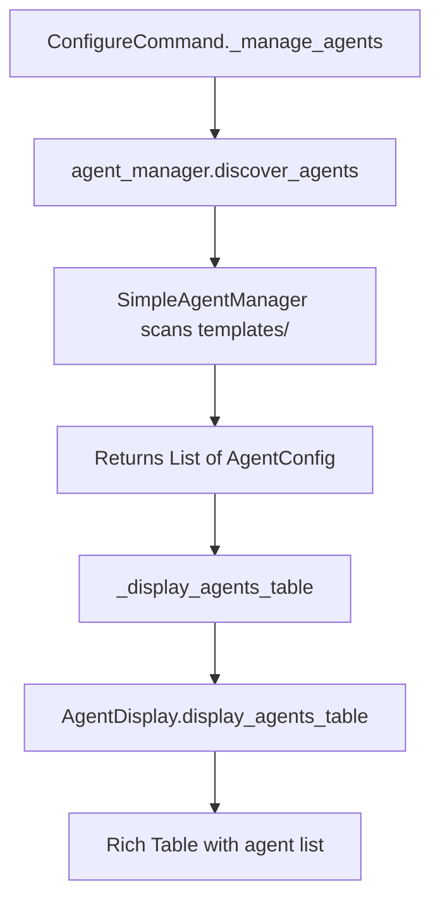

# Claude MPM Configuration Interface Analysis

**Research Date**: 2025-12-01
**Focus**: Agent Discovery Architecture in `claude-mpm config` Interface
**Context**: Understanding how the main config interface discovers and displays agents

## Executive Summary

The Claude MPM Configuration Interface (`claude-mpm config`) is a **separate interface** from the enhanced `claude-mpm agents manage` (AgentWizard) interface. It uses `SimpleAgentManager` for agent discovery, which **only scans local JSON templates** in `src/claude_mpm/agents/templates/` directory. This explains why remote agents from `claude-mpm-agents` repository are not appearing in the config interface.

### Key Findings

1. **Interface Identity**: The output is from `ConfigureCommand` (`configure.py`), not AgentWizard
2. **Agent Discovery**: Uses `SimpleAgentManager.discover_agents()` which scans only local JSON files
3. **No Remote Support**: Config interface has NO integration with RemoteAgentDiscoveryService
4. **Different Architecture**: Separate from the enhanced `agents manage` command

## File Locations

### Primary Configuration Interface

**Main File**: `/Users/masa/Projects/claude-mpm/src/claude_mpm/cli/commands/configure.py`
- **Class**: `ConfigureCommand` (extends `BaseCommand`)
- **Entry Point**: `manage_configure(args)` function
- **Lines of Code**: 826 lines

### Supporting Files

1. **Agent Discovery**: `/Users/masa/Projects/claude-mpm/src/claude_mpm/cli/commands/agent_state_manager.py`
   - **Class**: `SimpleAgentManager`
   - **Key Method**: `discover_agents()` (lines 99-186)

2. **Agent Display**: `/Users/masa/Projects/claude-mpm/src/claude_mpm/cli/commands/configure_agent_display.py`
   - **Class**: `AgentDisplay`
   - **Key Methods**: `display_agents_table()`, `display_agents_with_pending_states()`

3. **Navigation & Header**: `/Users/masa/Projects/claude-mpm/src/claude_mpm/cli/commands/configure_navigation.py`
   - **Class**: `ConfigNavigation`
   - **Key Methods**: `display_header()`, `show_main_menu()`

## Current Agent Discovery Architecture

### How SimpleAgentManager Discovers Agents

```python
# From agent_state_manager.py, lines 99-186
def discover_agents(self) -> List[AgentConfig]:
    """Discover available agents from template JSON files."""
    agents = []

    # Scan templates directory for JSON files
    if not self.templates_dir.exists():
        # Fallback to minimal set
        return [
            AgentConfig("engineer", "Engineering agent (templates not found)", []),
            AgentConfig("research", "Research agent (templates not found)", []),
        ]

    try:
        # Read all JSON template files
        for template_file in sorted(self.templates_dir.glob("*.json")):
            # Skip backup files
            if "backup" in template_file.name.lower():
                continue

            with template_file.open() as f:
                template_data = json.load(f)

            # Extract agent information from template
            agent_id = template_data.get("agent_id", template_file.stem)
            metadata = template_data.get("metadata", {})
            description = metadata.get("description", "No description available")

            # Extract tools as dependencies
            capabilities = template_data.get("capabilities", {})
            tools = capabilities.get("tools", [])
            display_tools = tools[:3] if len(tools) > 3 else tools

            # Normalize agent ID
            normalized_id = agent_id.replace("-agent", "").replace("_", "-")

            agents.append(AgentConfig(
                name=normalized_id,
                description=description[:80] + "..." if len(description) > 80 else description,
                dependencies=display_tools
            ))
```

**Key Characteristics**:
- ✅ Scans only local `src/claude_mpm/agents/templates/*.json` files
- ✅ Extracts metadata from JSON structure (agent_id, description, capabilities)
- ✅ Normalizes agent IDs (removes `-agent` suffix, replaces underscores)
- ✅ Handles malformed templates gracefully
- ❌ NO integration with RemoteAgentDiscoveryService
- ❌ NO remote repository scanning
- ❌ NO distinction between system vs. remote agents

### Interface Display Flow



## Header Display Implementation

### Location
`configure_navigation.py`, lines 47-81 (in `ConfigNavigation.display_header()`)

### Current Output
```
╭─────────────────────────────────────────────────────────────────╮
│                  Claude MPM Configuration Interface              │
│                         v5.0.0+build.534                         │
├─────────────────────────────────────────────────────────────────┤
│ Scope: PROJECT | Directory: /current/working/directory          │
╰─────────────────────────────────────────────────────────────────╯
```

### Implementation Details
```python
def display_header(self) -> None:
    """Display the TUI header with version and scope information."""
    self.console.clear()

    from claude_mpm import __version__

    header_text = Text()
    header_text.append("Claude MPM ", style="bold blue")
    header_text.append("Configuration Interface", style="bold")
    header_text.append(f"\nv{__version__}", style="dim blue")

    scope_text = Text(f"Scope: {self.current_scope.upper()}", style="bold blue")
    dir_text = Text(f"Directory: {self.project_dir}", style="dim")

    header_content = Columns([header_text], align="center")
    subtitle_content = f"{scope_text} | {dir_text}"

    header_panel = Panel(
        header_content,
        subtitle=subtitle_content,
        box=ROUNDED,
        style="blue",
        padding=(1, 2),
    )

    self.console.print(header_panel)
```

## Agent Table Display

### Location
`configure_agent_display.py`, lines 56-116 (in `AgentDisplay.display_agents_table()`)

### Current Output
```
Available Agents (1 total)
╭─────┬────────────────────────┬──────────────┬───────────────────────────────────────────────┬──────────────────────╮
│ ID  │ Name                   │ Status       │ Description                                   │ Model/Tools          │
├─────┼────────────────────────┼──────────────┼───────────────────────────────────────────────┼──────────────────────┤
│ 1   │ engineer               │ ✓ Enabled    │ No agents found in templates                  │ Default              │
╰─────┴────────────────────────┴──────────────┴───────────────────────────────────────────────┴──────────────────────╯
```

### Implementation Details
```python
def display_agents_table(self, agents: List[AgentConfig]) -> None:
    """Display a table of available agents with status and metadata."""
    table = Table(
        title=f"Available Agents ({len(agents)} total)",
        box=ROUNDED,
        show_lines=True,
    )

    table.add_column("ID", style="dim", width=3)
    table.add_column("Name", style="bold blue", width=22)
    table.add_column("Status", width=12)
    table.add_column("Description", style="bold", width=45)
    table.add_column("Model/Tools", style="dim", width=20)

    for idx, agent in enumerate(agents, 1):
        is_enabled = self.agent_manager.is_agent_enabled(agent.name)
        status = "[green]✓ Enabled[/green]" if is_enabled else "[red]✗ Disabled[/red]"

        # Format tools/dependencies - show first 2 tools
        tools_display = ""
        if agent.dependencies:
            if len(agent.dependencies) > 2:
                tools_display = f"{', '.join(agent.dependencies[:2])}..."
            else:
                tools_display = ", ".join(agent.dependencies)
        else:
            # Try to get model from template
            template_path = self._get_agent_template_path(agent.name)
            if template_path.exists():
                with template_path.open() as f:
                    template = json.load(f)
                model = template.get("capabilities", {}).get("model", "default")
                tools_display = f"Model: {model}"
            else:
                tools_display = "Default"

        # Truncate description for table display
        desc_display = f"[cyan]{agent.description[:42]}[/cyan]"

        table.add_row(str(idx), agent.name, status, desc_display, tools_display)

    self.console.print(table)
```

## Menu Options

### Location
`configure.py`, lines 286-342 (in `ConfigureCommand._manage_agents()`)

### Current Output
```
Agent Management Options:
  [t] Toggle agents (enable/disable multiple)
  [c] Customize agent template
  [v] View agent details
  [r] Reset agent to defaults
  [b] Back to main menu
```

### Implementation Details
```python
def _manage_agents(self) -> None:
    """Agent management interface."""
    while True:
        self.console.clear()
        self._display_header()

        # Display available agents
        agents = self.agent_manager.discover_agents()
        self._display_agents_table(agents)

        # Show agent menu
        self.console.print("\n[bold]Agent Management Options:[/bold]")

        text_t = Text("  ")
        text_t.append("[t]", style="bold blue")
        text_t.append(" Toggle agents (enable/disable multiple)")
        self.console.print(text_t)

        text_c = Text("  ")
        text_c.append("[c]", style="bold blue")
        text_c.append(" Customize agent template")
        self.console.print(text_c)

        text_v = Text("  ")
        text_v.append("[v]", style="bold blue")
        text_v.append(" View agent details")
        self.console.print(text_v)

        text_r = Text("  ")
        text_r.append("[r]", style="bold blue")
        text_r.append(" Reset agent to defaults")
        self.console.print(text_r)

        text_b = Text("  ")
        text_b.append("[b]", style="bold blue")
        text_b.append(" Back to main menu")
        self.console.print(text_b)

        choice = Prompt.ask("[bold blue]Select an option[/bold blue]", default="b")

        if choice == "b":
            break
        elif choice == "t":
            self._toggle_agents_interactive(agents)
        elif choice == "c":
            self._customize_agent_template(agents)
        elif choice == "v":
            self._view_agent_details(agents)
        elif choice == "r":
            self._reset_agent_defaults(agents)
```

## Integration Points for RemoteAgentDiscoveryService

### Required Changes

To integrate remote agent discovery into the configuration interface, we need to:

1. **Update SimpleAgentManager** to use RemoteAgentDiscoveryService
2. **Enhance agent display** to distinguish between system/remote/local agents
3. **Add source indicators** in the agent table
4. **Update template path resolution** to handle remote agents

### Proposed Architecture

```python
class SimpleAgentManager:
    def __init__(self, config_dir: Path):
        self.config_dir = config_dir
        self.config_file = config_dir / "agent_states.json"
        self.templates_dir = Path(__file__).parent.parent.parent / "agents" / "templates"

        # NEW: Add RemoteAgentDiscoveryService integration
        self.remote_service = RemoteAgentDiscoveryService()

    def discover_agents(self) -> List[AgentConfig]:
        """Discover agents from both local templates and remote repositories."""
        agents = []

        # 1. Discover local agents (existing logic)
        local_agents = self._discover_local_agents()
        agents.extend(local_agents)

        # 2. Discover remote agents (NEW)
        try:
            remote_agents = self.remote_service.discover_all_agents()
            for remote_agent in remote_agents:
                agents.append(AgentConfig(
                    name=remote_agent.name,
                    description=remote_agent.description,
                    dependencies=remote_agent.tools[:3],
                    source=remote_agent.source,  # NEW: track source
                    repository=remote_agent.repository  # NEW: track repo
                ))
        except Exception as e:
            self.logger.warning(f"Failed to discover remote agents: {e}")

        # 3. Deduplicate and sort
        agents = self._deduplicate_agents(agents)
        agents.sort(key=lambda a: a.name)

        return agents

    def _discover_local_agents(self) -> List[AgentConfig]:
        """Existing local agent discovery logic."""
        # Current implementation from lines 99-186
        pass

    def _deduplicate_agents(self, agents: List[AgentConfig]) -> List[AgentConfig]:
        """Remove duplicates, preferring local over remote."""
        seen = {}
        for agent in agents:
            if agent.name not in seen or agent.source == "local":
                seen[agent.name] = agent
        return list(seen.values())
```

### Enhanced Agent Display

```python
def display_agents_table(self, agents: List[AgentConfig]) -> None:
    """Display agents table with source indicators."""
    table = Table(
        title=f"Available Agents ({len(agents)} total)",
        box=ROUNDED,
        show_lines=True,
    )

    table.add_column("ID", style="dim", width=3)
    table.add_column("Name", style="bold blue", width=22)
    table.add_column("Source", style="dim", width=10)  # NEW
    table.add_column("Status", width=12)
    table.add_column("Description", style="bold", width=45)
    table.add_column("Model/Tools", style="dim", width=20)

    for idx, agent in enumerate(agents, 1):
        is_enabled = self.agent_manager.is_agent_enabled(agent.name)
        status = "[green]✓ Enabled[/green]" if is_enabled else "[red]✗ Disabled[/red]"

        # NEW: Source indicator
        source_display = {
            "local": "[yellow]📁 Local[/yellow]",
            "system": "[blue]⚙️ System[/blue]",
            "remote": "[green]☁️ Remote[/green]"
        }.get(agent.source, "[dim]Unknown[/dim]")

        # Existing columns...
        table.add_row(
            str(idx),
            agent.name,
            source_display,  # NEW
            status,
            desc_display,
            tools_display
        )
```

## Comparison: Config Interface vs. AgentWizard

| Feature | Config Interface (`configure.py`) | AgentWizard (`agent_wizard.py`) |
|---------|-----------------------------------|----------------------------------|
| **Command** | `claude-mpm config` → Agent Management | `claude-mpm agents manage` |
| **Agent Discovery** | `SimpleAgentManager.discover_agents()` | `RemoteAgentDiscoveryService` |
| **Agent Sources** | Local templates only | System + Remote repositories |
| **Display** | Basic Rich table | Enhanced table with source badges |
| **Remote Support** | ❌ No remote agent support | ✅ Full remote support |
| **Deployment** | N/A (config only) | ✅ Deploys agents to `~/.claude/agents/` |
| **Template Editing** | ✅ Yes (customize/reset) | ❌ No template editing |
| **State Management** | ✅ Enable/disable with batch save | ✅ Enable/disable individual |
| **Integration** | Part of main config interface | Standalone agents management |

## Implications

### Why Remote Agents Don't Appear in Config Interface

The configuration interface showing only 1 agent ("engineer") with "No agents found in templates" description is because:

1. **Template Directory Empty/Minimal**: The `src/claude_mpm/agents/templates/` directory likely contains minimal or no JSON templates
2. **No Remote Discovery**: Config interface doesn't integrate with RemoteAgentDiscoveryService
3. **Fallback Behavior**: When no templates found, returns minimal fallback agents

### User Confusion Point

Users may encounter **two different agent management interfaces**:

1. **`claude-mpm config` → Agent Management**: Shows only local template-based agents
2. **`claude-mpm agents manage`**: Shows all agents (system + remote)

This creates confusion when:
- Remote agents visible in `agents manage` don't appear in `config`
- Different agent counts between interfaces
- Enable/disable states may differ

## Recommended Actions

### Option 1: Deprecate Config Interface Agent Management

**Rationale**: AgentWizard provides superior functionality
- Remove agent management from `claude-mpm config`
- Redirect users to `claude-mpm agents manage`
- Keep config interface for other settings (behaviors, startup, etc.)

**Implementation**:
```python
def _manage_agents(self) -> None:
    """Redirect to agent wizard."""
    self.console.print("\n[bold yellow]Agent management has moved![/yellow]")
    self.console.print("Please use: [bold cyan]claude-mpm agents manage[/cyan]")
    self.console.print("\nThe new agent management interface provides:")
    self.console.print("  • Remote agent repository support")
    self.console.print("  • Enhanced agent discovery")
    self.console.print("  • Automatic deployment")

    if Confirm.ask("\nLaunch agent wizard now?", default=True):
        # Launch agent wizard
        os.system("claude-mpm agents manage")

    Prompt.ask("\nPress Enter to continue")
```

### Option 2: Enhance Config Interface with Remote Discovery

**Rationale**: Maintain consistent functionality across both interfaces
- Update SimpleAgentManager to use RemoteAgentDiscoveryService
- Add source indicators to agent table
- Maintain feature parity with AgentWizard

**Implementation**:
- Integrate RemoteAgentDiscoveryService into SimpleAgentManager
- Update AgentDisplay to show source badges
- Add remote agent deployment capability

### Option 3: Hybrid Approach

**Rationale**: Best of both worlds
- Config interface shows ALL agents (local + remote) for viewing
- Config interface allows enable/disable for local agents only
- Redirect to AgentWizard for remote agent operations

**Implementation**:
```python
def _manage_agents(self) -> None:
    """Enhanced agent management with remote awareness."""
    while True:
        agents = self.agent_manager.discover_agents()  # Now includes remote
        self._display_agents_table(agents)  # Shows source badges

        self.console.print("\n[bold]Agent Management Options:[/bold]")
        self.console.print("  [t] Toggle local agents")
        self.console.print("  [w] Launch Agent Wizard (for remote agents)")
        self.console.print("  [v] View agent details")
        self.console.print("  [b] Back to main menu")

        choice = Prompt.ask("[bold blue]Select an option[/bold blue]", default="b")

        if choice == "w":
            os.system("claude-mpm agents manage")
```

## Technical Debt & Risks

### Code Duplication
- Agent discovery logic duplicated between SimpleAgentManager and RemoteAgentDiscoveryService
- Agent display logic partially duplicated between AgentDisplay and AgentWizard

### Maintenance Burden
- Two separate agent management interfaces to maintain
- Risk of feature drift between interfaces
- User confusion about which interface to use

### Data Consistency
- Agent states managed separately in config vs. wizard
- Potential for inconsistent enable/disable states
- No shared cache between interfaces

## Conclusion

The Claude MPM Configuration Interface (`claude-mpm config`) uses `SimpleAgentManager` for agent discovery, which **only scans local JSON templates** and has **no integration with RemoteAgentDiscoveryService**. This creates a divergent user experience where:

- **Config interface**: Shows minimal local agents (currently showing fallback agent)
- **Agent wizard**: Shows full set of system + remote agents

**Recommended Path Forward**:
1. **Short-term**: Add clear messaging in config interface redirecting to `claude-mpm agents manage`
2. **Medium-term**: Integrate RemoteAgentDiscoveryService into SimpleAgentManager for consistent discovery
3. **Long-term**: Deprecate agent management from config interface, consolidate into agent wizard

This ensures users have a **single, authoritative interface** for agent management with full remote repository support.
