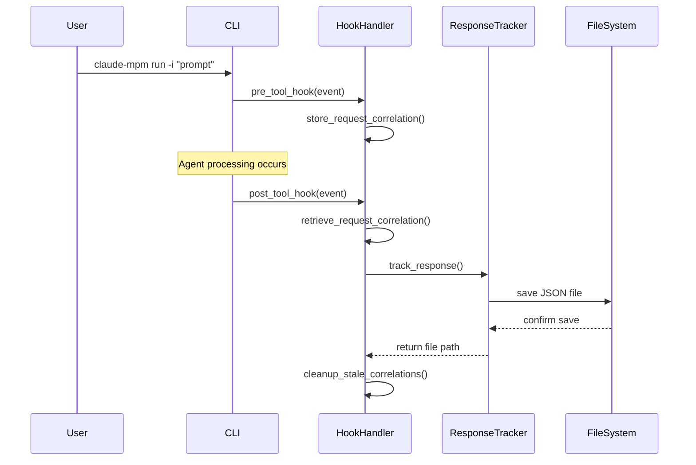

# Response Tracking Technical Reference

Comprehensive technical documentation for the Claude MPM response tracking system architecture, components, APIs, and integration points.

## Table of Contents

1. [System Components](#system-components)
2. [Data Flow Architecture](#data-flow-architecture)
3. [File Structure and Organization](#file-structure-and-organization)
4. [JSON Schema Specification](#json-schema-specification)
5. [API Reference](#api-reference)
6. [Integration Points](#integration-points)
7. [Performance Considerations](#performance-considerations)
8. [Error Handling](#error-handling)

## System Components

### ResponseTracker Service

**Location**: `src/claude_mpm/services/response_tracker.py`

The core service responsible for response storage and retrieval operations.

#### Class Definition

```python
class ResponseTracker:
    """Service for tracking and storing agent responses."""
    
    def __init__(self, base_dir: Optional[Path] = None):
        """
        Initialize response tracker.
        
        Args:
            base_dir: Base directory for storing responses. 
                     Defaults to .claude-mpm/responses/
        """
```

#### Key Methods

| Method | Purpose | Returns |
|--------|---------|---------|
| `track_response()` | Store agent response with metadata | `Path` to saved file |
| `get_session_responses()` | Retrieve all responses for a session | `List[Dict[str, Any]]` |
| `list_sessions()` | List all available sessions | `List[str]` |
| `get_session_stats()` | Calculate statistics for a session | `Dict[str, Any]` |
| `get_all_stats()` | Calculate overall statistics | `Dict[str, Any]` |
| `get_latest_responses()` | Get recent responses across sessions | `List[Dict[str, Any]]` |
| `clear_session()` | Delete all responses for a session | `bool` (success) |
| `clear_old_sessions()` | Delete sessions older than N days | `int` (count cleared) |

### Hook Integration

**Location**: `src/claude_mpm/hooks/claude_hooks/hook_handler.py`

Response tracking integrates directly into the existing hook system for automatic capture.

#### Hook Handler Integration

```python
class ClaudeHookHandler:
    def _initialize_response_tracking(self):
        """Initialize response tracking if enabled in configuration."""
        
    def _track_agent_response(self, session_id: str, agent_type: str, event: dict):
        """Track agent response by correlating with original request."""
```

#### Request-Response Correlation

The system uses a correlation mechanism to match responses with their original requests:

1. **Pre-tool Hook**: Captures request and generates correlation ID
2. **Delegation Storage**: Stores request data with 5-minute TTL
3. **Post-tool Hook**: Retrieves original request and saves complete interaction
4. **Cleanup**: Automatically removes stale correlation data

#### Correlation Data Structure

```python
delegation_requests = {
    "session_id": {
        "request": {
            "prompt": "Original user prompt",
            "description": "Agent task description"
        },
        "agent_type": "engineer",
        "timestamp": "2024-01-10T14:30:00.000Z",
        "correlation_id": "unique-correlation-id"
    }
}
```

### CLI Implementation

**Location**: `src/claude_mpm/cli/commands/responses.py`

Command-line interface for response tracking operations.

#### Command Structure

```python
def setup_parser(subparsers):
    """Set up the responses command parser."""
    parser = subparsers.add_parser('responses', help='View and manage tracked agent responses')
    
    subcommands = parser.add_subparsers(dest='subcommand')
    
    # Subcommands: list, view, stats, clear
```

#### Subcommand Functions

| Function | Purpose | Arguments |
|----------|---------|-----------|
| `list_responses()` | Display tracked responses | `--agent`, `--limit`, `--session` |
| `view_response()` | View specific response (deprecated) | `response_id`, `--raw` |
| `show_stats()` | Display comprehensive statistics | None |
| `clear_responses()` | Remove tracked responses | `--session`, `--older-than`, `--confirm` |

## Data Flow Architecture

### Complete Request-Response Flow



### Hook Event Processing

#### Pre-tool Hook Event

```python
{
    "tool": "Task",
    "agent_type": "engineer",
    "session_id": "session-abc123",
    "request": {
        "prompt": "Create a Python script",
        "description": "Implement data analysis functionality"
    },
    "timestamp": "2024-01-10T14:30:00.000Z"
}
```

#### Post-tool Hook Event

```python
{
    "tool": "Task", 
    "agent_type": "engineer",
    "session_id": "session-abc123",
    "output": "I'll create a Python script for data analysis...",
    "exit_code": 0,
    "duration": 2.3,
    "tokens": 1250,
    "model": "claude-3-sonnet-20240229"
}
```

### Thread Safety and Concurrency

The response tracking system implements thread-safe operations:

- **Atomic File Operations**: Each response saved in single atomic write
- **Concurrent Sessions**: Multiple sessions can be tracked simultaneously
- **Lock-Free Design**: No blocking locks for high-throughput scenarios
- **Correlation Cleanup**: Background cleanup of stale correlation data

## File Structure and Organization

### Directory Hierarchy

```
.claude-mpm/responses/
├── session-abc123/                          # Session directory
│   ├── engineer-20240110_143052_123.json   # Agent response file
│   ├── qa-20240110_143125_456.json         # Another agent response
│   └── documentation-20240110_143200_789.json
├── session-def456/
│   ├── research-20240110_150030_001.json
│   └── engineer-20240110_150145_002.json
└── default/                                # Default session
    └── pm-20240110_160000_999.json
```

### Filename Convention

Pattern: `<agent>-<timestamp>.json`

- **Agent**: Name of the agent that generated the response
- **Timestamp**: Format `YYYYMMDD_HHMMSS_mmm` (with milliseconds)
- **Extension**: Always `.json` for structured data

#### Timestamp Details

- **Year**: 4-digit year (2024)
- **Month**: 2-digit month (01-12) 
- **Day**: 2-digit day (01-31)
- **Hour**: 2-digit hour (00-23, 24-hour format)
- **Minute**: 2-digit minute (00-59)
- **Second**: 2-digit second (00-59)
- **Milliseconds**: 3-digit milliseconds (000-999)

### Directory Management

#### Automatic Creation

- Session directories created automatically when first response is tracked
- Parent directories created with `parents=True` for robustness
- Proper permissions set (755) for security

#### Cleanup Strategies

- **Time-based**: Remove sessions older than N days
- **Count-based**: Limit maximum number of sessions (future feature)
- **Size-based**: Remove largest sessions when disk space low (future feature)

## JSON Schema Specification

### Complete Response Schema

```json
{
  "$schema": "http://json-schema.org/draft-07/schema#",
  "type": "object",
  "title": "Claude MPM Response Tracking Schema",
  "required": ["timestamp", "session_id", "agent", "request", "response"],
  "properties": {
    "timestamp": {
      "type": "string",
      "format": "date-time",
      "description": "ISO 8601 timestamp with microsecond precision"
    },
    "session_id": {
      "type": "string",
      "description": "Unique session identifier for grouping related interactions"
    },
    "agent": {
      "type": "string",
      "description": "Name of the agent that generated this response"
    },
    "request": {
      "type": "string",
      "description": "Original prompt or request sent to the agent"
    },
    "response": {
      "type": "string",
      "description": "Complete agent response without truncation"
    },
    "metadata": {
      "type": "object",
      "description": "Additional information about the interaction",
      "properties": {
        "model": {
          "type": "string",
          "description": "Claude model identifier used for response"
        },
        "tokens": {
          "type": "integer",
          "minimum": 0,
          "description": "Total token count for request and response"
        },
        "duration": {
          "type": "number",
          "minimum": 0,
          "description": "Response generation time in seconds"
        },
        "tools_used": {
          "type": "array",
          "items": {"type": "string"},
          "description": "List of tools used during response generation"
        },
        "confidence": {
          "type": "number",
          "minimum": 0,
          "maximum": 1,
          "description": "Agent confidence score for response quality"
        },
        "response_format": {
          "type": "string",
          "enum": ["text", "json", "markdown", "code"],
          "description": "Format/type of the response content"
        },
        "error": {
          "type": "string",
          "description": "Error message if response generation failed"
        },
        "exit_code": {
          "type": "integer",
          "description": "Exit code from agent execution"
        }
      },
      "additionalProperties": true
    }
  },
  "additionalProperties": false
}
```

### Example Complete Response

```json
{
  "timestamp": "2024-01-10T14:30:52.123456",
  "session_id": "session-abc123",
  "agent": "engineer", 
  "request": "Create a Python script to analyze CSV data with pandas",
  "response": "I'll help you create a comprehensive Python script for CSV data analysis using pandas.\n\n```python\nimport pandas as pd\nimport matplotlib.pyplot as plt\n\ndef analyze_csv(file_path):\n    # Load CSV data\n    df = pd.read_csv(file_path)\n    \n    # Basic analysis\n    print(f\"Dataset shape: {df.shape}\")\n    print(f\"Columns: {df.columns.tolist()}\")\n    \n    return df\n\nif __name__ == \"__main__\":\n    df = analyze_csv(\"data.csv\")\n    print(df.describe())\n```\n\nThis script provides:\n1. CSV loading with pandas\n2. Basic dataset information\n3. Statistical summary\n4. Extensible structure for additional analysis",
  "metadata": {
    "model": "claude-3-sonnet-20240229",
    "tokens": 1250,
    "duration": 2.34,
    "tools_used": ["Write", "Read"],
    "confidence": 0.95,
    "response_format": "text",
    "exit_code": 0
  }
}
```

## API Reference

### ResponseTracker Class

#### Constructor

```python
def __init__(self, base_dir: Optional[Path] = None) -> None
```

**Parameters**:
- `base_dir` (Optional[Path]): Custom base directory for response storage. Defaults to `.claude-mpm/responses/`

**Raises**:
- `OSError`: If directory creation fails

#### track_response()

```python
def track_response(
    self,
    agent_name: str,
    request: str,
    response: str,
    session_id: Optional[str] = None,
    metadata: Optional[Dict[str, Any]] = None
) -> Path
```

**Parameters**:
- `agent_name` (str): Name of the agent generating the response
- `request` (str): Original request/prompt sent to agent
- `response` (str): Complete agent response
- `session_id` (Optional[str]): Session identifier (defaults to 'default')
- `metadata` (Optional[Dict[str, Any]]): Additional response metadata

**Returns**:
- `Path`: Path to the saved response file

**Raises**:
- `IOError`: If file write operation fails
- `JSONEncodeError`: If response data cannot be serialized

#### get_session_responses()

```python
def get_session_responses(self, session_id: str) -> List[Dict[str, Any]]
```

**Parameters**:
- `session_id` (str): Session identifier

**Returns**:
- `List[Dict[str, Any]]`: List of response dictionaries, sorted by timestamp

**Raises**:
- `FileNotFoundError`: If session directory doesn't exist
- `JSONDecodeError`: If response files are corrupted

#### get_session_stats()

```python
def get_session_stats(self, session_id: str) -> Dict[str, Any]
```

**Parameters**:
- `session_id` (str): Session identifier

**Returns**:
- `Dict[str, Any]`: Session statistics dictionary

**Schema**:
```python
{
    "session_id": str,
    "total_responses": int,
    "agents": Dict[str, int],  # agent_name -> count
    "first_response": str,     # ISO timestamp
    "last_response": str,      # ISO timestamp  
    "duration": float          # Total session duration in seconds
}
```

#### clear_session()

```python
def clear_session(self, session_id: str) -> bool
```

**Parameters**:
- `session_id` (str): Session identifier to clear

**Returns**:
- `bool`: True if successful, False if session not found or deletion failed

**Side Effects**:
- Removes entire session directory and all contained response files
- Logs operation success/failure

### Configuration API

#### Environment Variables

| Variable | Type | Default | Description |
|----------|------|---------|-------------|
| `CLAUDE_MPM_RESPONSE_TRACKING_ENABLED` | bool | `false` | Enable response tracking |
| `CLAUDE_MPM_RESPONSE_TRACKING_DIR` | string | `.claude-mpm/responses/` | Storage directory |
| `CLAUDE_MPM_DEBUG` | bool | `false` | Enable debug logging |

#### Configuration File Schema

```yaml
response_tracking:
  enabled: boolean                    # Enable response tracking
  storage_dir: string                # Custom storage directory  
  track_all_agents: boolean          # Track all agents (default: true)
  excluded_agents: array[string]     # Agent names to exclude
  min_response_length: integer       # Minimum response length
  auto_cleanup_days: integer         # Auto-cleanup threshold
  max_sessions: integer              # Maximum sessions to retain
```

## Integration Points

### Hook System Integration

Response tracking integrates with Claude MPM's hook system at several points:

#### Pre-tool Hooks

- **Purpose**: Capture request details for later correlation
- **Trigger**: Before agent tool execution
- **Data Stored**: Request prompt, agent type, session ID, timestamp

#### Post-tool Hooks

- **Purpose**: Capture response and correlate with original request
- **Trigger**: After agent tool execution completes
- **Data Processed**: Response output, metadata, execution metrics

### Manager UI Integration

The Terminal User Interface (TUI) integrates response tracking for real-time monitoring:

#### Socket.IO Events

```python
# Events emitted to manager UI
{
    "event": "response_tracked",
    "data": {
        "session_id": "session-abc123",
        "agent": "engineer", 
        "timestamp": "2024-01-10T14:30:52.123456",
        "file_path": "/path/to/response/file.json",
        "metadata": {"tokens": 1250, "duration": 2.3}
    }
}
```

#### Real-time Display

- Live response counter in status bar
- Recent responses list with scrolling
- Session-based organization in UI
- Performance metrics display

### CLI Integration

Command-line integration through the standardized CLI framework:

#### Command Registration

```python
# In src/claude_mpm/cli/parser.py
def setup_parser():
    subparsers = parser.add_subparsers()
    
    # Register responses command
    from claude_mpm.cli.commands.responses import setup_parser
    setup_parser(subparsers)
```

#### Argument Parsing

- Consistent argument patterns across all subcommands
- Validation and error handling
- Help text and usage examples

### Service Layer Integration

Response tracking integrates with other Claude MPM services:

#### Configuration Service

- Reading configuration values
- Environment variable processing
- Validation and defaults

#### Logging Service

- Structured logging for all operations
- Debug mode support
- Error reporting and metrics

## Performance Considerations

### Storage Performance

#### File I/O Optimization

- **Atomic Writes**: Each response written in single operation
- **Buffered I/O**: Use of system-level buffering for efficiency
- **UTF-8 Encoding**: Proper Unicode handling without performance penalty
- **JSON Formatting**: Pretty-printed JSON with `indent=2` for readability

#### Disk Usage Management

- **Response Size**: Full responses stored without truncation
- **File Count**: One file per response for granular access
- **Directory Structure**: Balanced tree to avoid directory size limits
- **Cleanup Strategies**: Time-based and size-based cleanup options

### Memory Performance

#### Memory Usage Patterns

- **Streaming Processing**: Responses processed without loading entire session into memory
- **Lazy Loading**: Session data loaded on-demand
- **Garbage Collection**: Proper cleanup of temporary objects
- **Resource Limits**: Configurable limits to prevent memory exhaustion

#### Optimization Techniques

```python
# Example: Efficient session processing
def get_session_responses(self, session_id: str) -> List[Dict[str, Any]]:
    responses = []
    session_dir = self.base_dir / session_id
    
    # Process files in sorted order without loading all at once
    for file_path in sorted(session_dir.glob("*.json")):
        try:
            with open(file_path, 'r', encoding='utf-8') as f:
                response = json.load(f)
                responses.append(response)
        except (json.JSONDecodeError, IOError) as e:
            logger.warning(f"Failed to load response from {file_path}: {e}")
            # Continue processing other files
    
    return responses
```

### Concurrency Performance

#### Thread Safety

- **No Shared State**: Each response tracking operation is independent
- **Atomic Operations**: File system operations are atomic at OS level
- **Lock-Free Design**: No explicit locking required for response storage
- **Concurrent Sessions**: Multiple sessions can be processed simultaneously

#### Scalability Considerations

- **Session Isolation**: Sessions processed independently for parallel execution
- **File System Limits**: Consider file system limits for large deployments
- **Network Storage**: Performance implications of network-mounted storage
- **Resource Monitoring**: Built-in monitoring for storage and memory usage

## Error Handling

### Error Categories

#### Configuration Errors

```python
class ResponseTrackingConfigError(Exception):
    """Raised when response tracking configuration is invalid."""
    pass
```

**Common Causes**:
- Invalid storage directory path
- Insufficient permissions
- Conflicting configuration values

**Handling Strategy**:
- Graceful degradation (disable tracking)
- Clear error messages to user
- Fallback to default configuration

#### Storage Errors

```python
class ResponseTrackingStorageError(Exception):
    """Raised when response storage operations fail."""
    pass
```

**Common Causes**:
- Disk space exhaustion
- Permission denied
- File system corruption
- Network storage issues

**Handling Strategy**:
- Retry with exponential backoff
- Alternative storage locations
- User notification of failures
- System continues operation without tracking

#### Data Integrity Errors

```python
class ResponseTrackingDataError(Exception):
    """Raised when response data is invalid or corrupted."""
    pass
```

**Common Causes**:
- JSON serialization failures
- Unicode encoding issues
- Corrupted response files
- Schema validation failures

**Handling Strategy**:
- Skip corrupted files during processing
- Validate data before storage
- Backup and recovery procedures
- Data repair utilities

### Error Recovery Mechanisms

#### Automatic Recovery

```python
def track_response_with_retry(self, max_retries=3, backoff_delay=1.0):
    """Track response with automatic retry on failure."""
    for attempt in range(max_retries):
        try:
            return self.track_response(...)
        except ResponseTrackingStorageError as e:
            if attempt == max_retries - 1:
                raise
            time.sleep(backoff_delay * (2 ** attempt))  # Exponential backoff
```

#### Graceful Degradation

The system is designed to never block Claude operations due to tracking failures:

```python
def safe_track_response(self, ...):
    """Safely track response without blocking main operations."""
    try:
        return self.track_response(...)
    except Exception as e:
        logger.error(f"Response tracking failed: {e}")
        # Continue without tracking - main operation proceeds
        return None
```

#### Data Validation

```python
def validate_response_data(self, data: dict) -> bool:
    """Validate response data against schema."""
    required_fields = ["timestamp", "session_id", "agent", "request", "response"]
    
    for field in required_fields:
        if field not in data:
            raise ResponseTrackingDataError(f"Missing required field: {field}")
    
    # Additional validation logic...
    return True
```

### Monitoring and Alerting

#### Health Checks

```python
def health_check(self) -> Dict[str, Any]:
    """Perform health check of response tracking system."""
    return {
        "storage_available": self._check_storage_space(),
        "permissions_ok": self._check_permissions(),
        "recent_failures": self._count_recent_failures(),
        "active_sessions": len(self.list_sessions()),
        "total_responses": self._count_total_responses()
    }
```

#### Metrics Collection

- **Response Rate**: Responses tracked per minute/hour
- **Error Rate**: Failed tracking attempts
- **Storage Usage**: Disk space consumption
- **Performance**: Response tracking latency
- **Session Activity**: Active vs. idle sessions

---

*This technical reference provides comprehensive information about the response tracking system's implementation. For user-focused documentation, see [USER_GUIDE.md](USER_GUIDE.md). For development and extension information, see [DEVELOPMENT.md](DEVELOPMENT.md).*