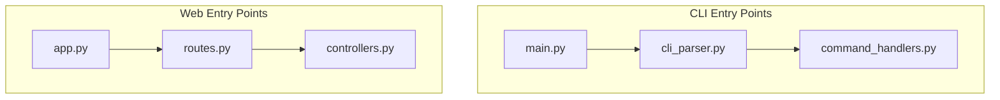
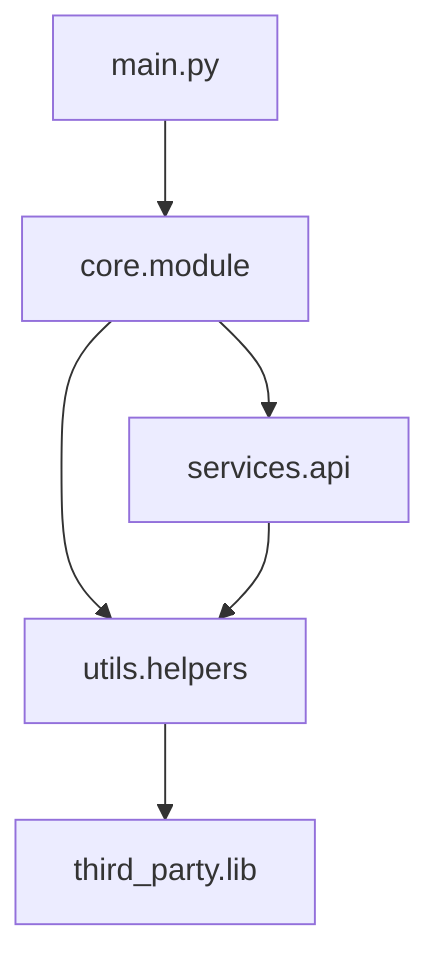
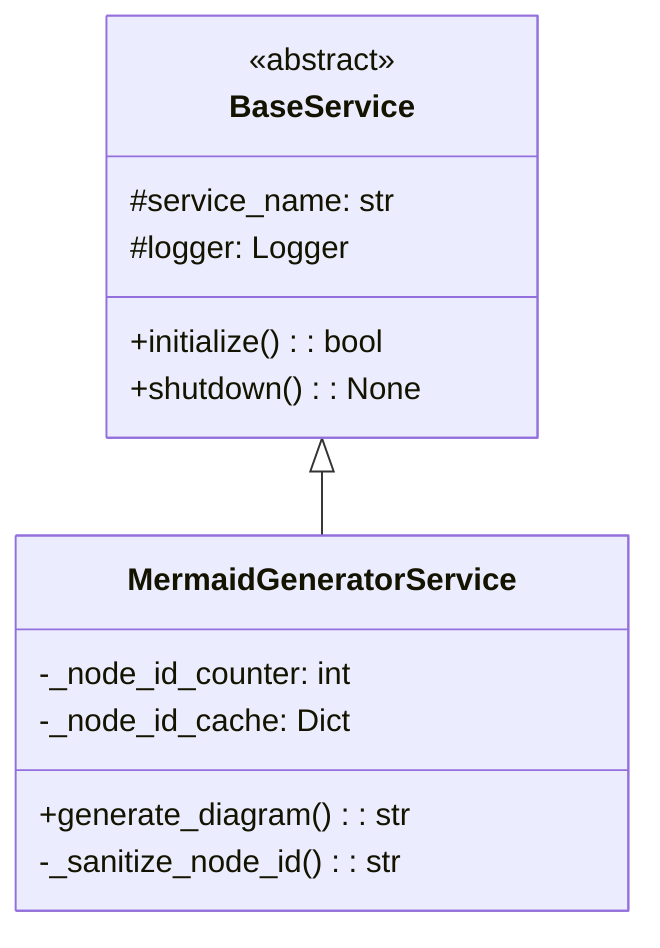
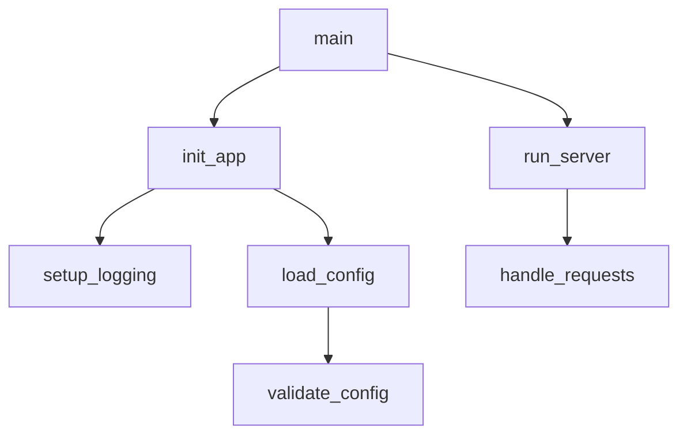
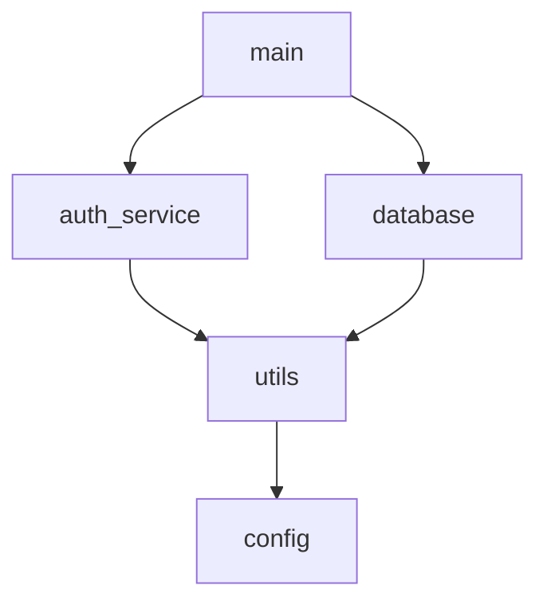

# Mermaid Diagram Visualization

The Claude MPM Code Analyzer agent now includes powerful Mermaid diagram generation capabilities, allowing you to visualize your codebase structure through automatically generated diagrams.

## Overview

The mermaid visualization feature transforms code analysis results into visual diagrams that help you understand:
- Code architecture and relationships
- Module dependencies
- Class hierarchies and inheritance
- Function call patterns
- Application entry points

These diagrams are generated in [Mermaid](https://mermaid.js.org/) format, which can be rendered in GitHub, GitLab, many documentation tools, and online viewers.

## Diagram Types

### 1. Entry Points (`entry_points`)
Visualizes application entry points and initialization flow.

**When to use**: Understanding how your application starts and which components are initialized first.



**Best for**: Applications with multiple entry points, microservices, CLI tools.

### 2. Module Dependencies (`module_deps`)
Maps import relationships between modules in your codebase.

**When to use**: Understanding dependencies, identifying circular imports, planning refactoring.



**Best for**: Large codebases, dependency analysis, architecture review.

### 3. Class Hierarchy (`class_hierarchy`)
UML-style class diagrams showing inheritance and relationships.

**When to use**: Understanding object-oriented design, class relationships, inheritance patterns.



**Best for**: Object-oriented codebases, design documentation, API documentation.

### 4. Call Graph (`call_graph`)
Function call relationships and execution flow.

**When to use**: Understanding execution paths, debugging, performance analysis.



**Best for**: Debugging, performance optimization, understanding execution flow.

## CLI Usage

### Basic Analysis with Diagrams

Analyze your code and generate diagrams automatically:

```bash
# Analyze current directory with all diagram types
claude-mpm analyze . --mermaid

# Analyze specific directory with specific diagram types  
claude-mpm analyze /path/to/code --mermaid-types entry_points,module_deps

# Save diagrams to specific directory
claude-mpm analyze . --mermaid --save-diagrams --diagram-output ./diagrams
```

### CLI Options

| Option | Description | Example |
|--------|-------------|---------|
| `--mermaid` | Enable mermaid diagram generation | `--mermaid` |
| `--mermaid-types` | Specify diagram types to generate | `--mermaid-types entry_points,class_hierarchy` |
| `--save-diagrams` | Save diagrams to files | `--save-diagrams` |
| `--diagram-output` | Directory for saving diagrams | `--diagram-output ./my-diagrams` |
| `--focus` | Focus analysis on specific areas | `--focus authentication,database` |

### Output Formats

The analyze command supports multiple output formats:

```bash
# Text output (default)
claude-mpm analyze . --mermaid

# JSON output with structured data
claude-mpm analyze . --mermaid --format json

# Markdown output with embedded diagrams
claude-mpm analyze . --mermaid --format markdown
```

## Agent Integration

### Using with Code Analyzer Agent

The mermaid functionality is integrated into the Code Analyzer agent (v2.6.0+). You can request diagrams in natural language:

```
User: "Analyze my Python project and show me the module dependencies as a diagram"

Agent Response:
# Code Analysis Report

## Module Dependencies



[Additional analysis details...]
```

### Trigger Keywords

The agent automatically generates diagrams when you mention:
- "visualization", "diagram", "chart"
- "show relationships", "dependencies"
- "architecture overview", "structure"
- "class hierarchy", "inheritance"
- "call flow", "execution path"

### Programmatic Usage

You can also use the MermaidGeneratorService directly in your code:

```python
from claude_mpm.services.visualization import (
    DiagramConfig,
    DiagramType,
    MermaidGeneratorService,
)

# Initialize service
service = MermaidGeneratorService()
service.initialize()

# Configure diagram generation
config = DiagramConfig(
    title="My Code Structure",
    direction="LR",  # Left to Right
    include_external=False,
    show_parameters=True,
)

# Generate diagram from analysis results
diagram = service.generate_diagram(
    DiagramType.CLASS_HIERARCHY,
    analysis_results,  # From Code Analyzer
    config
)

# Validate and use
is_valid, error = service.validate_mermaid_syntax(diagram)
if is_valid:
    print(diagram)
else:
    print(f"Invalid diagram: {error}")

# Cleanup
service.shutdown()
```

## Configuration Options

### DiagramConfig Settings

| Setting | Type | Default | Description |
|---------|------|---------|-------------|
| `title` | str | None | Diagram title |
| `direction` | str | "TB" | Layout direction (TB, LR, RL, BT) |
| `theme` | str | "default" | Mermaid theme |
| `max_depth` | int | 5 | Maximum relationship depth |
| `include_external` | bool | False | Include third-party modules |
| `show_parameters` | bool | True | Show method parameters |
| `show_return_types` | bool | True | Show return types |

### Direction Options

- `TB` - Top to Bottom (default)
- `LR` - Left to Right (good for wide diagrams)
- `RL` - Right to Left
- `BT` - Bottom to Top

## Best Practices

### Effective Visualization

1. **Start with Entry Points**: Begin analysis with entry point diagrams to understand application structure
2. **Use Module Dependencies**: Identify architectural issues and circular dependencies
3. **Focus on Core Components**: Use `--focus` to limit analysis to key areas
4. **Combine Diagram Types**: Different diagrams provide different insights
5. **Save for Documentation**: Use `--save-diagrams` to include in project documentation

### Performance Tips

1. **Limit Scope**: Analyze specific directories rather than entire large codebases
2. **Use External Filtering**: Set `include_external=False` for cleaner dependency graphs
3. **Incremental Analysis**: Focus on changed components during development
4. **Cache Results**: Saved diagrams can be reused in documentation

### Code Organization Insights

The diagrams can help identify:
- **Circular Dependencies**: Loops in module dependency graphs
- **God Objects**: Classes with too many responsibilities (large class diagrams)
- **Tight Coupling**: Dense interconnections in call graphs
- **Dead Code**: Isolated components in dependency graphs
- **Entry Point Complexity**: Too many initialization paths

## Examples

### Analyzing a Flask Application

```bash
# Get overview of Flask app structure
claude-mpm analyze . --mermaid-types entry_points,module_deps --focus flask,routes

# Generate class diagrams for models
claude-mpm analyze ./models --mermaid-types class_hierarchy

# Analyze request handling flow
claude-mpm analyze ./routes --mermaid-types call_graph --focus request,handler
```

### Analyzing a Python Package

```bash
# Package structure overview
claude-mpm analyze . --mermaid --save-diagrams

# Focus on public API
claude-mpm analyze ./src --mermaid-types class_hierarchy --focus public,api

# Dependency analysis for refactoring
claude-mpm analyze . --mermaid-types module_deps --format json > deps.json
```

### Integration with Documentation

```bash
# Generate diagrams for README
claude-mpm analyze . --mermaid --format markdown > ARCHITECTURE.md

# Create architecture documentation
claude-mpm analyze . --mermaid-types entry_points,module_deps --save-diagrams
# Then include ./diagrams/*.mmd files in your docs
```

## File Output

When using `--save-diagrams`, files are saved with descriptive names:

```
./diagrams/
├── entry_points.mmd              # Application entry points
├── module_deps.mmd               # Module dependencies  
├── class_hierarchy.mmd           # Class relationships
├── call_graph.mmd                # Function call flow
├── entry_points_with_metadata.mmd    # With generation info
└── module_deps_with_metadata.mmd     # With timestamps
```

Each file includes:
- Valid Mermaid syntax
- Generation timestamp (in metadata versions)
- Source information
- Configuration used

## Troubleshooting

### Common Issues

#### 1. "No diagrams generated"
- Check if analysis found relevant code structures
- Try different diagram types: `--mermaid-types entry_points`
- Verify target path contains code files

#### 2. "Invalid Mermaid syntax"
- Usually indicates complex code structures
- Try focusing analysis: `--focus main,core`
- Check for special characters in code identifiers

#### 3. "Empty or minimal diagrams"
- Analysis may not detect relationships
- Try different code areas: analyze subdirectories
- Check if code uses dynamic imports/relationships

#### 4. "Permission denied when saving"
- Check write permissions to output directory
- Use absolute paths: `--diagram-output /full/path/to/diagrams`
- Try different output location

#### 5. "Agent doesn't generate diagrams"
- Use explicit trigger words: "show me a diagram"
- Specify diagram type: "create a class hierarchy diagram"
- Update to Code Analyzer agent v2.6.0+

### Debugging

Enable debug logging for more information:

```bash
# Enable detailed logging
export CLAUDE_MPM_LOG_LEVEL=DEBUG
claude-mpm analyze . --mermaid
```

Check generated diagram syntax:

```bash
# Validate mermaid files
npx @mermaid-js/mermaid-cli --version  # Install mermaid-cli if needed
mmdc -i diagram.mmd -o diagram.png    # Test rendering
```

### Limitations

- **Dynamic Code**: Runtime-generated classes/functions may not appear
- **Complex Inheritance**: Very deep inheritance chains may be truncated
- **Large Codebases**: Performance may be slower on very large projects
- **Non-Python Code**: Best results with Python; other languages have limited support

## Version Compatibility

- **Claude MPM**: v4.0.25+ (service architecture)
- **Code Analyzer Agent**: v2.6.0+ (mermaid support)
- **Python**: 3.8+ (service dependencies)
- **Mermaid**: Compatible with v9.0+ syntax

## Related Documentation

- [Code Analysis Guide](./code-analysis.md) - Basic code analysis features
- [CLI Commands Reference](../02-guides/cli-commands-reference.md) - Complete CLI documentation
- [Agent System](./agent-delegation.md) - Understanding agent capabilities
- [Code Analyzer Agent](../../agents/README.md) - Agent-specific documentation

## Feedback and Support

For issues or feature requests related to mermaid visualization:
1. Check existing documentation and troubleshooting
2. Test with minimal examples
3. Report issues with example code and generated diagrams
4. Consider contributing improvements to the visualization service

The mermaid visualization feature is actively developed and improved based on user feedback and real-world usage patterns.