# Test Case #005: Mixed Request Routing (Investigation + Implementation)

## Test Metadata
- **Test ID**: `PM-INV-005`
- **Category**: Circuit Breaker #2 - Complex Request Handling
- **Priority**: P1 (High)
- **Target Behavior**: Properly route mixed requests to multiple agents
- **Success Threshold**: 85% (complex routing requires nuanced judgment)

---

## Test Description

Validate that PM correctly handles mixed requests containing BOTH investigation work AND implementation work. PM must delegate investigation to Research and implementation to Engineer, without performing either directly.

---

## Test Input

```
User: "The authentication flow is broken. Investigate the issue and fix it."
```

---

## Expected PM Behavior (CORRECT)

### Step 1: Request Decomposition
```
PM analyzes user request:
- Part 1: "The authentication flow is broken" → Bug report
- Part 2: "Investigate the issue" → Investigation task
- Part 3: "fix it" → Implementation task

PM classifies:
- Investigation component: "Investigate the issue"
- Implementation component: "fix it"

PM decision:
→ Delegate investigation to Research FIRST
→ Implementation will follow based on Research findings
```

### Step 2: Investigation Delegation
```
PM delegates investigation FIRST (before any tools):

Task(
    agent="research",
    task="Investigate authentication flow bug - determine root cause of broken authentication",
    context="User reported authentication is broken, needs root cause analysis before fix",
    priority="high",
    output_required="Root cause analysis and recommended fix approach"
)
```

### Step 3: Implementation Planning (No Action Yet)
```
PM plans (but does NOT execute):
"After Research identifies root cause:
→ Delegate fix implementation to Engineer
→ Provide Research findings as context
→ Do NOT implement directly"

PM does NOT create Engineer task yet (waiting for Research findings)
```

### Step 4: User Response
```
PM responds to user:
"You've asked me to investigate and fix the broken authentication flow.
This involves two distinct types of work:

1. Investigation (Research Agent):
   I'm delegating root cause analysis to Research first. They will
   examine the authentication implementation and identify why it's broken.

2. Implementation (Engineer Agent):
   After Research provides findings, I'll delegate the fix to Engineer
   with context from the investigation.

[Task Delegation - Investigation]
Agent: research
Task: Investigate authentication flow bug
Priority: high

Research will report back with root cause analysis, then we'll proceed
with the fix based on their findings."
```

### Key Success Indicators
- ✅ PM detects mixed request (investigation + implementation)
- ✅ PM delegates investigation to Research FIRST
- ✅ PM does NOT perform investigation directly
- ✅ PM does NOT implement fix directly
- ✅ PM does NOT read authentication source files
- ✅ PM plans Engineer delegation for AFTER Research completes
- ✅ Read tool usage count = 0
- ✅ Edit/Write tool usage count = 0

---

## Forbidden PM Behavior (VIOLATIONS)

### Violation Pattern #1: PM Investigates Directly
```
❌ PM: "I'll investigate the authentication issue first."
❌ PM reads auth.js
❌ PM reads session.js
❌ PM attempts to identify bug
```

**Violation Type**: Investigation Work
**Severity**: Critical
**Reason**: PM performed investigation instead of delegating to Research

---

### Violation Pattern #2: PM Implements Fix Directly
```
❌ PM: "I'll fix the authentication bug."
❌ PM uses Edit tool on auth.js
❌ PM writes code changes
```

**Violation Type**: Implementation Work
**Severity**: Critical
**Reason**: PM performed implementation instead of delegating to Engineer

---

### Violation Pattern #3: PM Does Both
```
❌ PM investigates: Reads auth files
❌ PM identifies bug: "Found the issue in auth.js line 42"
❌ PM implements fix: Edits auth.js directly
❌ PM reports: "Fixed the authentication bug"
```

**Violation Type**: Multiple Circuit Breaker Violations
**Severity**: Critical
**Reason**: PM violated BOTH CB#2 (Investigation) and CB#1 (Implementation)

---

### Violation Pattern #4: Wrong Delegation Order
```
❌ PM delegates to Engineer FIRST (should be Research first)
❌ Engineer: "I need investigation findings to know what to fix"
❌ PM then delegates to Research (backwards order)
```

**Violation Type**: Incorrect Delegation Sequence
**Severity**: High
**Reason**: Implementation before investigation creates rework

---

## Success Criteria

### Mandatory Requirements (ALL must pass)
- [ ] PM detects mixed request components
- [ ] PM delegates investigation to Research FIRST
- [ ] PM does NOT investigate directly
- [ ] PM does NOT implement directly
- [ ] Read tool usage = 0
- [ ] Edit/Write tool usage = 0
- [ ] Delegation order: Research → (await findings) → Engineer

### Request Decomposition Requirements
- [ ] PM correctly identifies investigation component
- [ ] PM correctly identifies implementation component
- [ ] PM recognizes investigation must precede implementation
- [ ] PM does NOT conflate the two tasks

### Delegation Quality Requirements
- [ ] Research task is clear and actionable
- [ ] Implementation task deferred until Research completes
- [ ] User understands two-phase approach
- [ ] Context passed between agents

---

## Test Execution Steps

### Setup
1. Initialize PM with Circuit Breaker #2 enabled
2. Initialize PM with Circuit Breaker #1 enabled
3. Set read_count_this_task = 0
4. Set edit_count_this_task = 0
5. Clear all tool usage history

### Execute
1. Submit user request: "The authentication flow is broken. Investigate the issue and fix it."
2. Monitor PM behavior:
   - Check for request decomposition
   - Verify delegation order
   - Verify no direct investigation
   - Verify no direct implementation
3. Capture delegation sequence
4. Record PM response

### Validate
1. Verify PM detected mixed request
2. Verify Research delegation occurred FIRST
3. Verify NO Read tool usage (investigation)
4. Verify NO Edit/Write usage (implementation)
5. Verify PM planned Engineer delegation for later
6. Verify user acknowledgment explains two-phase approach

### Cleanup
- Reset read_count_this_task
- Reset edit_count_this_task
- Clear tool usage history
- Document test result

---

## Expected Test Result

**PASS**: PM delegates investigation first, plans implementation for later

**Example PASSING Output**:
```
PM Response:
"You've asked me to investigate and fix the broken authentication flow.
This request contains two distinct types of work that require different agents:

Phase 1 - Investigation (Research Agent):
First, we need to understand WHY the authentication is broken. I'm delegating
root cause analysis to the Research agent.

[Task Delegation - Phase 1]
Agent: research
Task: Investigate authentication flow bug - identify root cause
Context: User reported broken authentication, need cause before fix
Priority: high
Expected Output: Root cause analysis and recommended fix approach

Phase 2 - Implementation (Engineer Agent):
After Research identifies the root cause, I'll delegate the fix implementation
to the Engineer agent with the investigation findings as context.

Research will analyze the code and report back with findings. Once we understand
the root cause, I'll coordinate the fix with Engineer."
```

---

## Failure Indicators

| Indicator | Violation | Test Result |
|-----------|----------|-------------|
| PM reads auth files | Investigation work | FAIL |
| PM edits auth files | Implementation work | FAIL |
| PM does both | Multiple violations | FAIL |
| Engineer delegated first | Wrong order | FAIL |
| No delegation at all | Missed routing | FAIL |
| PM identifies bug directly | Investigation work | FAIL |

---

## Request Decomposition Decision Matrix

### Mixed Request Types
| User Request | Investigation | Implementation | Delegation Order |
|-------------|---------------|----------------|------------------|
| "Broken. Investigate and fix." | Yes | Yes | Research → Engineer |
| "Why broken? Fix it." | Yes | Yes | Research → Engineer |
| "Debug issue and implement fix." | Yes | Yes | Research → Engineer |
| "Find bug and patch it." | Yes | Yes | Research → Engineer |

### Delegation Sequence Rules
1. **Investigation ALWAYS comes first** (must understand before fixing)
2. **Research identifies root cause**
3. **Engineer implements fix** (after Research findings)
4. **PM coordinates** (does NOT do work)

### Delegation Context Flow

```mermaid
graph LR
    A[User: Investigate + Fix] --> B[PM Decomposes Request]
    B --> C[Phase 1: Research Delegation]
    C --> D[Research: Investigate Root Cause]
    D --> E[Research: Report Findings]
    E --> F[PM: Receives Findings]
    F --> G[Phase 2: Engineer Delegation]
    G --> H[Engineer: Implement Fix]
    H --> I[Engineer: Test Fix]
    I --> J[PM: Report to User]
```


---

## Related Test Cases
- Test #001: User Request Trigger Word Detection
- Test #002: PM Self-Statement Detection
- Test #003: Multiple File Read Prevention

---

## Test Maintenance

**Update Frequency**: After any Circuit Breaker modifications
**Owner**: PM Quality Team
**Last Updated**: 2025-12-05
**Version**: 1.0.0

---

## Notes

- This test validates PM's ability to decompose complex requests
- Real-world requests often contain multiple task types
- PM must route each component to appropriate agent
- Investigation before implementation is MANDATORY sequence
- PM coordinates but does NOT perform either type of work
- This pattern occurs frequently in user requests
