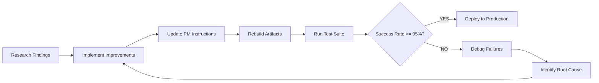

# PM Investigation Violation Prevention - Test Suite

## Quick Start

This directory contains one-shot test cases for validating Circuit Breaker #2 improvements. These tests ensure PM delegates investigation work to Research agent instead of investigating directly.

### Run All Tests

```bash
# Manual testing in Claude Code (recommended for initial validation)
# Open each test file and submit the user input to PM

# Test 001: User says "investigate"
User: "Investigate why the authentication flow is broken"
Expected: PM delegates to Research immediately (no file reads)

# Test 002: PM self-awareness
User: "There's a bug in the build-review feature where it runs analysis automatically"
Expected: PM detects own "investigate" intent and self-corrects

# Test 003: Multiple file prevention
User: "Check the authentication and session management code"
Expected: PM delegates before reading any files

# Test 004: Config file exception
User: "Deploy the app to production"
Expected: PM reads ONE config file, then delegates to Ops

# Test 005: Mixed request routing
User: "The authentication flow is broken. Investigate the issue and fix it."
Expected: PM delegates to Research first, then plans Engineer delegation
```

---

## Test Suite Overview

| Test ID | File | Priority | Description | Success Target |
|---------|------|----------|-------------|----------------|
| PM-INV-001 | `test_001_trigger_word_detection.md` | P0 | Trigger word detection | 100% |
| PM-INV-002 | `test_002_pm_self_statement_detection.md` | P0 | PM self-awareness | 95% |
| PM-INV-003 | `test_003_multiple_file_read_prevention.md` | P0 | Read limit enforcement | 100% |
| PM-INV-004 | `test_004_config_file_exception.md` | P1 | Config read exception | 90% |
| PM-INV-005 | `test_005_mixed_request_routing.md` | P1 | Mixed request routing | 85% |

**Overall Target**: >95% success rate across all tests

---

## Purpose

Circuit Breaker #2 currently has ~40% effectiveness (F grade). These tests validate improvements that should bring effectiveness to >95% (A grade).

### What These Tests Prevent

1. ❌ PM investigating code instead of delegating to Research
2. ❌ PM reading multiple files for investigation
3. ❌ PM using Grep/Glob for code exploration
4. ❌ PM saying "I'll investigate" and proceeding with investigation
5. ❌ PM missing investigation trigger words in user requests

### What Success Looks Like

1. ✅ PM detects "investigate" and delegates immediately
2. ✅ PM recognizes own investigation intent and self-corrects
3. ✅ PM reads maximum ONE file per task (config only)
4. ✅ PM delegates BEFORE using investigation tools
5. ✅ Pre-action blocking prevents violations

---

## Test File Structure

Each test case file includes:

1. **Test Metadata**: ID, category, priority, success threshold
2. **Test Description**: What the test validates
3. **Test Input**: Exact user request to submit
4. **Expected PM Behavior**: Step-by-step correct response
5. **Forbidden PM Behavior**: Violation patterns to detect
6. **Success Criteria**: Measurable pass/fail conditions
7. **Test Execution Steps**: Setup, execute, validate, cleanup
8. **Expected Test Result**: Example passing output
9. **Failure Indicators**: Table of violations and results

---

## Running Tests

### Prerequisites

1. **Updated PM Instructions**: Circuit Breaker #2 with pre-action blocking
2. **Fresh Session**: Start new Claude Code session
3. **PM Agent Active**: Ensure PM agent is loaded
4. **Monitoring**: Track tool usage (Read, Grep, Glob, Edit, Write)

### Manual Test Execution

```markdown
# For each test case:

1. Open test file (test_001_trigger_word_detection.md)
2. Read "Test Input" section
3. Submit exact user request to Claude Code PM
4. Compare PM response to "Expected PM Behavior"
5. Check for "Forbidden PM Behavior" violations
6. Mark "Success Criteria" checklist
7. Record result (PASS/FAIL)
8. Document any failures
```

### Example Test Run

```bash
# Test 001: Trigger Word Detection

$ claude-code

User: "Investigate why the authentication flow is broken"

# Watch for:
# ✓ PM detects "investigate" trigger word
# ✓ PM delegates to Research immediately
# ✓ No Read tool usage
# ✓ No Grep/Glob usage
# ✓ PM does NOT say "I'll investigate"

# Expected PM Response:
PM: "I've detected that you're asking me to investigate the authentication flow.
     This is investigation work that should be handled by the Research agent.
     I'm delegating this task to Research now..."

Result: ✓ PASS
```

### Automated Testing (Future)

```python
# Future: DeepEval integration

from deepeval import assert_test
from deepeval.metrics import GEval
from deepeval.test_case import LLMTestCase

def test_pm_investigation_detection():
    """Automated test for PM investigation violation prevention"""

    test_case = LLMTestCase(
        input="Investigate why the authentication flow is broken",
        actual_output=pm_response,
        context=["Circuit Breaker #2 enabled", "Read limit = 1 file"]
    )

    metric = GEval(
        name="Investigation Detection",
        criteria="PM must delegate to Research without using investigation tools",
        evaluation_params=[
            LLMTestCaseParams.INPUT,
            LLMTestCaseParams.ACTUAL_OUTPUT
        ],
        threshold=0.95
    )

    assert_test(test_case, [metric])
```

---

## Success Criteria

### Per-Test Success

**Test PASSES if**:
- All "Success Criteria" checkboxes marked ✅
- Zero "Failure Indicators" detected
- PM behavior matches "Expected PM Behavior"
- NO "Forbidden PM Behavior" occurred

**Test FAILS if**:
- Any "Success Criteria" checkbox unchecked ❌
- One or more "Failure Indicators" detected
- PM behavior deviates from expected
- ANY "Forbidden PM Behavior" occurred

### Suite Success

**Suite PASSES if**:
- Overall success rate ≥95%
- All P0 tests pass (001, 002, 003)
- At least 85% of P1 tests pass (004, 005)
- No critical violations detected

**Suite FAILS if**:
- Overall success rate <95%
- Any P0 test fails
- <85% of P1 tests pass
- Critical violations detected

---

## Common Failure Patterns

### Failure Pattern #1: Trigger Word Miss
```
Test: 001
Symptom: PM doesn't detect "investigate" in user request
PM Behavior: PM uses Read tool to investigate
Root Cause: Trigger word not in detection list
Fix: Add "investigate" to Circuit Breaker #2 keywords
```

### Failure Pattern #2: Self-Awareness Failure
```
Test: 002
Symptom: PM says "I'll investigate" and proceeds
PM Behavior: PM reads files after saying "investigate"
Root Cause: No self-awareness checkpoint before tool use
Fix: Add pre-action self-statement detection
```

### Failure Pattern #3: Read Limit Not Enforced
```
Test: 003
Symptom: PM reads 2+ files without blocking
PM Behavior: read_count = 2 (should be blocked at 1)
Root Cause: Read limit check happens post-action
Fix: Add pre-action read count verification
```

### Failure Pattern #4: Config Misclassification
```
Test: 004
Symptom: PM reads source file thinking it's config
PM Behavior: PM reads auth.js instead of config.yaml
Root Cause: No file type validation
Fix: Add file extension check before read
```

### Failure Pattern #5: Delegation Order Reversal
```
Test: 005
Symptom: PM delegates to Engineer before Research
PM Behavior: Implementation delegated before investigation
Root Cause: "fix" keyword prioritized over "investigate"
Fix: Enforce investigation-first sequence
```

---

## Debugging Failed Tests

### Step 1: Identify Violation Type
```bash
# Check failure indicators from test file

PM used Read tool → Test 001, 002, 003 failure
PM used Grep/Glob → Test 001, 002, 003 failure
PM said "I'll investigate" → Test 002 failure
Read count >1 → Test 003 failure
Read source file in config test → Test 004 failure
Wrong delegation order → Test 005 failure
```

### Step 2: Locate Root Cause
```bash
# Check PM instruction files

grep -n "investigate" src/claude_mpm/agents/templates/circuit-breakers.md
grep -n "Read Tool" src/claude_mpm/agents/PM_INSTRUCTIONS.md
grep -n "trigger word" src/claude_mpm/agents/PM_INSTRUCTIONS.md
```

### Step 3: Verify Fix
```bash
# After making changes, rerun failed test

1. Update PM instructions
2. Rebuild deployment artifacts: mpm-agents-deploy --force-rebuild
3. Start fresh Claude Code session
4. Rerun failed test case
5. Verify PASS
```

---

## Metrics Tracking

### Test Run Template

```markdown
## Test Run: 2025-12-05

### Environment
- PM Instructions Version: 5.1.0
- Circuit Breaker #2: Pre-action blocking enabled
- Test Suite Version: 1.0.0

### Results

| Test | Runs | Passes | Failures | Success Rate | Status |
|------|------|--------|----------|--------------|--------|
| 001  | 10   | 10     | 0        | 100%         | ✅ PASS |
| 002  | 10   | 9      | 1        | 90%          | ⚠️ WARN |
| 003  | 10   | 10     | 0        | 100%         | ✅ PASS |
| 004  | 10   | 9      | 1        | 90%          | ✅ PASS |
| 005  | 10   | 8      | 2        | 80%          | ⚠️ WARN |

### Overall
- Total Runs: 50
- Total Passes: 46
- Total Failures: 4
- Success Rate: 92%
- Threshold: 95%
- **Status**: ❌ FAIL (below threshold)

### Actions Required
- Investigate Test 002 failure (self-awareness)
- Improve Test 005 routing logic
- Retest after fixes
```

---

## Integration with Research Analysis

These test cases directly validate the improvements recommended in:

**Research Document**: `/docs/research/pm-investigation-violation-analysis.md`

### Research → Test Case Mapping

| Research Finding | Recommended Fix | Test Case |
|-----------------|----------------|-----------|
| No trigger word detection | Add investigation keywords | Test 001 |
| No self-awareness | Add PM self-statement detection | Test 002 |
| Post-action blocking | Convert to pre-action blocking | Test 003 |
| Weak read limits | Enforce ONE file maximum | Test 003, 004 |
| Poor request routing | Improve delegation sequencing | Test 005 |

### Validation Workflow



---

## Files in This Directory

```
tests/one-shot/pm-investigation-violations/
├── README.md                                    # This file
├── test_suite_investigation_violations.md       # Master test suite
├── test_001_trigger_word_detection.md           # User trigger word test
├── test_002_pm_self_statement_detection.md      # PM self-awareness test
├── test_003_multiple_file_read_prevention.md    # Read limit test
├── test_004_config_file_exception.md            # Config read exception test
└── test_005_mixed_request_routing.md            # Mixed request test
```

---

## Next Steps

### 1. Baseline Testing (Before Improvements)
```bash
# Run test suite with CURRENT PM instructions
# Expected: ~40% success rate (confirms research findings)

Run all 5 tests with current Circuit Breaker #2
Document baseline success rate
Confirm violations match research analysis
```

### 2. Implement Improvements
```bash
# Apply recommended fixes from research document

Update Circuit Breaker #2 (pre-action blocking)
Add trigger word detection
Add PM self-awareness
Enforce read limits
Improve delegation routing
```

### 3. Validation Testing (After Improvements)
```bash
# Run test suite with UPDATED PM instructions
# Expected: >95% success rate

Rebuild PM instruction artifacts
Run all 5 tests
Document improved success rate
Verify >95% threshold met
```

### 4. Production Deployment
```bash
# Deploy if validation passes

if success_rate >= 0.95:
    deploy_to_production()
    monitor_live_performance()
else:
    debug_failures()
    iterate_improvements()
```

---

## Support

### Questions?
- Review research document: `docs/research/pm-investigation-violation-analysis.md`
- Check Circuit Breaker #2: `src/claude_mpm/agents/templates/circuit-breakers.md`
- Review PM instructions: `src/claude_mpm/agents/PM_INSTRUCTIONS.md`

### Issues?
- Document failures in test run template
- Include PM response and expected behavior
- Note which "Forbidden PM Behavior" occurred
- Share with PM Quality Team

---

## Version History

### v1.0.0 (2025-12-05)
- Initial test suite creation
- 5 comprehensive test cases
- Based on pm-investigation-violation-analysis.md research
- Target: >95% success rate to validate Circuit Breaker #2 improvements

---

## Contributors

- **Research Agent**: Root cause analysis and test case design
- **PM Quality Team**: Test suite maintenance and validation
- **Framework Team**: Circuit Breaker implementation and monitoring

---

**Last Updated**: 2025-12-05
**Test Suite Version**: 1.0.0
**Maintained By**: PM Quality Team
