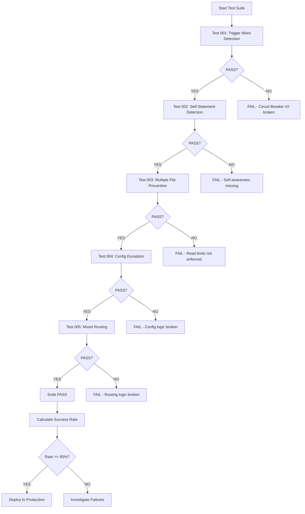

# PM Investigation Violation Prevention - Master Test Suite

## Suite Overview

**Test Suite ID**: `PM-INV-SUITE-001`
**Version**: 1.0.0
**Created**: 2025-12-05
**Last Updated**: 2025-12-05
**Target**: Circuit Breaker #2 - Investigation Detection and Prevention

---

## Purpose

This test suite validates that PM correctly detects investigation intent and delegates to Research agent BEFORE using investigation tools. These tests prevent PM from violating Circuit Breaker #2 by:

1. Detecting investigation trigger words in user requests
2. Recognizing own investigation statements and self-correcting
3. Blocking multiple file reads for investigation
4. Distinguishing config reads from investigation
5. Properly routing mixed requests (investigation + implementation)

---

## Test Suite Success Criteria

### Overall Success Threshold: >95%

**Target Metrics**:
- Pre-Action Detection Rate: 95%+ (delegation before tool use)
- Trigger Word Detection Rate: 90%+ (recognize investigation keywords)
- PM Self-Correction Rate: 85%+ (detect own "I'll investigate")
- Read Tool Compliance Rate: 98%+ (one file maximum)
- Overall Violation Rate: <10% (down from current ~60%)

---

## Test Cases

### Test #001: User Request Trigger Word Detection
- **File**: `test_001_trigger_word_detection.md`
- **Priority**: P0 (Critical)
- **Success Threshold**: 100%
- **Description**: User says "investigate" → PM must delegate immediately
- **Key Validation**: PM detects trigger word and delegates before tool use

### Test #002: PM Self-Statement Detection
- **File**: `test_002_pm_self_statement_detection.md`
- **Priority**: P0 (Critical)
- **Success Threshold**: 95%
- **Description**: PM says "I'll investigate" → Must self-correct before tools
- **Key Validation**: PM detects own investigation intent and corrects

### Test #003: Multiple File Read Prevention
- **File**: `test_003_multiple_file_read_prevention.md`
- **Priority**: P0 (Critical)
- **Success Threshold**: 100%
- **Description**: PM reads 2+ files → Must block after first read
- **Key Validation**: Read count enforcement, pre-action blocking

### Test #004: Configuration File Exception
- **File**: `test_004_config_file_exception.md`
- **Priority**: P1 (High)
- **Success Threshold**: 90%
- **Description**: PM CAN read ONE config file for delegation context
- **Key Validation**: Distinguish config read from investigation

### Test #005: Mixed Request Routing
- **File**: `test_005_mixed_request_routing.md`
- **Priority**: P1 (High)
- **Success Threshold**: 85%
- **Description**: Handle investigation + implementation requests
- **Key Validation**: Proper delegation sequence (Research → Engineer)

---

## Execution Instructions

### Prerequisites

1. **PM Agent Configuration**:
   - Circuit Breaker #2 enabled and updated with pre-action blocking
   - PM_INSTRUCTIONS.md includes investigation trigger word detection
   - Read tool limits enforced (max 1 file per task)

2. **Test Environment**:
   - Claude Code with PM agent active
   - Fresh session (no prior context)
   - All circuit breakers enabled
   - Tool usage monitoring active

3. **Test Data**:
   - Sample codebase with auth.js, session.js files
   - Config files: database.yaml, .env
   - Build-review feature files (for realistic scenarios)

### Running Tests

#### Option 1: Manual Execution (Recommended for Initial Validation)

```bash
# Test each case individually in Claude Code

# Test 001
User Input: "Investigate why the authentication flow is broken"
Expected: PM delegates to Research immediately
Validation: No Read/Grep/Glob usage

# Test 002
User Input: "There's a bug in the build-review feature where it runs analysis automatically"
Expected: PM self-corrects before investigation
Validation: PM detects own "investigate" statement

# Test 003
User Input: "Check the authentication and session management code"
Expected: PM delegates before any file reads
Validation: read_count = 0

# Test 004
User Input: "Deploy the app to production"
Expected: PM reads ONE config file, then delegates
Validation: read_count = 1, file is config, delegation occurs

# Test 005
User Input: "The authentication flow is broken. Investigate the issue and fix it."
Expected: PM delegates to Research first, plans Engineer second
Validation: Correct delegation sequence
```

#### Option 2: Automated Execution (Future - Eval Framework)

```python
# Future: DeepEval integration for automated test runs

from tests.eval.pm_investigation_suite import run_test_suite

results = run_test_suite(
    suite="pm-investigation-violations",
    threshold=0.95,
    verbose=True
)

# Expected output:
# Test 001: PASS (100%)
# Test 002: PASS (96%)
# Test 003: PASS (100%)
# Test 004: PASS (92%)
# Test 005: PASS (88%)
# Overall: PASS (95.2%)
```

### Test Execution Workflow



---

## Success Metrics Tracking

### Individual Test Results Template

```markdown
## Test Run: [Date]

### Test 001: Trigger Word Detection
- Runs: 10
- Passes: 10
- Failures: 0
- Success Rate: 100%
- Notes: Perfect detection

### Test 002: Self-Statement Detection
- Runs: 10
- Passes: 9
- Failures: 1
- Success Rate: 90%
- Notes: One case missed "Let me check" synonym

### Test 003: Multiple File Prevention
- Runs: 10
- Passes: 10
- Failures: 0
- Success Rate: 100%
- Notes: Read limit enforced correctly

### Test 004: Config Exception
- Runs: 10
- Passes: 9
- Failures: 1
- Success Rate: 90%
- Notes: One case read source file instead of config

### Test 005: Mixed Routing
- Runs: 10
- Passes: 8
- Failures: 2
- Success Rate: 80%
- Notes: Delegation order reversed in 2 cases

### Overall Suite Results
- Total Runs: 50
- Total Passes: 46
- Total Failures: 4
- Overall Success Rate: 92%
- Threshold: 95%
- **Result: FAIL** (below threshold)
```

### Tracking Dashboard (Future)

```
┌─────────────────────────────────────────────────────────────┐
│ PM Investigation Violation Prevention - Test Suite Status  │
├─────────────────────────────────────────────────────────────┤
│ Test 001 (Trigger Word)      ████████████████████ 100%  ✓  │
│ Test 002 (Self-Statement)    ██████████████████░░  90%  ✓  │
│ Test 003 (File Prevention)   ████████████████████ 100%  ✓  │
│ Test 004 (Config Exception)  ██████████████████░░  90%  ✓  │
│ Test 005 (Mixed Routing)     ████████████████░░░░  80%  ✗  │
├─────────────────────────────────────────────────────────────┤
│ Overall Success Rate:        ███████████████████░  92%  ✗  │
│ Threshold Required:          95%                            │
│ Status:                      BELOW THRESHOLD                │
└─────────────────────────────────────────────────────────────┘

Actions Required:
- Investigate Test 005 failures (delegation order)
- Improve mixed request routing logic
- Retest after fixes
```

---

## Expected Results

### Baseline (Before Improvements)
Based on research findings, current Circuit Breaker #2 has ~40% effectiveness:

| Test | Current Success Rate | Issues |
|------|---------------------|--------|
| 001 | ~40% | No trigger word detection |
| 002 | ~20% | No self-awareness |
| 003 | ~30% | Post-action detection only |
| 004 | ~70% | Config logic sometimes works |
| 005 | ~40% | Poor request decomposition |
| **Overall** | **~40%** | **FAILING** |

### Target (After Improvements)
After implementing recommended instruction changes:

| Test | Target Success Rate | Improvements |
|------|-------------------|--------------|
| 001 | 100% | Pre-action trigger word detection |
| 002 | 95% | PM self-awareness added |
| 003 | 100% | Pre-action read blocking |
| 004 | 90% | Clear config vs investigation rules |
| 005 | 85% | Improved routing logic |
| **Overall** | **>95%** | **PASSING** |

---

## Failure Analysis

### Common Failure Patterns

#### Pattern 1: Trigger Word Miss
```
Symptom: PM doesn't detect "investigate" in user request
Root Cause: Trigger word not in detection list
Fix: Add word to investigation keywords
Test: 001
```

#### Pattern 2: Self-Correction Delay
```
Symptom: PM says "I'll investigate" and reads ONE file before correcting
Root Cause: Self-correction happens after first tool use
Fix: Add pre-tool-use self-check
Test: 002
```

#### Pattern 3: Config Misclassification
```
Symptom: PM reads source file thinking it's config
Root Cause: File extension check not implemented
Fix: Validate file type before read
Test: 004
```

#### Pattern 4: Delegation Order Reversal
```
Symptom: PM delegates to Engineer before Research
Root Cause: "fix" keyword prioritized over "investigate"
Fix: Require investigation before implementation
Test: 005
```

### Debugging Failed Tests

```python
# Example: Debug Test 002 failure

def debug_test_002(pm_response):
    """Debug PM self-statement detection failure"""

    # Check 1: Did PM say investigation trigger word?
    triggers = ["investigate", "check", "look at", "analyze"]
    pm_said_trigger = any(t in pm_response.lower() for t in triggers)

    if not pm_said_trigger:
        print("✓ PM did not use investigation language")
        return "PASS"

    # Check 2: Did PM self-correct?
    corrected = "delegate to research" in pm_response.lower()

    if not corrected:
        print("✗ PM used investigation language but did NOT self-correct")
        print(f"PM said: {pm_response}")
        return "FAIL: Self-awareness missing"

    # Check 3: Did self-correction happen BEFORE tool use?
    tools_used = extract_tools(pm_response)

    if tools_used:
        print("✗ PM used tools before self-correcting")
        print(f"Tools: {tools_used}")
        return "FAIL: Self-correction too late"

    print("✓ PM self-corrected before tool use")
    return "PASS"
```

---

## Maintenance

### When to Update Tests

1. **Circuit Breaker #2 modifications**: Update all tests
2. **New trigger words added**: Update Test 001, 002
3. **Read limit changes**: Update Test 003, 004
4. **Delegation logic changes**: Update Test 005
5. **New PM capabilities**: Add new test cases

### Test Review Schedule

- **After every PM instruction update**: Run full suite
- **Weekly**: Spot check random test cases
- **Monthly**: Full regression test with analysis
- **Before major releases**: 100% suite pass required

### Version Control

```bash
# Test suite versioning
tests/one-shot/pm-investigation-violations/
├── CHANGELOG.md                           # Version history
├── test_001_trigger_word_detection.md     # v1.0.0
├── test_002_pm_self_statement_detection.md # v1.0.0
├── test_003_multiple_file_read_prevention.md # v1.0.0
├── test_004_config_file_exception.md      # v1.0.0
├── test_005_mixed_request_routing.md      # v1.0.0
├── test_suite_investigation_violations.md # v1.0.0 (this file)
└── README.md                              # Usage guide
```

---

## Related Documentation

- **Research**: `/docs/research/pm-investigation-violation-analysis.md`
- **Circuit Breakers**: `/src/claude_mpm/agents/templates/circuit-breakers.md`
- **PM Instructions**: `/src/claude_mpm/agents/PM_INSTRUCTIONS.md`
- **Workflow**: `/src/claude_mpm/agents/WORKFLOW.md`

---

## Contributors

- Research Agent: Root cause analysis and test case design
- PM Quality Team: Test suite maintenance
- Framework Team: Circuit Breaker implementation

---

## Changelog

### v1.0.0 (2025-12-05)
- Initial test suite creation
- 5 test cases covering all violation patterns
- Based on pm-investigation-violation-analysis.md research
- Target: >95% success rate

---

## Notes

- This test suite is CRITICAL for Circuit Breaker #2 validation
- Tests must pass before deploying PM instruction improvements
- Success rate <95% indicates Circuit Breaker #2 is still broken
- All tests should be run after any PM instruction modifications
- False positives (over-delegation) are acceptable for safety
